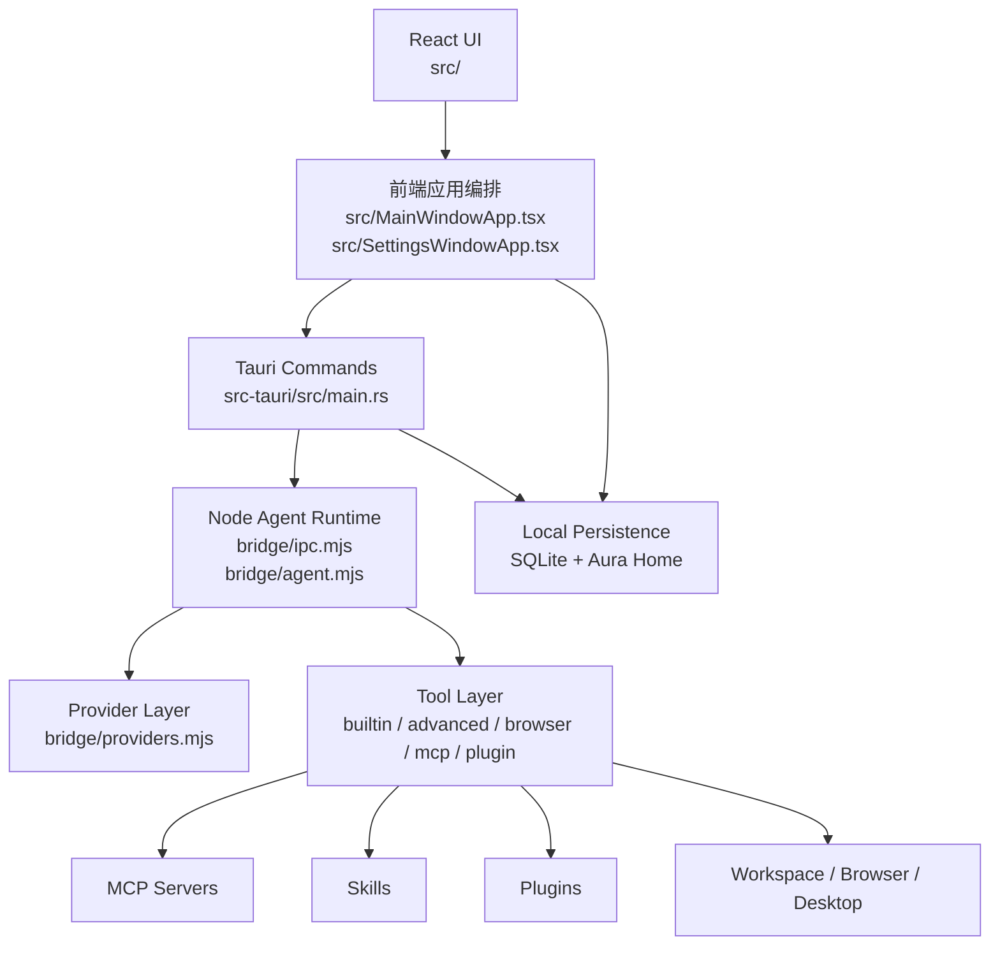
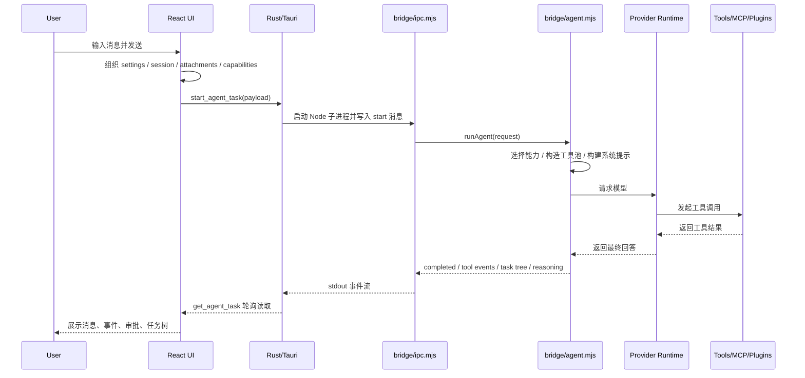

# Aura 技术架构

本文档面向开发者，介绍 Aura 当前 MVP 版本的整体技术架构、分层职责、关键数据流和扩展点。

Aura 的目标不是“把一个 LLM 聊天框做成桌面版”，而是提供一个完整的本地 Agent 平台：

- 有真实的桌面 UI 与设置窗口
- 有本地文件、浏览器、桌面、MCP、插件、技能等执行能力
- 有可持久化的会话、消息、版本和工作区状态
- 有面向桌面产品而不是 CLI 的运行时设计

---

## 1. 总体架构

Aura 当前可以分成 5 层：

1. 前端展示层
2. 前端应用编排层
3. Tauri / Rust 原生桥接层
4. Node Agent Runtime 层
5. 本地数据与扩展层

高层数据流如下：

---

## 2. 分层说明

## 2.1 前端展示层

主要目录：

- [src/views](/Users/fanhuaze/Documents/YunWork/desk-agent/src/views)
- [src/components](/Users/fanhuaze/Documents/YunWork/desk-agent/src/components)
- [src/styles.css](/Users/fanhuaze/Documents/YunWork/desk-agent/src/styles.css)

主要职责：

- 渲染主窗口、设置窗口、MCP 编辑窗口
- 展示会话列表、消息流、工具事件、任务树、资产列表
- 提供聊天输入、设置表单、Provider 配置、浏览器配置、能力开关
- 组织用户交互，不直接承载 Agent 执行逻辑

典型文件：

- [src/App.tsx](/Users/fanhuaze/Documents/YunWork/desk-agent/src/App.tsx)
  根据当前窗口类型决定渲染主窗口、设置窗口还是 MCP 编辑窗口
- [src/views/ChatView.tsx](/Users/fanhuaze/Documents/YunWork/desk-agent/src/views/ChatView.tsx)
  主聊天工作台
- [src/views/HomeView.tsx](/Users/fanhuaze/Documents/YunWork/desk-agent/src/views/HomeView.tsx)
  欢迎页 / 空状态入口
- [src/views/ProvidersView.tsx](/Users/fanhuaze/Documents/YunWork/desk-agent/src/views/ProvidersView.tsx)
  Provider 资产与配置界面
- [src/components/AppSidebar.tsx](/Users/fanhuaze/Documents/YunWork/desk-agent/src/components/AppSidebar.tsx)
  会话列表与底部设置入口

这一层的设计原则：

- 只负责 UI 和交互
- 不直接访问模型 Provider
- 不直接操作 MCP
- 通过 `src/lib/*` 访问 Tauri 命令和前端应用服务

---

## 2.2 前端应用编排层

主要目录：

- [src/MainWindowApp.tsx](/Users/fanhuaze/Documents/YunWork/desk-agent/src/MainWindowApp.tsx)
- [src/SettingsWindowApp.tsx](/Users/fanhuaze/Documents/YunWork/desk-agent/src/SettingsWindowApp.tsx)
- [src/McpEditorWindowApp.tsx](/Users/fanhuaze/Documents/YunWork/desk-agent/src/McpEditorWindowApp.tsx)
- [src/lib](/Users/fanhuaze/Documents/YunWork/desk-agent/src/lib)

主要职责：

- 管理全局状态与窗口级状态
- 组装 Agent 请求参数
- 维护会话生命周期
- 把 UI 动作映射为 Tauri 或 Runtime 调用
- 管理本地持久化同步
- 处理多窗口通信

### 2.2.1 主窗口编排

主入口：

- [src/MainWindowApp.tsx](/Users/fanhuaze/Documents/YunWork/desk-agent/src/MainWindowApp.tsx)

负责：

- 当前会话切换
- 工作区选择与加载
- 启动 Agent 任务
- 轮询任务状态
- 处理审批、取消、追加输入
- 文件预览与附件导入
- 会话与工作区的绑定

### 2.2.2 设置窗口编排

主入口：

- [src/SettingsWindowApp.tsx](/Users/fanhuaze/Documents/YunWork/desk-agent/src/SettingsWindowApp.tsx)

负责：

- Provider Profiles 管理
- 模型抓取与连通性检测
- 浏览器运行时设置
- MCP 列表管理
- 技能 / 插件资产管理
- 通用偏好保存

### 2.2.3 MCP 编辑子窗口

主入口：

- [src/McpEditorWindowApp.tsx](/Users/fanhuaze/Documents/YunWork/desk-agent/src/McpEditorWindowApp.tsx)

负责：

- 编辑单个 MCP Server
- 新增 / 删除 MCP Server
- 将结果写回设置存储

### 2.2.4 前端服务模块

典型文件：

- [src/lib/agent.ts](/Users/fanhuaze/Documents/YunWork/desk-agent/src/lib/agent.ts)
  Agent 任务启动、轮询、审批、取消、追加输入
- [src/lib/provider.ts](/Users/fanhuaze/Documents/YunWork/desk-agent/src/lib/provider.ts)
  Provider 测试与模型抓取
- [src/lib/mcp.ts](/Users/fanhuaze/Documents/YunWork/desk-agent/src/lib/mcp.ts)
  MCP Server 检查
- [src/lib/workspace.ts](/Users/fanhuaze/Documents/YunWork/desk-agent/src/lib/workspace.ts)
  文件树、文本预览、附件导入、会话工作区目录
- [src/lib/windows.ts](/Users/fanhuaze/Documents/YunWork/desk-agent/src/lib/windows.ts)
  多窗口创建、关闭与事件广播
- [src/lib/storage.ts](/Users/fanhuaze/Documents/YunWork/desk-agent/src/lib/storage.ts)
  设置、会话、能力覆盖的归一化与持久化入口
- [src/lib/persistence.ts](/Users/fanhuaze/Documents/YunWork/desk-agent/src/lib/persistence.ts)
  SQLite 持久化桥接
- [src/lib/aura.ts](/Users/fanhuaze/Documents/YunWork/desk-agent/src/lib/aura.ts)
  Aura Home 的目录、文件与资产访问
- [src/lib/browser.ts](/Users/fanhuaze/Documents/YunWork/desk-agent/src/lib/browser.ts)
  浏览器运行时状态、安装、导入、清理等前端桥接

---

## 2.3 Tauri / Rust 原生桥接层

主要目录：

- [src-tauri/src/main.rs](/Users/fanhuaze/Documents/YunWork/desk-agent/src-tauri/src/main.rs)
- [src-tauri/capabilities/default.json](/Users/fanhuaze/Documents/YunWork/desk-agent/src-tauri/capabilities/default.json)
- [src-tauri/tauri.conf.json](/Users/fanhuaze/Documents/YunWork/desk-agent/src-tauri/tauri.conf.json)

主要职责：

- 提供桌面窗口与多窗口能力
- 提供 Tauri command 给前端调用
- 启动 Node Runtime 子进程
- 管理 Agent 后台任务句柄
- 读写本地文件
- 处理图片预览、附件写入、目录管理
- 承担 SQLite 持久化
- 管理 Aura Home 目录
- 实现浏览器相关的系统级能力和 Chrome 导入逻辑

### 2.3.1 任务桥接

Rust 层通过 `Command::new("node")` 启动：

- [bridge/ipc.mjs](/Users/fanhuaze/Documents/YunWork/desk-agent/bridge/ipc.mjs)

并把前端的任务 payload 发送给 Node Runtime。

Rust 负责：

- 维护任务 ID
- 保存任务快照
- 保存 pending approval
- 提供轮询读取
- 提供中断 / 审批 / 追加输入等命令入口

### 2.3.2 本地系统命令

Rust 层提供的命令主要包括：

- Agent 任务相关命令
- Provider / MCP / Browser action 命令
- 文件树、文本、图片、附件处理命令
- 会话工作目录创建 / 删除
- SQLite 设置与会话持久化命令
- Aura Home 读写与重置命令

### 2.3.3 本地持久化

Rust 层负责把前端状态落入 SQLite。

当前持久化内容包括：

- 设置
- 会话
- 消息
- 消息版本
- 项目级能力覆盖规则

这使 Aura 不依赖浏览器 localStorage 作为最终存储层，而是有真正的桌面持久化能力。

---

## 2.4 Node Agent Runtime 层

主要目录：

- [bridge](/Users/fanhuaze/Documents/YunWork/desk-agent/bridge)

这是 Aura 的核心执行层。

主要职责：

- 生成系统提示词
- 选择当前轮可用能力
- 调用模型 Provider
- 维护工具执行上下文
- 管理 MCP / Skill / Plugin 装载
- 管理多 Agent 委派
- 管理浏览器和桌面自动化工具
- 产出结构化事件、推理、错误、重试信息

### 2.4.1 Runtime 主入口

核心文件：

- [bridge/ipc.mjs](/Users/fanhuaze/Documents/YunWork/desk-agent/bridge/ipc.mjs)
- [bridge/agent.mjs](/Users/fanhuaze/Documents/YunWork/desk-agent/bridge/agent.mjs)

`ipc.mjs` 的职责：

- 接收来自 Rust 的启动消息
- 把审批消息回传给 Runtime
- 把运行中的工具事件、任务树、完成结果流回 Rust

`agent.mjs` 的职责：

- 构造上下文
- 计算 capability 选择结果
- 组装工具池
- 调用具体 Provider 运行器
- 归一化结果
- 对回答执行最终整理
- 对错误进行结构化标准化

### 2.4.2 Provider 层

核心文件：

- [bridge/providers.mjs](/Users/fanhuaze/Documents/YunWork/desk-agent/bridge/providers.mjs)
- [bridge/providerActions.mjs](/Users/fanhuaze/Documents/YunWork/desk-agent/bridge/providerActions.mjs)

负责：

- OpenAI-compatible Provider 调用
- Google Gemini Provider 调用
- 回答收尾与格式整理
- Provider 模型拉取
- Provider 连通性检测
- Provider 失败后的结构化错误处理

当前前端定义的 Provider 类型为：

- `openai`
- `google`
- `custom`

并通过 `ProviderProfile` 管理多个 Provider 实例。

### 2.4.3 内置工具层

核心文件：

- [bridge/tools.mjs](/Users/fanhuaze/Documents/YunWork/desk-agent/bridge/tools.mjs)

负责提供通用本地工具，例如：

- 文件树遍历
- 代码搜索
- 文件读取
- 文件写入
- Shell 执行
- Git / 工作区辅助能力

这些工具都围绕当前会话工作区执行，并严格受 `cwd` 约束。

### 2.4.4 高级工具层

核心文件：

- [bridge/advancedTools.mjs](/Users/fanhuaze/Documents/YunWork/desk-agent/bridge/advancedTools.mjs)

负责提供更强的 Agent 能力：

- `spawn_subagent` 多 Agent 委派
- Computer Use 桌面操作
- 系统 Chrome 自动化备用能力
- 浏览器运行时相关工具

其中桌面自动化当前主要面向 macOS。

### 2.4.5 浏览器运行时层

核心文件：

- [bridge/browserRuntime.mjs](/Users/fanhuaze/Documents/YunWork/desk-agent/bridge/browserRuntime.mjs)
- [bridge/browserProfileActions.mjs](/Users/fanhuaze/Documents/YunWork/desk-agent/bridge/browserProfileActions.mjs)

这层是 Aura 区别于很多普通 Agent 工具的关键能力之一。

职责包括：

- 基于 `playwright-core` 启动 Aura 浏览器运行时
- 支持三种浏览器来源：
  - `system-chrome`
  - `managed-chrome`
  - `custom-executable`
- 管理 Aura 自己的浏览器 Profile
- 支持网站登录态导入
- 支持接管与恢复
- 支持 Profile 清理与重置

这意味着 Aura 不是简单调用系统浏览器，而是拥有一套可控的网页执行环境。

### 2.4.6 MCP 层

核心文件：

- [bridge/mcp.mjs](/Users/fanhuaze/Documents/YunWork/desk-agent/bridge/mcp.mjs)
- [bridge/mcpActions.mjs](/Users/fanhuaze/Documents/YunWork/desk-agent/bridge/mcpActions.mjs)

职责：

- 启动 `stdio MCP` 客户端
- 拉取 MCP 工具描述
- 把 MCP 工具统一接入 Aura 工具池
- 为设置页提供 MCP 检查与工具预览

Aura 把 MCP 看成一等公民，而不是外挂脚本。

### 2.4.7 Skills / Plugins 层

核心文件：

- [bridge/extensions.mjs](/Users/fanhuaze/Documents/YunWork/desk-agent/bridge/extensions.mjs)
- [bridge/capabilitySelector.mjs](/Users/fanhuaze/Documents/YunWork/desk-agent/bridge/capabilitySelector.mjs)

职责：

- 读取技能目录和插件目录
- 生成技能提示词
- 装载插件工具
- 根据当前任务和工作区动态选择能力
- 结合全局与项目级覆盖规则决定最终启用集

这层让 Aura 的扩展能力不是“全开”或“全关”，而是可以根据上下文动态分配。

### 2.4.8 错误与恢复

核心文件：

- [bridge/runtimeErrors.mjs](/Users/fanhuaze/Documents/YunWork/desk-agent/bridge/runtimeErrors.mjs)

职责：

- 把 Provider / MCP / Plugin / Tool / System 错误归一化
- 标准化错误类别
- 生成可恢复建议
- 支持 Provider failure recovery

这是 Aura 能做出“桌面产品体验”而不是“脚本报错体验”的关键基础。

---

## 2.5 本地数据与扩展层

Aura 不把所有状态都塞在前端内存里，而是拆成两套本地数据层：

1. SQLite
2. Aura Home

### 2.5.1 SQLite

通过 Rust commands 暴露，前端桥接在：

- [src/lib/persistence.ts](/Users/fanhuaze/Documents/YunWork/desk-agent/src/lib/persistence.ts)

负责：

- 设置持久化
- 会话持久化
- 消息持久化
- 消息版本持久化
- 项目能力覆盖规则持久化

适合放结构化状态。

### 2.5.2 Aura Home

前端桥接在：

- [src/lib/aura.ts](/Users/fanhuaze/Documents/YunWork/desk-agent/src/lib/aura.ts)

Rust 层会确保 `~/.aura` 目录存在，并维护这些子目录：

- 浏览器目录
- 浏览器运行时目录
- 浏览器 Profile 目录
- 技能目录
- 插件目录
- MCP 配置目录
- 工作区目录
- 日志目录

适合放：

- 技能 / 插件资产
- 浏览器 Profile
- 浏览器运行时
- 日志
- 会话产物目录

这让 Aura 有一个明确的“本地 Agent Home”，方便用户管理和排障。

---

## 3. 关键数据模型

核心类型定义在：

- [src/types.ts](/Users/fanhuaze/Documents/YunWork/desk-agent/src/types.ts)

最关键的几类模型包括：

### 3.1 AgentSettings

负责保存全局运行偏好：

- 当前 Provider 与模型
- Provider Profiles
- 工作区默认目录
- 执行模式
- Memory 模式
- Reasoning effort
- Browser 配置
- MCP Server 配置
- Skills / Plugins 启用情况
- 审批策略

### 3.2 ProviderProfile

每个 Provider Profile 包含：

- `name`
- `provider`
- `apiKey`
- `baseUrl`
- `enabled`
- `models`
- `defaultModel`

这意味着 Aura 可以把“厂商类型”和“具体配置实例”分开管理。

### 3.3 Session

每个会话包含：

- 会话标题
- 绑定 Provider Profile
- 模型
- 工作区路径
- 工作区根目录
- 会话消息
- 工具事件
- 任务树
- 更新时间

这让 Aura 的会话不是纯聊天记录，而是绑定真实执行上下文的工作单元。

### 3.4 ChatMessage / ChatMessageVariant

消息结构不仅有文本，还包括：

- 附件
- 推理摘要
- phase outputs
- usage
- events
- steps
- capability snapshot
- retry info
- model info
- appended inputs

这为后续做更强的消息级调试、版本对比、任务恢复提供了基础。

---

## 4. 核心执行链路

## 4.1 聊天消息发送链路

## 4.2 Provider 测试与模型抓取链路

设置页中的“测试连通性 / Fetch models”走的是另一条轻量链路：

1. 设置页调用 [src/lib/provider.ts](/Users/fanhuaze/Documents/YunWork/desk-agent/src/lib/provider.ts)
2. Tauri 执行 `run_provider_action`
3. Rust 启动 [bridge/providerActions.mjs](/Users/fanhuaze/Documents/YunWork/desk-agent/bridge/providerActions.mjs)
4. Node 直接请求厂商 API
5. 返回模型列表和状态给设置页

这样做的优点是：

- 不需要走完整 Agent Runtime
- 测试配置更快
- 设置页逻辑和会话运行时解耦

## 4.3 MCP 检查链路

设置页编辑 MCP Server 时：

1. 前端调用 [src/lib/mcp.ts](/Users/fanhuaze/Documents/YunWork/desk-agent/src/lib/mcp.ts)
2. Tauri 执行 `run_mcp_action`
3. Node 侧通过 [bridge/mcpActions.mjs](/Users/fanhuaze/Documents/YunWork/desk-agent/bridge/mcpActions.mjs) 启动目标 MCP
4. 拉取工具列表
5. 返回工具描述给设置页

## 4.4 浏览器运行时链路

浏览器任务执行时：

1. Agent Runtime 判断该任务适合浏览器能力
2. 根据设置选择浏览器来源
3. 使用 Aura 浏览器 Profile 启动 Chromium / Chrome
4. 在独立运行时中执行网页自动化
5. 需要人工参与时进入 takeover
6. 用户完成后继续执行

## 4.5 Agent Runtime 日志与合约

Agent Runtime 的执行状态通过两条链路输出：

1. **任务事件流**：`bridge/ipc.mjs` 将 `text_delta`、`reasoning_delta`、`tool_event`、`task_tree`、`route_decision`、`context_compression` 等事件写到 stdout，Rust 侧合并进 `AgentTaskSnapshot`，前端通过 `get_agent_task` 轮询展示。
2. **结构化运行日志**：`bridge/agentRuntimeLogs.mjs` 通过 `runtime_log` 事件输出 `agent.*` 日志，Rust 侧写入 Aura app log，日志看板可按 `runId`、`taskId`、`assistantMessageId` 追踪一次完整运行。

当前 Step 1 的日志事件包括：

- `agent.run.started`
- `agent.path.selected`
- `agent.architecture.fallback`
- `agent.classifier.result`
- `agent.fast_path.started`
- `agent.fast_path.finished`
- `agent.plan.created`
- `agent.plan.updated`
- `agent.graph.transition`
- `agent.step.started`
- `agent.step.finished`
- `agent.checkpoint.created`
- `agent.route.decision`
- `agent.tool.event`
- `agent.context.compression`
- `agent.retry.progress`
- `agent.memory.updated`
- `agent.recovery.event`
- `agent.completion.checked`
- `agent.error.classified`
- `agent.run.finished`

这些日志遵守几个约束：

- `route-first` 是当前稳定执行内核，在 runtime 日志中归一为 `architectureMode: "legacy"`。
- `fast` 路径只处理简单无工具问答；工作区、写入、附件、网页/最新信息、复杂任务仍会进入标准或长任务路径。
- `long` 路径进入 Hybrid State Graph，图中的执行节点仍委托 route-first，以保留现有工具路由、恢复和证据策略。
- `hybrid` / `graph` 是阶段性架构模式；需要回退时会记录 `agent.architecture.fallback`。
- 日志只记录摘要、状态、id、token、耗时、错误分类等诊断字段，不记录完整文件内容、API key 或大段模型输出。
- 日志失败不能影响 Agent 主执行路径。

关键运行时数据合约：

| 数据 | 作用 |
|------|------|
| `messages` | 传给模型的对话上下文，会被上下文压缩影响 |
| `toolEvents` | 完整工具事件轨迹，用于 UI 展示、evidence policy、recovery |
| `workMemories` | 可复用工作记忆，供后续任务 carryover |
| `routeDecision` | 当前能力层、预算、挂载工具、stop reason 的快照 |
| `contextCompression` | 最近一次压缩摘要和 token 统计 |
| `runtime_log` | 结构化诊断日志，不直接参与模型上下文 |

---

## 5. 权限与安全边界

Aura 当前的权限模型主要体现在以下几类动作上：

- Shell
- 文件写入
- Computer Use
- Chrome 自动化

这些能力支持：

- 自动允许
- 手动审批
- 后续扩展为更细粒度策略

另外，Aura 还有几个关键安全边界：

1. 工具大多以当前工作区为边界执行
2. MCP 通过显式配置接入
3. 浏览器登录态使用 Aura 自己的 Profile，而非默认复用用户浏览器
4. 高风险动作在 UI 层有审批入口

---

## 6. 为什么这种架构适合桌面 Agent

Aura 采用 `React + Tauri + Rust + Node Runtime` 的混合架构，不是偶然选择，而是为了同时满足以下需求：

- 桌面 UI 要轻、跨平台、可快速迭代
- 本地系统能力需要稳定、安全、可打包
- Agent Runtime 需要丰富的 JS 生态
- 浏览器自动化需要成熟 Node 侧能力
- MCP / 插件 / Skill 装载天然适合 Node 运行时

如果全部写在前端：

- 无法获得稳定的 OS 与本地文件能力

如果全部写在 Rust：

- Provider / 浏览器 / MCP / 插件生态实现成本会显著提高

如果全部写在 Node / Electron：

- 桌面原生能力、包体、权限模型、系统集成不如 Tauri/Rust 精细

所以 Aura 当前架构本质上是在做一个平衡：

- UI 与产品体验在前端
- OS 能力与持久化在 Rust
- Agent 智能与工具生态在 Node

---

## 7. 当前 MVP 覆盖范围

Aura 当前第一阶段 MVP 已经覆盖：

- 多 Provider Profiles
- Provider 测试与模型抓取
- 多窗口桌面结构
- 会话、消息、消息版本本地持久化
- MCP 接入与检查
- 技能 / 插件资产管理
- 浏览器运行时与登录态导入
- 多 Agent 委派
- Computer Use
- Chrome 备用自动化
- 工作区感知会话
- 审批与事件轨迹

还可以继续增强的方向包括：

- 更成熟的聊天 Composer 交互
- 更细粒度的权限系统
- 更强的任务恢复与断点续跑
- 更完整的插件市场与技能生态
- 更丰富的跨平台桌面自动化能力

---

## 8. 开发者阅读顺序建议

如果你是第一次接触这个项目，推荐按下面顺序读代码：

1. [README.md](/Users/fanhuaze/Documents/YunWork/desk-agent/README.md)
2. [src/App.tsx](/Users/fanhuaze/Documents/YunWork/desk-agent/src/App.tsx)
3. [src/MainWindowApp.tsx](/Users/fanhuaze/Documents/YunWork/desk-agent/src/MainWindowApp.tsx)
4. [src/SettingsWindowApp.tsx](/Users/fanhuaze/Documents/YunWork/desk-agent/src/SettingsWindowApp.tsx)
5. [src/types.ts](/Users/fanhuaze/Documents/YunWork/desk-agent/src/types.ts)
6. [src/lib/storage.ts](/Users/fanhuaze/Documents/YunWork/desk-agent/src/lib/storage.ts)
7. [src-tauri/src/main.rs](/Users/fanhuaze/Documents/YunWork/desk-agent/src-tauri/src/main.rs)
8. [bridge/ipc.mjs](/Users/fanhuaze/Documents/YunWork/desk-agent/bridge/ipc.mjs)
9. [bridge/agent.mjs](/Users/fanhuaze/Documents/YunWork/desk-agent/bridge/agent.mjs)
10. [bridge/providers.mjs](/Users/fanhuaze/Documents/YunWork/desk-agent/bridge/providers.mjs)
11. [bridge/tools.mjs](/Users/fanhuaze/Documents/YunWork/desk-agent/bridge/tools.mjs)
12. [bridge/advancedTools.mjs](/Users/fanhuaze/Documents/YunWork/desk-agent/bridge/advancedTools.mjs)
13. [bridge/browserRuntime.mjs](/Users/fanhuaze/Documents/YunWork/desk-agent/bridge/browserRuntime.mjs)
14. [bridge/mcp.mjs](/Users/fanhuaze/Documents/YunWork/desk-agent/bridge/mcp.mjs)

---

## 9. 一句话总结

Aura 的技术架构不是“桌面聊天壳”，而是一个由 `桌面 UI + Rust 原生桥接 + Node Agent Runtime + 本地扩展系统 + 本地持久化` 共同组成的桌面 Agent 平台。

这也是它最重要的工程价值所在。
