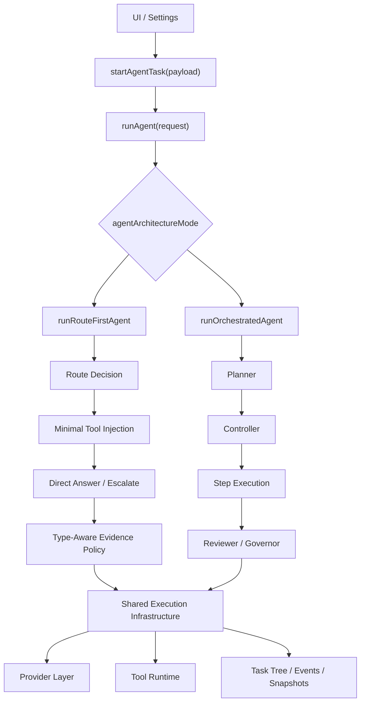
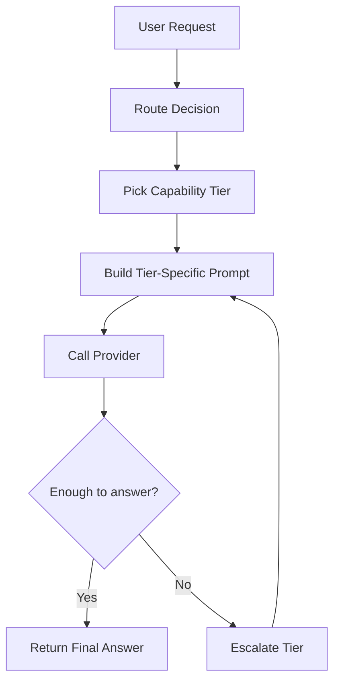
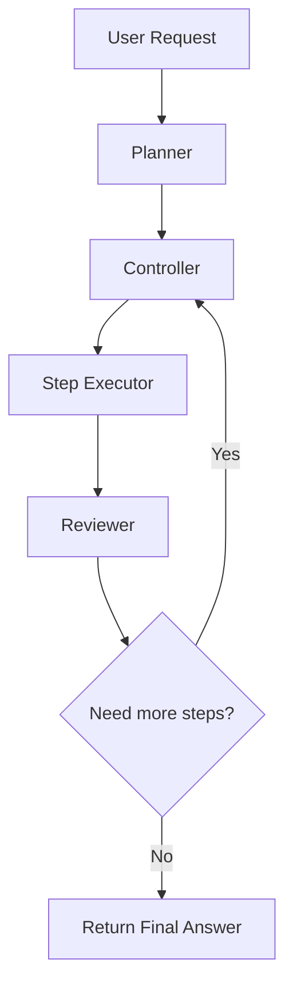

# Agent 双轨架构详设

本文档用于指导 Aura 后续把 Agent 执行体系演进为“双轨架构”：

- 默认模式：方案 A，对应“路由优先 / 最小工具注入”模式
- 可切换模式：方案 B，对应“规划-执行-审查”编排模式

目标不是同时维护两套互相缠绕的逻辑，而是在共享基础设施的前提下，明确拆分两条执行管线，降低工具误用、减少实现遗漏，并为后续灰度上线与实验切换提供稳定边界。

---

## 1. 设计目标

### 1.1 业务目标

1. 默认情况下显著减少“本可直接回答，却先去调工具”的行为。
2. 保留后续支持复杂多步任务、长链路任务和高确定性任务的能力。
3. 允许用户主动切换执行模式，但不要求两套模式在第一阶段功能完全对等。

### 1.2 工程目标

1. 两套模式共享底层执行基础设施，但不共享上层决策逻辑。
2. 模式切换必须是“入口级分流”，而不是在同一条流程里打很多条件分支。
3. UI、任务快照、日志、指标都能明确识别当前运行的是哪一种模式。
4. 方案 B 可以后补，但现在就要为它预留清晰接口，避免方案 A 落地后把架构锁死。

### 1.3 非目标

1. 本次详设不要求立刻重写 Provider 层。
2. 本次详设不要求立刻实现完整的 Planner JSON 协议。
3. 本次详设不要求一开始就让两种模式在所有任务上自动智能切换。

---

## 2. 当前实现的关键约束

当前主链路大致如下：

`MainWindowApp -> startAgentTask -> Tauri -> bridge/ipc.mjs -> runAgent -> selectTurnCapabilities -> buildSystemPrompt -> provider loop -> enforceEvidencePolicy`

现状里最关键的几个约束是：

1. `runAgent` 是单入口单流程，所有任务都走同一套工具选择、Prompt 拼装和 Provider loop。
2. `selectTurnCapabilities` 是全局工具暴露入口，当前按组暴露工具，只要 `score > 0` 就整组挂载。
3. `buildSystemPrompt` 主要按 settings 拼能力提示，而不是按“本轮真实挂载能力”拼。
4. Provider 调用阶段默认就是“工具已在场”的状态，OpenAI 兼容路径使用 `tool_choice: 'auto'`。
5. `enforceEvidencePolicy` 是全局后置策略，容易用执行型约束污染诊断型回答。

这意味着，如果直接把方案 B 的 planner / controller 逻辑零散塞进现有链路，很容易与方案 A 的工具暴露、Prompt 和证据策略互相干扰。

---

## 3. 设计原则

### 3.1 双轨不是“双倍复杂度”，而是“共享引擎 + 分离大脑”

建议按两层拆分：

- 共享执行基础设施
- 模式专属决策管线

共享执行基础设施负责：

1. 工具注册与调用
2. Provider 接入与流式输出处理
3. 审批、取消、追加输入
4. 任务树、消息快照、事件记录
5. MCP / Skill / Plugin 装载
6. 错误归一化与恢复

模式专属决策管线负责：

1. 意图理解
2. 工具暴露策略
3. Prompt 结构
4. 执行阶段划分
5. 证据策略
6. 停止条件与预算控制

### 3.2 入口级分流，避免过程内污染

正确做法：

`runAgent(request) -> resolveAgentMode(settings) -> runRouteFirstAgent(...) | runOrchestratedAgent(...)`

不建议的做法：

1. 在 `selectTurnCapabilities` 内大量写 `if (mode === 'B')`
2. 在同一个 `buildSystemPrompt` 中拼接两套互斥规则
3. 在同一个 provider loop 中既跑“直接回答”又跑“planner/controller”

### 3.3 默认模式优先保证速度与自然度

方案 A 是默认模式，因此架构优先级应为：

1. 减少误工具化
2. 减少 TTFT
3. 提高回答自然度
4. 在确有必要时再升级到更重的工具链

方案 B 应优先保证：

1. 复杂任务确定性
2. 多步骤任务可见性
3. 工具调用的可控性和可审查性

### 3.4 Prompt 瘦身，控制流显式化

本次重构的一个核心目标，是把过去为了修补问题而不断叠加到 Prompt 中的“限制词”系统性下沉到运行时代码中。

原则如下：

1. Prompt 保留最小必要规则：
   - 角色定位
   - 诚实原则
   - 输出风格
   - 当前任务目标
   - 当前真实可用能力摘要
2. Prompt 不再承担以下职责：
   - 路由决策
   - 工具授权
   - 预算控制
   - 完成态判定
3. 模型可以决定“在当前边界内怎么做”，但不能决定“自己拥有哪些边界”。

本次需要重点清理的旧式 Prompt 补丁包括但不限于：

1. 全局性的“优先使用 browser_*”
2. 全局性的“任何真实动作都必须先用工具”
3. 用 Prompt 强行替代运行时预算与升级条件的限制词

一句话原则：

**Prompt 变薄，运行时变强；让模型做决策，不让 Prompt 假装做控制器。**

---

## 4. 目标架构总览



---

## 5. 数据模型设计

### 5.1 设置层新增字段

在 `src/types.ts` 的 `AgentSettings` 中新增：

```ts
export type AgentArchitectureMode = 'route-first' | 'orchestrated'
```

并增加：

```ts
agentArchitectureMode: AgentArchitectureMode
```

建议默认值：

```ts
agentArchitectureMode: 'route-first'
```

原因：

1. 这是产品级运行模式，不属于 Provider 配置。
2. 应该和 `executionMode`、`memoryMode`、`reasoningEffort` 一样被视为 Agent 偏好。
3. 后续可以在设置页暴露，也可以支持每轮临时覆盖。

注意：

1. 不要复用现有 `executionMode` 字段承载双轨语义。
2. `executionMode` 当前更接近“任务时长 / 循环上限”偏好，而不是“决策架构”。
3. 如果复用旧字段，后续 UI、日志和兼容逻辑都会变得含混。

### 5.2 任务快照新增模式元数据

建议在 `AgentTaskSnapshot`、`ChatMessageVariant` 关联的运行时快照中增加：

```ts
agentMode?: AgentArchitectureMode
routeDecision?: {
  answerMode?: 'advise' | 'diagnose' | 'execute'
  capabilityTier?: 'none' | 'local-readonly' | 'local-write' | 'web-lookup' | 'browser-interactive'
}
planSummary?: {
  stepCount: number
  currentStep?: string
}
```

用途：

1. UI 能显示本轮到底运行的是哪种模式。
2. 排查日志时能看出方案 A 是在哪个层级升级了能力。
3. 方案 B 可以在不暴露完整 Planner JSON 的前提下，先展示可读摘要。

### 5.3 指标字段建议

建议后续指标埋点至少带上：

1. `agent_mode`
2. `route_answer_mode`
3. `route_capability_tier`
4. `first_response_used_tools`
5. `browser_tool_invoked`
6. `planner_generated`
7. `plan_revisions`
8. `task_completed_within_initial_tier`

### 5.4 能力可见性分层模型

为了避免“模型不知道有哪些能力”和“模型拥有过多能力决策权”这两个问题混在一起，建议把能力分成四层：

1. `installed`
   - 系统里已安装的 skill / plugin / mcp / tool 资产
   - 主要给设置页和资产管理使用
2. `enabled`
   - 用户在设置层启用的能力
   - 表示“允许参与候选”
3. `candidate`
   - 根据当前任务初筛后，认为可能相关的能力
4. `mounted`
   - 本轮真正挂给模型的能力集

模型应当知道的是：

1. 本轮 `mounted` 的 skill / plugin / mcp / tool
2. 当前能力层级
3. 当前是否允许写文件 / 跑命令 / 开浏览器
4. 当前预算和限制

模型不应当直接知道或直接使用的是：

1. 全部 `installed` 能力的完整世界模型
2. 未进入本轮上下文的高侵入能力
3. 未经系统授权的升级路径

因此正确原则不是“不让模型知道能力”，而是：

**系统先裁剪，再把裁剪后的真实能力边界暴露给模型。**

---

## 6. 模块拆分设计

### 6.1 建议新增或重构的 Runtime 模块

建议在 `bridge/` 下拆成如下职责：

1. `agent.mjs`
   仅保留统一入口、公共准备逻辑、模式分流。
2. `agentModes/routeFirst.mjs`
   方案 A 主流程。
3. `agentModes/orchestrated.mjs`
   方案 B 主流程。
4. `agentRouting.mjs`
   方案 A 的路由决策、能力分层、升级条件。
5. `agentPrompting.mjs`
   拆分公共 Prompt 片段与模式专属 Prompt builder。
6. `agentEvidence.mjs`
   拆分回答类型感知的证据策略。
7. `agentGovernor.mjs`
   统一放预算、停止条件、连续失败控制。
8. `agentPlanner.mjs`
   方案 B 的 Plan 协议与校验逻辑。

### 6.2 建议保留共享的模块

以下模块继续共享：

1. `providers.mjs`
2. `tools.mjs`
3. `advancedTools.mjs`
4. `browserRuntime.mjs`
5. `extensions.mjs`
6. `mcp.mjs`
7. `runtimeErrors.mjs`

但共享不代表不需要补接口。后续需要在共享层为上层模式提供“更精确的调用方式”，而不是让上层继续直接复用当前全局默认行为。

### 6.3 Tauri / IPC 层职责

Tauri / IPC 层在这次改造中的建议职责是“透传 + 快照保存”，而不是“参与模式决策”。

建议：

1. 前端把 `agentArchitectureMode` 放进 `settings` 后，继续通过现有 payload 传给 Runtime。
2. Rust 层负责保存任务快照中的 `agentMode`、`routeDecision`、`planSummary` 等元数据。
3. 模式选择、路由、Planner、证据策略都放在 Node Runtime 内部完成。

这样做的好处是：

1. 避免 Tauri 层也出现一份模式逻辑副本。
2. 后续切换 Provider 或 Runtime 细节时，桌面桥接层更稳定。
3. 出问题时，排查边界更清晰。

---

## 7. 方案 A 详设：Route-First 模式

### 7.1 目标

方案 A 的核心目标是：

1. 先判定“回答类型”和“能力层级”
2. 只注入当前层级所需的最小能力
3. 先争取直接回答
4. 在证据不足时逐级升级，而不是一开始就把所有重工具挂给模型

### 7.2 执行流程



### 7.3 路由输出

建议路由器输出至少包含两个维度：

1. 回答模式 `answerMode`
   - `advise`
   - `diagnose`
   - `execute`
2. 能力层级 `capabilityTier`
   - `none`
   - `local-readonly`
   - `local-write`
   - `web-lookup`
   - `browser-interactive`

建议实际运行时统一落成如下结构化状态：

```ts
type RouteState = {
  answerMode: 'advise' | 'diagnose' | 'execute'
  capabilityTier:
    | 'none'
    | 'local-readonly'
    | 'local-write'
    | 'web-lookup'
    | 'browser-interactive'
  allowEscalationTo: Array<'local-write' | 'web-lookup' | 'browser-interactive'>
  budgets: {
    searchesRemaining: number
    browserEscalationsRemaining: number
    writeEscalationsRemaining: number
  }
  mountedCapabilities: {
    skills: string[]
    plugins: string[]
    mcpServers: string[]
    tools: string[]
  }
  completionPolicy: {
    canClaimDone: boolean
    requiresEvidenceForDone: boolean
  }
}
```

这个对象的意义是：

1. 模型不直接面对一堆散落规则，而是面对一个已经被系统收敛好的运行时边界。
2. 运行时可以解释“为什么本轮没挂浏览器”“为什么不能升级写文件”“为什么还剩 0 次搜索预算”。
3. UI、日志、指标都能围绕这个状态做展示与追踪。

### 7.4 能力层级定义

#### Tier 0: `none`

适用：

1. 常见概念问答
2. 代码思路解释
3. Git 报错含义解释
4. 明显不需要环境验证的诊断型问题

挂载：

1. 不挂工具
2. 或只挂极少量不会诱发真实动作的文本能力

#### Tier 1: `local-readonly`

适用：

1. 需要读取仓库文件分析
2. 需要查看 Git 状态 / diff / 错误输出
3. Review、诊断、定位问题

挂载：

1. 文件读取
2. 代码搜索
3. shell 只读命令
4. Git 只读能力

#### Tier 2: `local-write`

适用：

1. 真正要改代码
2. 真正要执行命令修复
3. 真正要修改配置

挂载：

1. Tier 1 全部
2. 文件写入
3. 可写 shell
4. 必要时审批链路

#### Tier 3: `web-lookup`

适用：

1. 需要最新信息
2. 需要联网查官方文档
3. 需要外部事实验证

挂载：

1. 搜索型网页能力
2. 不默认暴露网页交互型能力

#### Tier 4: `browser-interactive`

适用：

1. 必须真实打开网页、点击、输入
2. 必须处理登录、阻塞、接管

挂载：

1. 完整 browser runtime 能力
2. 可选 Chrome automation fallback

### 7.5 路由器实现建议

建议把当前 `inferTaskSignals` + `taskNeedsExecution` 的逻辑升级为：

1. 第一层：高置信规则
   - 是否明确要求“帮我修改 / 帮我执行 / 帮我安装”
   - 是否明确要求“帮我分析 / 看看为什么 / 解释一下”
   - 是否明确要求“查询最新 / 今天 / 当前 / 新闻 / 价格”
2. 第二层：轻量语义分类
   - 可先使用启发式
   - 预留后续接小模型分类器接口
3. 第三层：保守降级
   - 不确定时优先低层级能力，而不是直接升到浏览器

这里的关键不是“全靠死规则”或“完全放权给模型”，而是：

1. 输入层
   - 用户消息
   - 当前 workspace / 会话上下文
   - settings
   - 已启用能力
   - 历史工具结果
   - 预算消耗
2. 判定层
   - 一部分用确定性规则
   - 一部分可用轻量分类器或小模型
   - 最终必须落成结构化字段，而不是只保留一段自由文本
3. 执行层
   - 系统按结构化结果挂载能力、设置预算、控制升级
   - 模型只在给定边界内选择动作

### 7.6 升级条件

只有满足下列条件之一才允许升级层级：

1. 模型明确表示缺少本地上下文
2. 用户请求里包含明显的执行动作
3. 问题涉及最新事实，内部知识可能过期
4. 当前层级工具执行后仍无法完成用户目标

### 7.7 停止条件

方案 A 必须显式定义停止条件，避免升级后无限游走：

1. 已形成可交付回答
2. 已完成请求的真实执行并拿到证据
3. 新一层级没有提供增量信息
4. 达到预算上限

### 7.8 证据策略

方案 A 下的证据策略必须改为“类型感知”：

1. `advise` / `diagnose`
   - 不要求工具证据
   - 只禁止谎称“已经修复”
2. `execute`
   - 必须有工具证据才允许说已完成

### 7.9 Prompt 设计

方案 A 的 Prompt 由三部分组成：

1. 公共基础规则
2. 当前层级能力说明
3. 当前回答模式约束

例如：

- `diagnose + local-readonly`
  强调“优先分析原因，不要声称已修改”
- `execute + local-write`
  强调“可以执行，但必须验证后再确认完成”
- `advise + none`
  强调“先直接回答，除非明确缺乏事实”

### 7.10 运行时关键决策如何计算

以下五类边界决策必须由系统先计算，再暴露结果给模型，而不是交给模型自由决定。

#### 7.10.1 本轮到底挂不挂 `browser_*`

计算原则：

1. 先看任务类型
   - 本地诊断、Git 报错、代码解释：默认不挂浏览器
   - 最新事实、官方文档、价格新闻：允许 `web-lookup`
   - 明确网页操作、登录、点击、表单：才允许 `browser-interactive`
2. 再看本地上下文是否足够
   - 如果当前 workspace、报错信息、代码上下文已经足够回答，则不挂浏览器
3. 再看用户是否明确要求
   - 用户显式说“去官网查一下”“打开这个页面”时，提高网页能力优先级
4. 最后看设置和预算
   - 浏览器被禁用、运行时不可用、预算耗尽时，不挂浏览器

建议决策结果：

1. `advise/diagnose + 本地问题` -> 不挂 `browser_*`
2. `advise/diagnose + 最新外部事实` -> 仅挂搜索型网页能力
3. `execute + 明确网页操作目标` -> 挂完整 `browser_*`

#### 7.10.2 是否允许从 `local-readonly` 升到 `local-write`

计算原则：

1. 先看用户目标
   - “帮我分析 / 看看原因” -> 默认不允许升级写
   - “帮我直接修 / 帮我改掉” -> 可允许升级写
2. 再看当前层结果
   - 只读层已足够完成用户目标，则不升级
   - 只读层明确发现“必须改文件或执行命令”才能继续，才升级
3. 再看风险与前置条件
   - 没有工作区
   - 没有审批能力
   - 修改范围不明确
   这些都应阻止升级

建议规则：

1. `answerMode === 'execute'` 时，才默认允许进入 `local-write`
2. `answerMode === 'diagnose'` 时，通常保持只读，除非用户追加确认
3. 只读工具可以返回结构化提示，如：
   - `requiresWrite=true`
   - `writeTargetHints=[...]`
   再由系统决定是否升级

#### 7.10.3 是否还有一次搜索预算

这项应完全由系统按状态累计：

1. 初始化预算
   - 标准模式默认 `searchesRemaining = 1`
   - 编排模式或复杂任务可更高
2. 每次调用搜索型能力时扣减
3. 即使搜索没有带来有效增量，也应扣减
4. 预算耗尽后：
   - 不再挂搜索工具
   - 或执行时直接拒绝并要求收束回答

建议预算分类：

1. `search`
2. `browserInteractive`
3. `writeEscalation`
4. `planRevision`

不要只用一个总步数覆盖所有能力类别。

#### 7.10.4 某个 plugin / skill 是否应该进本轮上下文

这项不看“装没装”，而看“对当前任务是否相关”。

建议分两步：

第一步：候选能力筛选

1. 只从 `enabled` 能力中选
2. 基于元数据初筛：
   - 名称
   - description
   - keywords
   - allowedTools
   - 作用域限制

第二步：候选能力打分

1. 显式命中最高优先
   - 用户直接点名 skill / plugin
2. 语义相关性次之
   - 用户请求文本与 capability keywords 的匹配程度
3. 任务类型加权
   - Git 任务给 Git 相关能力加权
   - Review 任务给审查相关能力加权
   - 浏览器任务给网页相关能力加权
4. 风险降权
   - 高侵入能力在 `advise/diagnose` 模式下默认降权
   - 重工具默认降权

最后只取 Top-K 的 `mounted` 能力给模型，不应把所有已安装能力全塞进上下文。

#### 7.10.5 最终能不能宣称“已经修复 / 已经完成”

这项必须由系统判定，不能完全交给模型。

计算原则：

1. 先看任务类型
   - `advise/diagnose` 默认不能宣称“已修复”
2. 再看是否发生真实执行
   - 是否有写文件、命令执行、浏览器真实操作
3. 再看是否有成功证据
   - 文件 diff
   - 命令成功返回
   - 测试通过
   - 页面状态符合预期
4. 再看是否满足完成条件
   - 不同任务可定义不同的完成信号

建议规则：

1. `advise/diagnose` -> 永远不能 `claim done`
2. `execute + 无工具证据` -> 不能 `claim done`
3. `execute + 有操作证据但无验证` -> 只能说“已做修改，待进一步验证”
4. `execute + 有操作证据 + 有验证证据` -> 才能说“已完成”

系统可以允许模型参与“倾向判断”，但最终必须把该判断收编为结构化完成策略，再决定是否放行最终措辞。

---

## 8. 方案 B 详设：Orchestrated 模式

### 8.1 目标

方案 B 用于复杂多步任务，不追求最低 TTFT，而追求：

1. 可分阶段控制
2. 可审查工具决策
3. 高确定性

### 8.2 执行流程



### 8.3 Plan 协议建议

Planner 输出建议至少包含：

1. `goal`
2. `steps[]`
3. `steps[i].type`
   - `answer`
   - `inspect`
   - `modify`
   - `research`
   - `browser_interaction`
4. `steps[i].requiredCapabilityTier`
5. `steps[i].stopCondition`
6. `steps[i].successSignal`

第一阶段无需让 UI 展示完整 JSON，只需内部校验并记录摘要。

### 8.4 Controller 职责

Controller 负责：

1. 校验 Plan 是否合理
2. 对每步注入最小工具集
3. 控制步与步之间的状态迁移
4. 根据 Reviewer 结果决定是否继续执行

### 8.5 Reviewer / Governor

Reviewer 负责判断：

1. 当前步骤是否完成
2. 工具输出是否真的推进了目标
3. 是否需要修订后续计划

Governor 负责：

1. 限制最大步数
2. 限制连续失败
3. 限制同类工具重复调用
4. 达到预算后强制收束

### 8.6 为什么 B 不应该直接复用 A 的路由器

A 的路由器解决的是“首轮最小能力注入”问题。  
B 的 Planner 解决的是“多步编排和阶段控制”问题。

两者可共享部分能力层级定义，但不应共享主控制权：

1. A 是单轮逐级升级
2. B 是计划驱动的多轮分步执行

---

## 9. 共享层与隔离层边界

### 9.1 必须共享的内容

1. 工具定义与调用
2. Provider 流式适配
3. 审批链路
4. 任务树 / 事件 / phase 输出
5. 错误归一化
6. 能力资产装载

### 9.2 必须隔离的内容

1. 工具选择策略
2. Prompt builder
3. 证据策略
4. 阶段推进逻辑
5. 停止条件

### 9.3 最危险的串逻辑点

后续实现时要重点防止以下五处串逻辑：

1. `selectTurnCapabilities`
   - 不要继续作为两种模式唯一的工具暴露入口。
2. `buildSystemPrompt`
   - 不要继续承担两种模式的完整 Prompt 组装。
3. `enforceEvidencePolicy`
   - 不要继续作为全局统一后处理。
4. Provider loop
   - 不能默认假设所有模式都应该“带工具直接开跑”。
5. UI phase 文案
   - 不能只显示“模型连接中 / 工具执行中”，还要体现当前模式。

---

## 10. 前端与设置设计

### 10.1 设置页

建议在设置页“Agent 行为”相关区域新增：

1. 标准模式（默认）
   - 更快，适合日常问答和编码协助
2. 编排模式（实验性）
   - 更稳，适合复杂多步任务

原因：

1. 面向用户的命名应避免暴露“方案 A / 方案 B”。
2. 模式名称应描述体验差异，而不是实现方式。

### 10.2 主窗口展示

主窗口建议增加以下展示信息：

1. 本轮模式标签
   - `标准模式`
   - `编排模式`
2. 方案 A 可展示能力层级
   - `无工具`
   - `本地只读`
   - `本地可写`
   - `网页查询`
   - `浏览器交互`
3. 方案 B 可展示计划摘要
   - 当前步骤数
   - 当前执行步骤

### 10.3 每轮覆盖能力

后续可选增强：

1. 设置页提供默认模式
2. Chat 输入区或更多菜单支持“本轮改用编排模式”

这样用户不必每次去设置页切换全局偏好。

---

## 11. 任务 Phase 设计

### 11.1 方案 A 建议 Phase

1. `preparing`
2. `routing`
3. `model_connecting`
4. `model_streaming`
5. `tier_escalating`
6. `tool_running`
7. `finalizing`
8. `recovering`

### 11.2 方案 B 建议 Phase

1. `preparing`
2. `planning`
3. `plan_review`
4. `step_executing`
5. `step_reviewing`
6. `tool_running`
7. `finalizing`
8. `recovering`

说明：

当前 `AgentExecutionPhase` 可继续复用已有字段，但建议后续扩展枚举，避免 UI 只能显示笼统状态。

---

## 12. 预算与治理策略

### 12.1 方案 A 预算

建议默认预算：

1. 外部搜索不超过 1 次
2. 浏览器交互升级不超过 1 次
3. 单轮层级升级不超过 2 次
4. 同类失败不超过 2 次

### 12.2 方案 B 预算

建议默认预算：

1. Plan 步数不超过 5 步
2. 单步计划修订不超过 1 次
3. 同类工具连续失败不超过 2 次
4. 总工具步数不超过设置中的 `maxSteps`

---

## 13. 实施分期

### Phase 0：接口预埋

目标：

1. 增加 `agentArchitectureMode`
2. 任务快照带上 `agentMode`
3. `runAgent` 支持模式分流骨架
4. Tauri / IPC 只做字段透传与快照存储补强

不做：

1. 不改现有执行语义
2. 不开放 B 给用户

### Phase 1：落地方案 A

目标：

1. 拆出 `runRouteFirstAgent`
2. 实现路由输出、能力层级、类型感知证据策略
3. Prompt 改成按本轮真实能力拼装
4. 增加基础预算与停止条件

上线策略：

1. 默认启用
2. 保留旧逻辑兜底开关，便于回滚

### Phase 2：为方案 B 预埋 Planner 基础设施

目标：

1. 新增 `runOrchestratedAgent`
2. 先打通 Planner -> Controller -> 单步执行骨架
3. 隐藏在实验开关后

### Phase 3：开放编排模式试用

目标：

1. 设置页开放切换
2. UI 展示计划摘要
3. 打通指标对比

---

## 14. 文件级改造建议

### 14.1 第一批改造文件

1. `src/types.ts`
   - 新增模式类型、快照元数据
2. `src/lib/storage.ts`
   - 持久化默认值、归一化逻辑
3. `src/SettingsWindowApp.tsx`
   - 新增模式切换 UI
4. `src/MainWindowApp.tsx`
   - 启动任务时带上模式
5. `bridge/agent.mjs`
   - 入口分流
6. `src/lib/agent.ts`
   - 保持 payload 透传
7. `src-tauri/src/main.rs`
   - 快照字段透传与保存，避免参与模式决策

### 14.2 第二批改造文件

1. `bridge/agentModes/routeFirst.mjs`
2. `bridge/agentRouting.mjs`
3. `bridge/agentPrompting.mjs`
4. `bridge/agentEvidence.mjs`
5. `bridge/agentGovernor.mjs`

### 14.3 第三批改造文件

1. `bridge/agentModes/orchestrated.mjs`
2. `bridge/agentPlanner.mjs`
3. `src/views/ChatView.tsx`
   - 展示模式、层级或计划摘要

---

## 15. 验收标准

### 15.1 方案 A 验收

1. 常见 Git / 编程问答任务的首答工具调用率明显下降。
2. 不涉及最新信息的问题，不应无故打开浏览器。
3. 诊断型问题可以直接给解释，不会被证据策略误拦截。
4. 执行型问题仍然必须有真实工具证据才能宣称完成。

### 15.2 方案 B 验收

1. 能正确生成并执行多步计划。
2. 不会因沿用 A 的工具暴露逻辑而在计划外调用重工具。
3. UI 能明确展示当前处于计划、执行还是审查阶段。

---

## 16. 风险清单

1. 如果把模式差异只做成 Prompt 差异，而不做控制流分离，后续一定会串逻辑。
2. 如果继续让 `selectTurnCapabilities` 成为唯一暴露入口，方案 A 和 B 都会受制于旧的工具组打分模型。
3. 如果不把模式写入任务快照和指标，后续很难评估哪种模式真的更好。
4. 如果设置页只提供全局切换，不支持后续每轮覆盖，用户体验会偏重。
5. 如果方案 B 提前暴露给普通用户，而没有预算和 governor，很容易把问题复杂化。

---

## 17. 实施建议结论

建议采用如下落地路线：

1. 先做模式字段、入口分流和快照补强。
2. 优先落地方案 A，作为新的默认标准模式。
3. 方案 B 先以实验模式存在，只开放骨架和内部测试。
4. 只有当模式边界、指标和 UI 展示都稳定后，再正式开放双轨切换。

一句话总结：

**双轨共存是合适的，但前提是“共享底层，分离控制流”；否则不是双轨，而是两套规则互相污染。**
