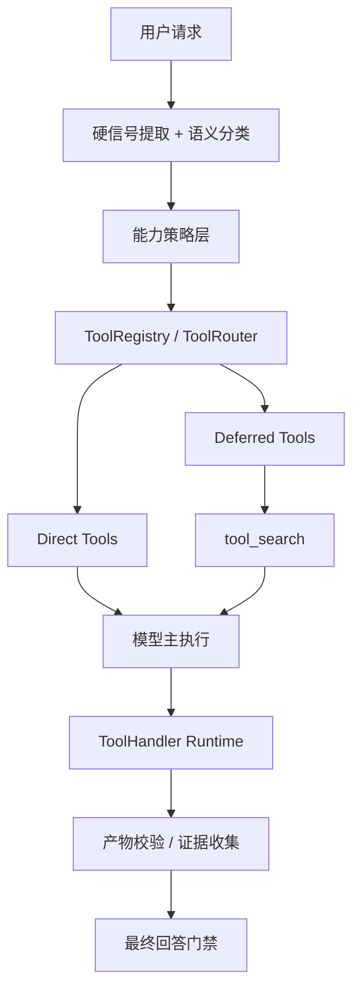

# Agent 重构蓝图（对标 Codex 的能力补齐方案）

> 状态：详细设计稿 v1
> 日期：2026-04-23
> 范围：`bridge/agent.mjs`、`bridge/agentRouting.mjs`、`bridge/capabilitySelector.mjs`、`bridge/tools.mjs`、`bridge/agentEvidence.mjs`、`bridge/webTools.mjs`、`bridge/intentClassifier.mjs`、插件与 MCP 接入链路

---

## 1. 设计结论

这次重构的核心目标不是继续修补关键字路由，而是把 Aura Agent 从“路由优先、词表驱动、工具分层暴露”升级为“能力优先、语义驱动、统一工具注册与执行”的架构。

一句话概括：

> 模型负责理解任务语义，系统负责构造可用能力、执行工具、验证产物、控制权限与性能。

本次建议采用的总体方向是：

1. 保留少量硬规则，只处理安全边界和明确的交互边界。
2. 去掉大部分“先按关键字把任务判成某个 tier，再挂对应工具”的做法。
3. 引入统一的 `ToolRegistry / ToolRouter / ToolHandler` 架构。
4. 引入 `direct tools + deferred tools + tool_search` 机制，避免一次性把全部工具塞给模型。
5. 把“写成功了吗”“文档真的落盘了吗”“代码真的改到了吗”从 prompt 约束升级为运行时硬校验。
6. 把文件编辑能力升级为补丁式编辑，而不是继续以精确字符串替换为主。
7. 把性能优化纳入主设计，而不是等功能做完再补。

---

## 2. 当前问题总览

### 2.1 当前主链路

Aura 当前主链路大致是：

1. `intentClassifier.mjs` 输出语义分类
2. `agentRouting.mjs` 基于分类结果和硬信号推导 `routeState`
3. `filterToolsForRouteState()` 按 `capabilityTier` 裁剪工具
4. `capabilitySelector.mjs` 再按关键字和 group 打分选 skill / tool
5. `agentPrompting.mjs` 把 route 结果写回 prompt
6. 主 Agent 执行

这条链路已经比纯关键字匹配好，但本质上仍然是：

> 先决定“这轮允许看见什么工具”，再让模型在一个被强裁剪后的工具集合里行动。

### 2.2 当前相对 Codex 的核心差距

#### 差距一：工具暴露方式仍然是“路由裁剪”，不是“能力注册”

当前 `agentRouting.mjs` 会先生成 `capabilityTier`，再用 `filterToolsForRouteState()` 物理裁剪工具集合。

这意味着：

1. 工具可见性高度依赖前置分类质量。
2. 一旦分类偏了，模型根本看不到正确工具。
3. Web、文件、插件、MCP 的暴露规则都被捆绑到同一套路由逻辑里。

Codex 的做法是：

1. 先构造工具注册表
2. 再把当前会话可见的工具 spec 直接给模型
3. 运行时再按 handler、权限、延迟加载和审批策略执行

差异本质：

> 我们现在是“先判桶再给工具”；Codex 更像“先给能力，再由模型选择工具，系统兜底执行”。

#### 差距二：仍然存在大量关键字驱动的二次判断

虽然现在已经有意图分类器，但：

1. `agentRouting.mjs` 仍保留大量关键词和硬编码 tier 逻辑
2. `capabilitySelector.mjs` 仍然通过 `isResearchTask / isBrowserTask / isEditingTask` 等关键词再次打分
3. skill 和 tool group 的选择仍然依赖字符串包含关系

这会导致：

1. 路由和能力选择重复判断
2. 词表维护成本不断膨胀
3. 上下文语义一复杂就容易误判

#### 差距三：缺少统一的 Tool Registry / Tool Router / Tool Handler

当前工具更多是“平铺数组 + 局部筛选”模式。

缺少：

1. 统一的工具注册表
2. 工具 spec 与 handler 的显式绑定
3. 工具并行能力声明
4. 工具命名空间管理
5. direct/deferred 工具的统一表示

这会让后续接更多插件、MCP、Lightpanda 内部工具、系统浏览器、automation 时越来越乱。

#### 差距四：没有 deferred tools 和 `tool_search`

当前只要工具挂上来，模型就要么看得到，要么看不到。

缺少：

1. 延迟暴露工具
2. 工具元数据检索
3. 按需加载工具
4. 大规模 MCP / plugin / dynamic tools 的 discoverability 机制

Codex 的 `tool_search` 很关键：

1. 不需要把所有工具一开始都塞给模型
2. 工具量大时仍能保持 prompt 干净
3. 模型可以先理解任务，再找工具，而不是先被海量工具淹没

#### 差距五：执行成功与否缺少确定性验收

当前 `write_file` 直接返回一段字符串，`agentEvidence.mjs` 只把它记成 `file_mutation`。

缺少：

1. 写文件后的 read-back 校验
2. 产物存在性确认
3. 文件 hash / bytes / created/updated 状态
4. “这轮必须产出文件”的硬门槛
5. 最终回答前的 deterministic completion gate

所以现在很容易出现：

1. 回答说“已经写好了”
2. 实际目录下没有文件
3. 或者路径不对、写到别处、写失败但没被阻止

#### 差距六：文件编辑工具太弱

当前主要写入工具是：

1. `write_file`
2. `edit_file`
3. `multi_edit_file`

其中 `edit_file` / `multi_edit_file` 主要依赖“精确 oldText 替换”。

这会带来几个问题：

1. 模型必须先把原文读得很准
2. 大文件和重复片段很容易失败
3. 代码改动速度慢
4. 容易反复读文件、反复尝试

相对 Codex 的 `apply_patch`，我们的文件编辑能力明显偏弱。

#### 差距七：prompt 承担了太多系统控制职责

当前 prompt 里已经写了大量 route、budget、tool-use 建议。

这并不是坏事，但问题在于：

1. 很多行为约束只存在于 prompt
2. 一旦模型偏离，就只能靠提示词“劝”
3. 缺少运行时硬拦截

应该由系统代码决定的事情包括：

1. 是否允许声称完成
2. 是否允许某类工具
3. 是否需要审批
4. 是否必须验证文件产物

这些不能只靠 prompt。

#### 差距八：插件与 MCP 的可用性建模不够成熟

当前 plugin / MCP 工具的接入更多是“当作普通工具一起筛选”。

缺少：

1. 命名空间级别的分层
2. tool metadata 检索
3. discoverable tools 与 currently mounted tools 的区分
4. 缺失能力时的 suggest / enable / install 流程

这导致：

1. 插件越多，工具选择越乱
2. 模型要么看不到工具，要么看到太多工具
3. 缺少可解释的能力发现路径

#### 差距九：性能路径没有被显式设计

当前慢的原因不只是模型本身：

1. 每轮前置分类
2. route 推导
3. capabilitySelector 再打分
4. prompt 拼接复杂
5. 工具数组大时筛选和解释成本高
6. 写文件和编辑经常需要多次尝试

这意味着：

> 现在的慢，既有“判断链太长”的问题，也有“工具执行质量太低导致反复补救”的问题。

---

## 3. 对标 Codex 应该学什么，不该照搬什么

### 3.1 应该吸收的能力

应该吸收：

1. 统一工具注册与路由
2. 工具 spec 与 handler 分离
3. deferred tool exposure
4. `tool_search` 按需发现工具
5. handler 级运行时执行
6. 明确的并行能力声明
7. 强运行时校验，而不是把约束放在 prompt
8. 更强的补丁式文件编辑能力

### 3.2 不该照搬的部分

不建议直接照搬：

1. 所有工具一律完全模型自决
2. 对我们产品边界不重要的重型 code-mode 体系
3. 过于复杂的通用化抽象

因为 Aura 仍有自己的产品边界：

1. 明确区分 `Lightpanda 信息获取` 与 `系统浏览器交互`
2. 明确区分 `lookup` 与 `browser-interactive`
3. 明确保留本地工作区安全边界
4. 明确保留用户审批语义

所以我们应该做的是：

> 采用 Codex 的“能力架构思想”，但保留 Aura 的产品边界和交互模型。

---

## 4. 目标架构

### 4.1 总体分层

目标架构建议拆成六层：

1. `Intent Layer`
   只做语义分类和硬信号提取，不直接裁工具。
2. `Capability Policy Layer`
   只决定安全边界、审批边界、交互边界、产物要求。
3. `Tool Registry Layer`
   注册当前会话可用的 direct tools、deferred tools、tool handlers。
4. `Tool Discovery Layer`
   为 deferred tools 提供 `tool_search`。
5. `Execution Runtime Layer`
   负责 handler 执行、并行控制、审批、错误归因、产物验收。
6. `Completion & Evidence Layer`
   决定什么叫“完成”，什么时候允许说 done。

### 4.2 目标执行流



### 4.3 关键原则

#### 原则一：分类器只输出语义信号

分类器不再负责：

1. 选工具
2. 定 route tier
3. 算预算
4. 决定是否已完成

分类器只输出：

1. `answerMode`
2. `needsExternalFacts`
3. `webInteractionRequired`
4. `workspaceRelated`
5. `isCapabilityAdmin`
6. `taskComplexity`
7. `planDepth`
8. `confidence`

#### 原则二：route 不再主导普通工具暴露

未来 route 只该决定强边界：

1. 是否允许写文件
2. 是否允许系统浏览器交互
3. 是否允许 capability admin
4. 是否需要审批

而不该再决定：

1. `web_search` 能不能见
2. `read_file` 能不能见
3. 某个 plugin / MCP tool group 能不能见

#### 原则三：tool 可见性应以能力为中心

工具分三类：

1. `core direct tools`
   例如 `read_file`、`search_code`、`list_files`、`web_search`、`web_fetch`
2. `privileged direct tools`
   例如 `write_file`、`apply_patch`、`run_shell`、`system_browser_open`
3. `deferred tools`
   例如 plugin、MCP、dynamic tools、某些低频高级能力

#### 原则四：写操作必须通过验收门

凡是用户显式要求“产出文件、改代码、落地文档、生成结果”，都必须：

1. 有真实工具调用
2. 有明确的目标路径
3. 有 read-back 或 stat 校验
4. 通过 completion gate 后才能说完成

---

## 5. 目标能力矩阵

| 能力域 | 当前状态 | 目标状态 |
| --- | --- | --- |
| 意图理解 | 语义分类 + 关键词补丁 | 语义分类 + 硬信号，去除大部分二次关键词判断 |
| 工具暴露 | route 先裁工具 | ToolRegistry 按能力构造工具集 |
| 工具发现 | 无 deferred discovery | 支持 `tool_search` 按需发现工具 |
| 插件 / MCP | 平铺混入工具列表 | direct / deferred / discoverable 分层 |
| 文件写入验收 | 仅记 `file_mutation` | `file_verified`、read-back、hash、bytes |
| 文件编辑 | 精确字符串替换 | 补丁式编辑为主，精确替换为辅 |
| 完成态控制 | prompt 约束为主 | runtime completion gate 为主 |
| 浏览器能力 | 已简化，但路由仍较硬 | Lightpanda lookup 与系统浏览器交互彻底分层 |
| 性能 | 分类、筛选、执行多次重复 | 减少前置判断和失败重试，缓存工具索引 |

---

## 6. 核心重构方案

### 6.1 方案一：重构 `routeState` 的职责

当前 `routeState` 过于臃肿，同时承担：

1. 能力 tier
2. 工具裁剪
3. 搜索预算
4. 浏览器升级
5. 写入升级
6. 完成策略

重构后建议：

#### 保留的字段

1. `answerMode`
2. `needsExternalFacts`
3. `webInteractionRequired`
4. `workspaceRelated`
5. `isCapabilityAdminTask`
6. `explicitSystemBrowserRequest`
7. `researchMode`

#### 下放到 Capability Policy 的字段

1. `allowWrite`
2. `allowBrowserInteraction`
3. `allowCapabilityAdmin`
4. `requiresApproval`
5. `requiresArtifactVerification`

#### 下放到 Runtime 的字段

1. `searchBudget`
2. `escalationBudget`
3. `completionPolicy`

也就是说，`routeState` 不再是“大总管”，而是语义与边界快照。

### 6.2 方案二：引入 Tool Registry

新增建议文件：

1. `bridge/toolRegistry.mjs`
2. `bridge/toolRouter.mjs`
3. `bridge/toolDiscovery.mjs`
4. `bridge/toolHandlers/`

职责拆分：

#### `toolRegistry.mjs`

负责：

1. 根据 settings、已启用插件、MCP、dynamic tools 注册工具
2. 生成 `directTools`
3. 生成 `deferredTools`
4. 生成 `discoverableTools`

#### `toolRouter.mjs`

负责：

1. 产出当前回合模型可见的 `modelVisibleTools`
2. 把 tool name 解析到 handler
3. 决定哪些工具支持并行
4. 处理 direct tool 与 deferred tool 的命名空间

#### `toolDiscovery.mjs`

负责：

1. 为 deferred tools 建工具索引
2. 提供 `tool_search`
3. 返回需要注入下一轮的 loadable specs

### 6.3 方案三：引入 `tool_search`

新增内置工具：

1. `tool_search`

用途：

1. 当 plugin / MCP / dynamic tools 规模变大时，不要提前全挂载
2. 模型先理解任务，再按 query 找工具
3. 统一处理“当前有很多工具，但不应全部暴露”的问题

建议第一阶段接入范围：

1. plugin tools
2. MCP tools
3. 后续可扩展到部分高级内置工具

不建议第一阶段 deferred 的工具：

1. `read_file`
2. `search_code`
3. `web_search`
4. `web_fetch`
5. `system_browser_open`
6. `write_file`

这些仍应作为 direct tools 存在。

### 6.4 方案四：升级文件编辑能力

新增建议文件：

1. `bridge/patchTool.mjs`
2. `bridge/fileVerification.mjs`

建议新增内置工具：

1. `apply_patch`

目标：

1. 大多数代码编辑走 patch
2. `edit_file` 保留为兼容工具
3. `write_file` 主要用于新建或整体落文档

工具策略建议：

1. 新建文件 -> `write_file`
2. 小型精确替换 -> `edit_file`
3. 中大型代码改造 -> `apply_patch`

### 6.5 方案五：引入文件产物验收

新增证据类型：

1. `file_verified`
2. `artifact_present`
3. `artifact_hash_recorded`

执行规则：

1. `write_file` 完成后自动 `stat + read back`
2. `apply_patch` 完成后自动确认目标文件存在且可读
3. 用户明确要求输出文件时，若没有 `file_verified`，最终回答禁止使用“已完成”

建议把工具返回值结构化：

```json
{
  "path": "docs/agent_refactor_blueprint.md",
  "bytes": 12345,
  "sha256": "xxx",
  "created": true,
  "updated": false,
  "verified": true
}
```

### 6.6 方案六：引入 Completion Gate

新增建议文件：

1. `bridge/completionGate.mjs`

职责：

1. 读取 route / policy / toolEvents / evidence
2. 判断本轮是否允许声称完成
3. 若不允许，则对最终回答进行硬拦截或重写

核心规则：

1. 用户要求写文件，但没有 `file_verified` -> 不能说完成
2. 用户要求改代码，但没有真实写入工具事件 -> 不能说完成
3. 用户要求执行命令，但没有命令结果 -> 不能说完成
4. 用户要求打开系统浏览器，但没有 `system_browser_open` 成功事件 -> 不能说完成

### 6.7 方案七：重构 capabilitySelector

`capabilitySelector.mjs` 当前仍强依赖关键词与 group score。

建议改成：

1. 直接消费 `ToolRegistry` 产出的 direct / deferred 工具
2. skill 选择保留轻量打分，但减少关键词权重
3. tool group 不再主导工具可见性，只参与排序和 prompt 压缩

也就是说：

> `capabilitySelector` 应从“工具裁判”退化成“能力排序器”。

### 6.8 方案八：统一 plugin / MCP 暴露模型

建议统一三种状态：

1. `mounted`
   当前直接挂给模型的工具
2. `deferred`
   可通过 `tool_search` 找到的工具
3. `discoverable`
   当前未启用，但系统知道可以提示启用/安装的工具

这能自然衔接未来的：

1. `tool_suggest`
2. 插件启用引导
3. MCP server 按需暴露

### 6.9 方案九：性能重构

性能优化建议与功能重构同时进行。

建议重点优化：

1. 明确任务跳过远程意图分类
   - 例如明确的“写文档到 `docs/x.md`”
2. 减少 `capabilitySelector` 的二次大规模字符串打分
3. 缓存 plugin / MCP tool metadata 索引
4. 缓存 `tool_search` 的 BM25 或倒排索引
5. 写任务优先给 patch/edit 路径，减少反复失败
6. completion finalizer 只在需要时运行

### 6.10 方案十：统一本地检索 Runtime

这部分是本蓝图下的专项子设计，不单独另起一套总方案。

目标不是复制 Codex 的 provider-native `web_search` 基础设施，而是：

> 在“搜索与网页读取必须本地完成”的前提下，把 Aura 的信息获取能力重构成统一的 Retrieval Runtime，让模型的使用体验尽量接近“在调用一组稳定的检索工具”，而不是面对一堆分裂的底层实现。

核心原则：

1. 检索能力作为普通 direct tools 暴露，不再依赖 route 关键词漏判才能拿到
2. 后端实现细节不暴露给模型，由 runtime 自己选择 provider、fetch、Lightpanda
3. 信息获取失败即失败，不自动升级到系统浏览器
4. 系统浏览器只服务显式交互任务，不承担“查资料 fallback”
5. 检索结果、失败原因、来源信息都结构化返回

建议能力边界：

1. `web_search / web_fetch / web_research` 在第一阶段继续保留现有对外名字
2. 在运行时内部统一收口到 `retrievalRuntime`
3. `Lightpanda` 作为读取型 backend，不直接暴露为“浏览器工具”
4. `system_browser_open` 只在明确浏览器交互任务中可见

建议新增文件：

1. `bridge/retrievalRuntime.mjs`
2. `bridge/retrievalProviders/README.md`

建议内部执行链：

1. 搜索任务
   - 优先 search provider / API
   - 再试现有搜索 fallback
2. URL 读取任务
   - 优先 direct fetch / readability / provider content
   - 再试 `Lightpanda`
3. 仍失败
   - 返回结构化失败，不再自动拉起系统浏览器

运行时要求：

1. 支持统一代理策略
2. 支持按域名 cooldown / failure memory
3. 支持并发读取池
4. 支持来源与 backend 记录，便于证据层和调试

与主蓝图的关系：

1. 它依赖 `ToolRegistry / ToolRouter` 成为统一工具供给入口
2. 它不依赖 `tool_search` 才能开始落地
3. 它应在 route 精简前完成，以便用新的检索链替换旧 research 分支
4. 它属于 Agent 总重构中的一个 phase，而不是独立工程

---

## 7. 文件级改造清单

### 7.1 新增文件

建议新增：

1. `bridge/toolRegistry.mjs`
2. `bridge/toolRouter.mjs`
3. `bridge/toolDiscovery.mjs`
4. `bridge/completionGate.mjs`
5. `bridge/fileVerification.mjs`
6. `bridge/patchTool.mjs`
7. `bridge/retrievalRuntime.mjs`
8. `bridge/retrievalProviders/README.md`
9. `bridge/toolHandlers/README.md`

### 7.2 重点重构文件

#### `bridge/agent.mjs`

改造目标：

1. 不再直接依赖“route 先裁工具”的主逻辑
2. 接入 `ToolRegistry / ToolRouter`
3. 在 provider turn 前构造 `modelVisibleTools`
4. 在 final answer 前接入 `completionGate`

#### `bridge/agentRouting.mjs`

改造目标：

1. 删除大部分普通任务关键词 tier 决策
2. 保留硬信号与强边界规则
3. route 不再负责普通工具暴露

#### `bridge/capabilitySelector.mjs`

改造目标：

1. 弱化关键词筛选
2. 改为对 direct/deferred 工具做排序与提示
3. skill 选择只保留辅助作用

#### `bridge/tools.mjs`

改造目标：

1. 把文件工具结构化输出
2. 新增 `apply_patch`
3. 写入后接 file verification

#### `bridge/agentEvidence.mjs`

改造目标：

1. 新增 `file_verified`
2. 区分 `file_mutation` 与 `artifact_verified`
3. 为 completion gate 提供更强依据

#### `bridge/webTools.mjs`

改造目标：

1. 保持 `web_search / web_fetch / web_research`
2. 纳入 ToolRegistry direct tools
3. 内部逐步接到统一 `retrievalRuntime`
4. 不再承担“失败后自动升级系统浏览器”的职责
5. 和 Lightpanda internal runtime 继续解耦

#### `bridge/retrievalRuntime.mjs`

改造目标：

1. 统一封装搜索、网页抓取、正文抽取、Lightpanda 读取
2. 屏蔽 provider / fetch / Lightpanda 的 backend 细节
3. 统一代理、重试、超时、并发池与域名级失败策略
4. 为证据层输出结构化来源与失败原因

### 7.3 可以逐步删除的旧逻辑

完成重构后可逐步移除：

1. `EXTERNAL_FACT_KEYWORDS` 大词表
2. `capabilityTier` 驱动的大部分普通工具裁剪逻辑
3. `capabilitySelector` 中对 browser / research / editing 的重复关键词判断
4. 仅依赖 prompt 的完成态约束

---

## 8. 分阶段实施计划

### Phase 1：完成态与写文件可靠性

目标：

1. 先解决“说做了但没文件”的问题

内容：

1. `write_file` 结构化输出
2. 引入 `fileVerification`
3. `agentEvidence` 增加 `file_verified`
4. `completionGate` 落地

验收：

1. 用户要求把方案落到 `docs/x.md`
2. 如果文件不存在，模型不能说“已完成”
3. 如果文件存在且 read-back 成功，可以稳定说“已完成”

### Phase 2：文件编辑能力升级

目标：

1. 提升改代码速度和成功率

内容：

1. 新增 `apply_patch`
2. 降低 `edit_file` 的主路径权重
3. 改写 prompt 中对编辑工具的推荐顺序

验收：

1. 中大型代码改动不再主要依赖 exact replace
2. 修改速度和成功率显著提升

### Phase 3：ToolRegistry / ToolRouter 落地

目标：

1. 建立统一工具注册与执行主链

内容：

1. 新增 `toolRegistry.mjs`
2. 新增 `toolRouter.mjs`
3. `agent.mjs` 改用 registry/router 供给工具

验收：

1. 工具可见性不再依赖 route 直接裁剪数组
2. direct tools 与 deferred tools 概念成立

### Phase 4：本地检索 Runtime 落地

目标：

1. 把信息获取能力从“多个分裂实现”收敛成统一 retrieval 主链

内容：

1. 新增 `retrievalRuntime.mjs`
2. `web_search / web_fetch / web_research` 接到统一 runtime
3. 明确 `Lightpanda lookup` 与 `system browser interaction` 的边界
4. 禁止检索失败后自动升级到系统浏览器

验收：

1. 查资料任务稳定拿到检索工具，不再依赖关键词 tier
2. `web_*` 失败时返回结构化失败原因
3. “查资料”与“操作浏览器”两条链彻底分开

### Phase 5：接入 `tool_search`

目标：

1. 解决 plugin / MCP 工具规模扩张问题

内容：

1. 新增 `tool_search`
2. 建 deferred tool metadata 索引
3. plugin / MCP 分层暴露

验收：

1. 大量工具不再一次性塞给模型
2. 模型可以按需求发现延迟工具

### Phase 6：route 精简与 capabilitySelector 降级

目标：

1. 去除历史遗留的关键词主导逻辑

内容：

1. 精简 `agentRouting.mjs`
2. 改造 `capabilitySelector.mjs`
3. 保留少量硬信号与审批边界

验收：

1. route 成为“边界层”，不再是“工具总控层”

### Phase 7：性能优化与缓存

目标：

1. 把整体响应速度拉回可接受水平

内容：

1. 明确任务跳过分类器
2. cache tool metadata
3. cache deferred search index
4. 减少不必要 finalization

验收：

1. 常见写文档、改代码、查资料任务耗时明显下降

---

## 9. 验收标准

### 9.1 功能验收

1. 用户要求写文档到指定目录时，必须真实落盘并可验证。
2. 用户要求改代码时，模型能优先使用 patch 而不是反复 exact replace。
3. 插件和 MCP 工具数量增多后，模型仍能稳定选对工具。
4. Web 查资料任务不再因为关键词漏判而拿不到 web 工具。
5. Web 查资料任务不会因为失败而自动升级到系统浏览器。
6. 明确的浏览器交互任务仍能直接走系统浏览器。

### 9.2 体验验收

1. 明显减少“已经做了，但实际没做”的情况。
2. 明显减少“明明是本地写任务，却跑去做搜索”。
3. 明显减少“只是查资料，却被复杂路由挡住”的情况。
4. 文件修改成功率和响应速度提升。

### 9.3 架构验收

1. ToolRegistry 和 ToolRouter 成为唯一工具供给入口。
2. direct/deferred/discoverable 三种工具状态清晰分离。
3. completion gate 成为完成态唯一硬门禁。
4. route 不再承担普通工具暴露职责。

---

## 10. 风险与迁移策略

### 10.1 主要风险

1. 一次性重构过大，容易引入回归。
2. `tool_search` 若设计过重，前期反而会拖慢简单任务。
3. 本地检索 Runtime 若过早接入旧 route，后续可能重复返工。
4. 旧 prompt、旧 route、旧 capabilitySelector 可能出现行为冲突。

### 10.2 迁移策略

建议采用“新旧并行、逐步切换”：

1. 先上 completion gate，不动主路由
2. 再上 `apply_patch`
3. 再上 ToolRegistry，但暂时兼容旧 route
4. 再上本地 Retrieval Runtime，替换旧 research 主链
5. 再上 deferred tools 和 `tool_search`
6. 最后删除旧关键词主路径

这样做的好处是：

1. 用户最痛的“假完成”最先解决
2. 改代码速度也能尽快改善
3. 搜索专项不会建立在旧关键词路由上重复返工
4. 架构升级不会一次性把系统打碎

---

## 11. 最终建议

这次重构不应该再继续围绕“补几个关键词、修几个 prompt、加几条 fallback”展开。

真正值得做的是：

1. 把 Agent 从 `route-first tools filter` 升级为 `capability-first tool runtime`
2. 把完成态从“模型自述”升级为“系统验收”
3. 把文件编辑从“精确替换”升级为“补丁优先”
4. 把信息获取链路升级为统一的本地 Retrieval Runtime
5. 把插件/MCP 接入从“平铺暴露”升级为“按需发现”

如果只选最值的第一批，我建议按下面顺序做：

1. `completionGate + fileVerification`
2. `apply_patch`
3. `ToolRegistry / ToolRouter`
4. 本地 Retrieval Runtime
5. `tool_search`
6. 精简 `agentRouting` 与 `capabilitySelector`

这六步做完，Aura Agent 的底层能力会和现在是一个级别差异，而不是小修小补。
