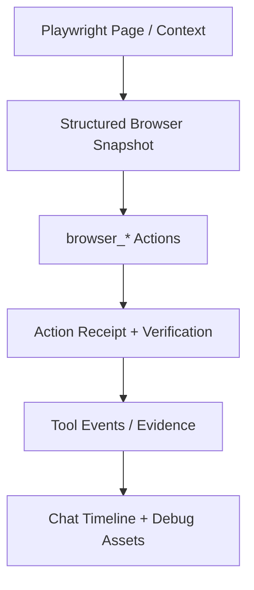

# Aura 浏览器运行时体验升级详设

本文档用于指导 Aura 在当前 `playwright-core` 浏览器运行时基础上，吸收 `playwright-cli` 中最值得借鉴的交互模式与调试能力，形成一套更适合 agent 执行流的浏览器能力升级方案。

目标不是引入 `playwright-cli` 作为新运行时，也不是把网页任务改成 shell 驱动，而是：

1. 保持现有 `browser_*` 工具、Aura Profile、blocker 接管和 route-first 架构不变
2. 引入更强的页面快照、会话管理、状态资产化与调试取证能力
3. 让模型在网页任务里更少猜 selector、更少机械重试、更多基于结构化证据推进

```
playwright-cli 仓库地址：https://github.com/microsoft/playwright-cli
```
---

## 0. 当前基线（2026-04-17）

当前实现已经具备：

1. 基于 `playwright-core` 的 Aura 浏览器运行时，主入口在 [bridge/browserRuntime.mjs](/Users/fanhuaze/Documents/YunWork/desk-agent/bridge/browserRuntime.mjs)
2. Aura 专用持久化 Profile、系统 Chrome / 托管浏览器 / 自定义可执行文件三种来源
3. `browser_open`、`browser_search`、`browser_get_page`、`browser_run_javascript`、`browser_screenshot`、`browser_click`、`browser_type`、`browser_wait_for`
4. blocker 检测、`browser_takeover_visible`、`browser_resume_after_takeover`
5. route-first 路由里对 `browser_*` 的工具曝光和预算控制
6. 一版浏览器操作 skill：[skills/aura-browser-operator.md](/Users/fanhuaze/Documents/YunWork/desk-agent/skills/aura-browser-operator.md)

当前主要短板：

1. `browser_get_page` 只有文本或 HTML 输出，没有稳定的结构化 snapshot
2. `browser_click` / `browser_type` 以 CSS selector 为主，模型容易猜错
3. 浏览器会话只有隐式“当前 session”，缺少命名、多会话和显式列举能力
4. Cookie / localStorage / sessionStorage 缺少面向 agent 的读写接口
5. console、network、trace、video 等调试取证能力还没有进入网页任务主路径

---

## 1. 设计目标

### 1.1 业务目标

1. 网页任务默认采用“观察 -> 操作 -> 验证”的闭环，而不是直接猜 selector 连续执行
2. 网页任务失败时能返回足够证据，而不是只给一句失败描述
3. 登录复用、跨轮次恢复、复现问题的成本明显下降
4. Aura 浏览器体验保持不打断用户桌面，必要时再进入可见接管

### 1.2 工程目标

1. 所有新增能力都通过现有 `browser_*` 体系暴露，不引入外部 CLI 依赖
2. 新能力优先以结构化 JSON 结果回流，而不是依赖纯文本输出
3. 浏览器结果能被 agentEvidence、finalization、UI 和后续持久化消费
4. 新能力分阶段实现，每个阶段都可单独交付和验收

### 1.3 非目标

1. 本次不引入 `playwright-cli`
2. 本次不引入完整 codegen / Playwright test generation
3. 本次不重写现有 Aura 浏览器设置页和安装机制
4. 本次不把 route-first 改成浏览器专用状态机

---

## 2. 参考来源与取舍

本设计主要借鉴 `playwright-cli` 的以下优点：

1. snapshot-first
2. 元素 ref 优先而非 selector 优先
3. 命名 session
4. 存储状态资产化
5. 调试与取证能力产品化

明确不直接照搬的部分：

1. CLI 命令接口
2. shell 权限模型
3. 依赖 `playwright` 完整包与 CLI 会话目录的设计
4. 文本型 stdout 输出作为主交互层

---

## 3. 一句话架构



核心思想：

1. 页面先被结构化观察
2. 操作尽量基于稳定 ref 或结构化定位信息
3. 操作后返回 receipt 与验证结果
4. 证据进入任务时间线和完成态系统

---

## 4. 最值得抄的 5 个能力

### 4.1 能力一：Snapshot-First 页面快照

#### 价值

解决当前 `browser_get_page` 只能读文本 / HTML，缺少结构化页面语义的问题。

#### 目标能力

新增显式 snapshot 概念，让模型可以先读取页面结构，再决定如何操作。

建议新增结果结构：

```ts
type BrowserElementRef = {
  ref: string
  tag: string
  role?: string
  text?: string
  testId?: string
  placeholder?: string
  label?: string
  href?: string
  visible: boolean
  interactive: boolean
}

type BrowserPageSnapshot = {
  url: string
  title: string
  capturedAt: number
  mode: 'full' | 'partial' | 'element'
  source: 'browser_get_page' | 'browser_snapshot'
  contentFormat: 'text' | 'html' | 'snapshot'
  text?: string
  html?: string
  refs?: BrowserElementRef[]
}
```

#### 建议实现

1. 保留现有 `browser_get_page(format=text|html)`
2. 扩展支持 `format=snapshot`
3. 新增 `browser_snapshot` 工具，专门负责结构化页面快照
4. 支持参数：
   - `depth`
   - `selector`
   - `interactiveOnly`
   - `maxRefs`

#### 代码落点

1. [bridge/browserRuntime.mjs](/Users/fanhuaze/Documents/YunWork/desk-agent/bridge/browserRuntime.mjs)
2. `serializePageContent()` 附近新增 `serializePageSnapshot()`
3. `buildBrowserResult()` 扩展 `snapshot` 字段

#### 验收标准

1. 模型可在不读取整页 HTML 的情况下拿到关键交互元素
2. snapshot 结果能稳定包含 ref、文本、角色、test id 等信息
3. 页面变化后再次抓取 snapshot，ref 至少在同一轮交互中可稳定使用

---

### 4.2 能力二：元素 Ref 与更稳定的定位闭环

#### 价值

解决当前 `browser_click` / `browser_type` 主要依赖 CSS selector，模型容易猜错的问题。

#### 目标能力

把交互默认路径从：

1. 猜 selector
2. 点击
3. 失败

改成：

1. 抓 snapshot
2. 选择 ref
3. 执行动作
4. 返回 receipt 并验证

建议扩展：

```ts
type BrowserActionReceipt = {
  action: 'click' | 'type' | 'wait' | 'select'
  target:
    | { kind: 'ref'; value: string }
    | { kind: 'selector'; value: string }
  success: boolean
  urlBefore: string
  urlAfter: string
  titleBefore: string
  titleAfter: string
  snapshotChanged?: boolean
}
```

#### 建议实现

1. `browser_click` 和 `browser_type` 新增 `ref` 参数
2. 内部统一 target 解析逻辑：
   - 优先 `ref`
   - 其次 `selector`
3. 关键动作后自动采集最小验证结果：
   - URL 是否变化
   - title 是否变化
   - 目标文本是否出现
   - 是否触发 blocker
4. 新增 `browser_inspect_element`
   - 输入 `ref` 或 `selector`
   - 输出属性、文本、可见性、bounding box、aria 信息

#### 代码落点

1. [bridge/browserRuntime.mjs](/Users/fanhuaze/Documents/YunWork/desk-agent/bridge/browserRuntime.mjs:942)
2. 在 `browser_click`、`browser_type`、`browser_wait_for` 附近抽出 `resolveBrowserTarget()`

#### 验收标准

1. 至少 70% 常见网页任务可以不用猜 CSS selector
2. 动作结果包含 receipt，而不是只返回最终页面摘要
3. 模型可以基于 `browser_inspect_element` 修正定位，而不是盲点第二次

---

### 4.3 能力三：命名 Session 与多会话管理

#### 价值

解决当前只有一个隐式 session，难以并行网页任务、难以恢复和清理的问题。

#### 目标能力

让浏览器上下文成为显式资源，而不是全局单例当前页。

建议新增状态：

```ts
type BrowserSessionDescriptor = {
  id: string
  label?: string
  visible: boolean
  headless: boolean
  profilePath: string
  createdAt: number
  lastUsedAt: number
  pageCount: number
  activePageUrl?: string
  activePageTitle?: string
}
```

#### 建议实现

1. 把当前 `BrowserSessionManager` 从单实例扩展为：
   - `Map<string, SessionState>`
   - `activeSessionId`
2. 默认 session 仍保留，避免破坏现有调用
3. 为 `browser_*` 工具统一加可选参数：
   - `sessionId`
   - `createIfMissing`
4. 新增管理工具：
   - `browser_list_sessions`
   - `browser_close_session`
   - `browser_set_active_session`
5. 可选支持 `label`

#### 代码落点

1. [bridge/browserRuntime.mjs](/Users/fanhuaze/Documents/YunWork/desk-agent/bridge/browserRuntime.mjs:768)
2. session manager 生命周期
3. UI 未来可在浏览器设置页或任务调试卡中展示 session 列表

#### 验收标准

1. 支持至少 2 个 Aura 浏览器 session 并存
2. 关闭一个 session 不影响其他 session
3. 工具事件能带回 sessionId，方便时间线与调试

---

### 4.4 能力四：存储状态资产化

#### 价值

解决登录复用、跨轮次恢复、问题复现都高度依赖 Aura Profile 黑盒状态的问题。

#### 目标能力

把浏览器存储状态变成 agent 可读写的结构化资产。

建议新增工具：

1. `browser_storage_list`
2. `browser_storage_get`
3. `browser_storage_set`
4. `browser_storage_clear`
5. `browser_storage_export_state`
6. `browser_storage_import_state`

建议覆盖：

1. cookies
2. localStorage
3. sessionStorage
4. 可选 IndexedDB 元信息

#### 建议实现

1. 先做只读：
   - 按 origin 列表
   - 读取 cookie / storage
2. 再做受限写入：
   - 只允许当前 session / 当前 profile
   - 记录审计信息
3. 最后做 import/export：
   - 导出到工作区文件
   - 从工作区文件恢复

#### 代码落点

1. [bridge/browserRuntime.mjs](/Users/fanhuaze/Documents/YunWork/desk-agent/bridge/browserRuntime.mjs)
2. [src/lib/browser.ts](/Users/fanhuaze/Documents/YunWork/desk-agent/src/lib/browser.ts) 如需补配套 IPC
3. 与现有 Chrome 导入能力共用部分状态模型

#### 验收标准

1. 模型能读取当前 origin 的 cookie / storage
2. 用户可导出并恢复一个会话状态
3. 登录复用和调试复现不必完全依赖手工接管

---

### 4.5 能力五：调试与取证能力产品化

#### 价值

解决当前网页任务失败时，日志和证据不足的问题。

#### 目标能力

让浏览器运行时输出可复查的取证资产，而不是只返回一句失败描述。

建议新增能力：

1. `browser_console_get`
2. `browser_network_get`
3. `browser_trace_start`
4. `browser_trace_stop`
5. `browser_video_start`
6. `browser_video_stop`

建议新增资产结构：

```ts
type BrowserDebugArtifact = {
  kind: 'console' | 'network' | 'trace' | 'video' | 'screenshot'
  sessionId: string
  savedTo?: string
  summary?: string
  createdAt: number
}
```

#### 建议实现

1. Phase 1 先做 lightweight 版本：
   - console ring buffer
   - network ring buffer
2. Phase 2 再做 trace / video 文件产物
3. 工具结果中统一带 `artifacts`
4. UI 里显示下载路径或可点击文件路径

#### 代码落点

1. [bridge/browserRuntime.mjs](/Users/fanhuaze/Documents/YunWork/desk-agent/bridge/browserRuntime.mjs)
2. [src/views/ChatView.tsx](/Users/fanhuaze/Documents/YunWork/desk-agent/src/views/ChatView.tsx) 时间线展示
3. 可选扩展 [bridge/agentEvidence.mjs](/Users/fanhuaze/Documents/YunWork/desk-agent/bridge/agentEvidence.mjs) 把 trace / screenshot 纳入验证证据

#### 验收标准

1. 页面失败时可快速定位是 console error、接口失败还是页面阻塞
2. 至少支持导出一个 trace 或 video 文件
3. 任务时间线可展示调试资产

---

## 5. 分阶段实施建议

### Phase A：Snapshot 与 Ref 闭环

目标：

1. 建立 snapshot-first 路径
2. 降低 selector 猜测成本

范围：

1. `browser_get_page(format=snapshot)`
2. `browser_snapshot`
3. `browser_click(ref=...)`
4. `browser_type(ref=...)`
5. `browser_inspect_element`
6. action receipt

预期收益：

1. 立刻提升现有网页任务成功率
2. 与现有 skill 高度匹配

### Phase B：多 Session

目标：

1. 让浏览器会话成为显式资源

范围：

1. session manager 重构
2. `browser_list_sessions`
3. `browser_close_session`
4. 所有 `browser_*` 接 sessionId

预期收益：

1. 为复杂网页任务、长任务、恢复流打基础

### Phase C：Storage State

目标：

1. 降低登录复用和复现场景成本

范围：

1. storage read
2. storage write
3. import/export

### Phase D：Debug Artifacts

目标：

1. 网页失败有证据，调试闭环更完整

范围：

1. console / network ring buffer
2. trace / video 产物
3. UI 展示

---

## 6. 与现有模块的关系

### 6.1 `bridge/browserRuntime.mjs`

这是本次升级的主战场，应承担：

1. snapshot 序列化
2. ref 映射与动作解析
3. 多 session 管理
4. storage 读写
5. console / network / trace / video 收集

### 6.2 `bridge/agentEvidence.mjs`

建议逐步增强浏览器验证信号：

1. `browser_snapshot` 成功可记为 `page_state`
2. `browser_inspect_element` 成功可记为 `page_state`
3. `browser_wait_for` 命中目标时可记为 `page_state`
4. trace / screenshot 产物暂不直接视为 verified，但可作为 partial 证据

### 6.3 `bridge/agentPrompting.mjs`

建议加入更明确的浏览器操作边界：

1. 先 snapshot 再动作
2. 动作后要验证
3. blocker 时优先 takeover
4. 连续两次无增量不再机械重试

### 6.4 `src/views/ChatView.tsx`

建议新增：

1. session badge
2. snapshot / receipt / artifacts 展示
3. trace / screenshot 文件链接
4. 可选折叠的 console / network 摘要

### 6.5 Skill

现有 [skills/aura-browser-operator.md](/Users/fanhuaze/Documents/YunWork/desk-agent/skills/aura-browser-operator.md) 已提供行为约束。每完成一个 phase，都应同步更新 skill，让模型优先使用新的稳定能力，而不是继续猜 selector。

---

## 7. 兼容性与迁移策略

原则：

1. 不破坏现有 `browser_*` 调用方式
2. 优先“加能力”，再慢慢把模型默认路径引到新能力

具体策略：

1. `browser_get_page(text|html)` 保持兼容
2. `browser_click(selector=...)` 与 `browser_type(selector=...)` 保持兼容
3. 新增 `ref` 参数，不删除 `selector`
4. 新工具先作为增量能力挂载
5. skill 与 prompting 先引导模型优先走新路径

---

## 8. 风险与应对

### 8.1 Snapshot 太大

风险：

1. token 成本飙升

应对：

1. 支持 `depth`
2. 支持 `interactiveOnly`
3. 支持 `maxRefs`
4. 默认返回摘要而不是整页树

### 8.2 Ref 不稳定

风险：

1. 页面刷新后 ref 失效

应对：

1. ref 只保证同一轮或同一页面版本内稳定
2. 动作后若 DOM 明显变化，要求重新 snapshot
3. receipt 中显式返回 snapshotChanged

### 8.3 多 Session 复杂度上升

风险：

1. 生命周期管理、泄露、并发问题增加

应对：

1. 从最多 2 到 3 个 session 起步
2. 增加 idle timeout
3. 提供 `browser_close_session` 与全局清理

### 8.4 Debug 资产过重

风险：

1. trace / video 占用磁盘和时间

应对：

1. 默认关闭
2. 按 session / task 显式开启
3. 支持清理过期文件

---

## 9. 验收标准

### 9.1 功能正确性

1. 模型可通过 snapshot + ref 完成常见网页表单与按钮交互
2. 至少支持多 session 的基本创建、列举、关闭
3. 至少支持读取当前 origin 的 cookie 与 localStorage
4. 页面失败时能读取 console 或 network 摘要

### 9.2 用户体验

1. 网页任务中“猜 selector -> 失败 -> 再猜”的频率明显下降
2. 失败时用户能看到更具体的卡点和证据
3. blocker 接管与恢复流不被破坏

### 9.3 架构一致性

1. 所有新增能力都走现有 `browser_*` 工具体系
2. 不依赖外部 `playwright-cli`
3. 与 route-first、completionState、Chat timeline 保持一致

---

## 10. 推荐的施工顺序

如果只选一个最小闭环开始，我建议按这个顺序：

1. `browser_snapshot` + `browser_get_page(format=snapshot)`
2. `browser_click(ref)` + `browser_type(ref)` + receipt
3. `browser_inspect_element`
4. `browser_list_sessions`
5. `browser_console_get` / `browser_network_get`

原因：

1. 这是最能直接提升当前网页任务成功率的一组能力
2. 与刚写好的 Aura Browser Operator skill 完全同向
3. 对现有架构侵入最小

---

## 11. 一句话结论

这次升级的核心不是“把 `playwright-cli` 搬进 Aura”，而是：

**把它最有效的浏览器交互模式，翻译成 Aura 自己的结构化 `browser_*` 能力体系。**

只要先把 snapshot、ref、session、storage、debug artifacts 五件事做好，Aura 当前的 `playwright-core` 方案就能从“能用”提升到“适合 agent 稳定长期使用”。
