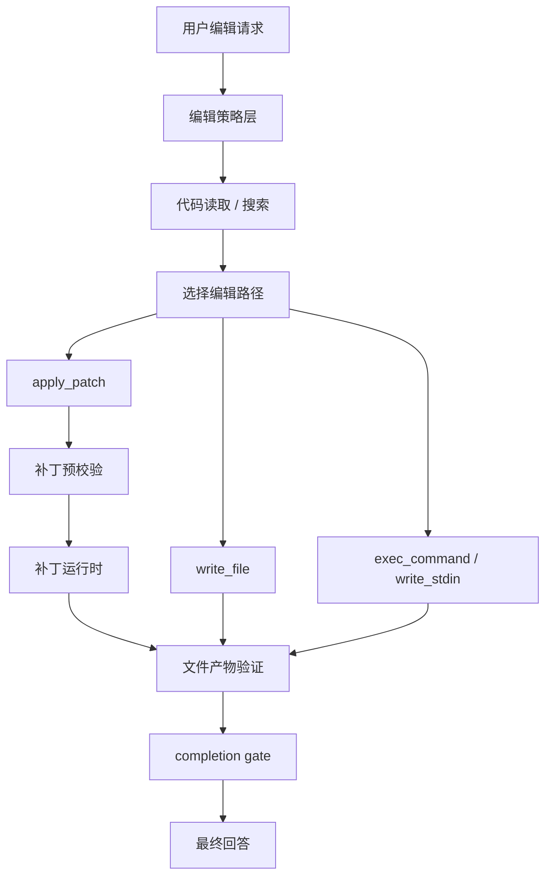

# 文件修改与代码修改专项重构设计（对齐 Codex 编辑体验）

> 状态：详细设计稿 v1
> 日期：2026-04-23
> 目标：将 Aura 在“写文件、改代码、落文档、执行开发命令”这类任务上的体验，尽可能重构到接近 Codex 的水平
> 范围：`bridge/tools.mjs`、`bridge/agent.mjs`、`bridge/agentEvidence.mjs`、`bridge/providers.mjs`、后续新增的编辑运行时与补丁工具模块

---

## 1. 设计结论

Aura 当前在代码修改类任务上的瓶颈，不是“模型不够聪明”，而是“编辑工具和运行时太弱”。

一句话概括当前问题：

> 现在 Aura 主要靠“整文件写入 + 精确字符串替换 + 短命 shell + prompt 约束”来做修改，这条链路天然比 Codex 的“补丁优先 + 预校验 + 长会话命令 + 运行时验收”弱很多。

本次专项重构的结论非常明确：

1. **将 `apply_patch` 设为代码修改主路径**
2. **将 `exec_command / write_stdin` 设为命令执行主路径**
3. **将 `write_file` 收缩为新建文档/小文件工具**
4. **将 `edit_file / multi_edit_file` 降级为兼容性 fallback**
5. **引入文件产物验证与 completion gate，杜绝“说改了其实没改”**
6. **引入与 Codex 等价的 patch 预解析、路径解析、上下文校验、审批与事件流**

这不是在现有工具上打补丁，而是要把 Aura 的“编辑子系统”重构成一套独立、清晰、强约束的运行时。

---

## 2. 目标与非目标

### 2.1 目标

本次重构希望实现以下用户体验目标：

1. 用户让 Agent “把方案落成文档”，文件必须真实出现在指定目录。
2. 用户让 Agent “修改代码”，应优先走补丁式编辑，而不是反复字符串替换。
3. 用户让 Agent “运行命令、看结果、继续修”，应支持长会话命令执行，而不是每次重开 shell。
4. 用户让 Agent “改多个文件”，应能在一个 patch 中稳定完成，而不是多次重写整文件。
5. Agent 不应再轻易回答“已经完成”，除非系统层已经拿到足够证据。
6. 常见开发任务的速度、稳定性、产物一致性应明显提升。

### 2.2 非目标

这次重构不包括：

1. Web 检索链路重构
2. 系统浏览器交互链路重构
3. 插件与 MCP 工具发现体系的完整落地
4. 复杂多 Agent 编排设计

这些方向会和本设计协同，但本次只聚焦“文件修改/代码修改类任务”。

### 2.3 与外围架构的边界说明

本专项需要和主 Agent 架构协同，但不等于把所有“对齐 Codex”的工作都塞进这里。

针对当前和 Codex 的主要差距，这份文档的覆盖边界明确如下：

1. 完整纳入本专项：
   `apply_patch` 主路径、patch 预解析/预验证、shell patch 拦截、`file_verified + completion gate`、`exec_command / write_stdin` 长会话执行。
2. 作为协同依赖，但不是本专项主目标：
   `tool_search` 的搜索质量、namespace 聚合、discoverable inventory 丰富度。
3. 作为协同依赖，但不应阻塞本专项：
   route/selector 的继续瘦身。编辑主路径不应再依赖大面积关键词表，但这些改动仍属于更大的 agent 主链重构。
4. 显式不在本专项范围内：
   provider-native `web_search` 或与 Codex 完全等价的联网基础设施。

这意味着：

1. 本文档要解决“编辑子系统本身是否足够强”。
2. 但不会把 `tool_search`、retrieval、browser 这些外围系统一起扩成新的总蓝图。
3. 后续评估时，也要把“编辑子系统是否齐平”和“整机能力是否齐平”分开看。

---

## 3. 当前问题分析

### 3.1 当前主工具过弱

Aura 当前文件修改主工具是：

1. `write_file`
2. `edit_file`
3. `multi_edit_file`

其中：

1. `write_file` 是整文件覆盖写入
2. `edit_file` 是精确 `oldText -> newText` 替换
3. `multi_edit_file` 是多次精确替换串行执行

这类工具对模型的要求非常苛刻：

1. 必须先把原文读得足够完整
2. 必须准确截取需要替换的旧文本
3. 文件一大、代码一复杂、重复片段一多，就容易失败
4. 失败后往往需要再次读文件、再次定位、再次尝试

这天然会让 Aura 在代码修改任务上显得：

1. 慢
2. 不稳
3. 容易重复读文件
4. 容易出现“局部改动不准”

### 3.2 写入成功没有强验收

当前 `write_file` 写完只返回一句自然语言结果，例如：

1. 写了多少字符
2. 写到了哪个路径

系统证据层只会把这记成：

1. `file_mutation`

但这不够。

当前缺少：

1. 写后 `stat`
2. 写后 `read back`
3. 文件 hash
4. bytes 记录
5. created/updated 状态
6. “目标文件确实存在”的强验证信号

所以会出现一个典型问题：

1. Agent 说“文档已经写好”
2. 目录下其实没有
3. 或者路径写偏了
4. 或者写失败了但回答没有被拦住

### 3.3 完成态控制太软

当前系统虽然已经有：

1. `not_executed`
2. `executed_unverified`
3. `executed_verified`

这些完成态概念，但最终的语言控制仍然大量依赖 finalization prompt。

也就是说：

1. 系统会提示模型“不要乱说完成”
2. 但不是每次都会跑 finalization
3. 即使跑了，也仍然是让模型来“整理最终回答”

这会导致：

1. 完成态约束偏软
2. 有时模型还是会说“已经做了”
3. 系统缺少最后一道 deterministic gate

### 3.4 shell 执行是短会话

当前 `run_shell` 每次都直接：

1. 启一个新的 `/bin/zsh -lc ...`
2. 等待输出
3. 结束

这对简单命令可以工作，但对开发任务并不理想。

开发任务经常需要：

1. 连续执行多条命令
2. 保持同一上下文
3. 看输出后继续输入
4. 与 REPL、测试观察、交互命令配合

短会话 shell 的缺点是：

1. 每次重建环境
2. 无法续写 stdin
3. 不适合长任务
4. 不适合交互式命令

### 3.5 没有“编辑主路径”

当前 Aura 对于“怎么改文件”没有真正收敛的主路径。

模型可能：

1. 用 `write_file` 整体覆盖
2. 用 `edit_file` 精确替换
3. 用 `multi_edit_file`
4. 甚至尝试用 shell 去改文件

这种不收敛会带来：

1. 行为不稳定
2. prompt 约束变复杂
3. 结果质量难以预测

Codex 在这点上非常清晰：

> 读代码可以走 shell，改代码优先走 `apply_patch`。

Aura 也需要这种清晰主路径。

---

## 4. Codex 为什么在编辑任务上体验更好

### 4.1 它把“代码修改”收敛到 `apply_patch`

Codex 的关键设计不是提供了很多编辑工具，而是把主要编辑行为收敛到一个核心工具：

1. `apply_patch`

它是一个带语法约束的 freeform tool。

优点：

1. 模型不用构造巨大 JSON
2. patch 表达方式天然适合“局部修改”
3. 可一次改多个文件
4. 可表示新增、删除、修改、移动文件
5. patch 的结构天然适合预校验

### 4.2 它不是“直接应用 patch”，而是“先验证再执行”

Codex 的 patch 流程不是：

1. 模型给 patch
2. 系统直接写文件

而是：

1. 先解析 patch
2. 解析 shell/heredoc 形式的 patch
3. 解析相对路径
4. 读取旧文件内容
5. 计算修改后的新内容
6. 生成结构化变更
7. 再决定是否执行、是否审批、是否进入 runtime

这意味着 patch 在真正落盘前已经经过了：

1. 结构正确性校验
2. 路径合法性校验
3. 上下文匹配校验
4. 文件存在性校验

### 4.3 它把 patch 视为受控的 mutating runtime

Codex 不把 patch 当成普通文本。

它会进一步做：

1. 计算影响文件集合
2. 计算所需文件权限
3. 与 session/turn 的已有权限合并
4. 触发 approval / sandbox / guardian review
5. 通过统一 orchestrator 执行

这意味着：

1. patch 变更有很强的可控性
2. 可以精细审批
3. 可以精细记录事件
4. 可以精细失败归因

### 4.4 它防止模型“走错路”

Codex 还有一个很实用的机制：

1. 如果模型错误地在 shell 里调用 `apply_patch`
2. 运行时会识别这是 patch
3. 然后拦截它，转回 `apply_patch` 正规链路

好处：

1. 提高鲁棒性
2. 减少模型误用 shell 的影响
3. 保证 patch 仍然经过验证和审批

### 4.5 它的 shell 是长会话模型

Codex 的 `exec_command` / `write_stdin` 可以：

1. 启一个命令会话
2. 返回 `session_id`
3. 后续继续向该会话写 stdin
4. 轮询输出

这使它非常适合：

1. 连续调试
2. 运行测试再继续操作
3. 交互式命令
4. 保持命令上下文

### 4.6 它的提示词与运行时协同

Codex 的系统提示词也非常配合它的编辑体系：

1. 搜索文本/文件优先 `rg`、`rg --files`
2. 修改文件优先 `apply_patch`
3. patch 成功后不要浪费 token 再整文件重读

这意味着：

1. 工具设计
2. runtime 设计
3. prompt 设计

三者是同向的，不是各自为战。

---

## 5. Aura 的目标编辑体验

重构后的 Aura 在编辑类任务上，目标体验应该是：

### 5.1 新建文件体验

当用户说：

1. “把方案写成文档保存到 `docs/x.md`”
2. “生成一个配置文件”
3. “新建一个脚本”

Aura 应：

1. 优先走 `write_file`
2. 自动创建父目录
3. 写后立即验证
4. 回答中稳定说明目标路径与验证结果

### 5.2 修改现有代码体验

当用户说：

1. “改一下这个函数”
2. “修复这个 bug”
3. “重构这个模块”

Aura 应：

1. 先用 `rg` / `read_file` 精准定位
2. 优先生成 `apply_patch`
3. patch 成功后不再整文件重复重读
4. 如需验证，再进行 targeted read 或测试

### 5.3 连续开发任务体验

当用户说：

1. “跑一下测试看哪里坏了，再继续修”
2. “启动 dev server 看报错，再改”
3. “执行命令后继续观察输出”

Aura 应：

1. 启用长会话 `exec_command`
2. 用 `write_stdin` 续写
3. 不重复重开 shell
4. 保持上下文与会话状态

### 5.4 完成态体验

当用户要求产出文件或改代码时：

1. 没有真实文件或真实修改 -> 绝不说完成
2. 已写入但未验证 -> 只能说“已执行，待验证”
3. 已验证 -> 才能明确说“已完成”

---

## 6. 总体设计原则

### 6.1 原则一：补丁优先

修改现有文件时：

1. `apply_patch` 是主路径
2. `edit_file` 是 fallback
3. `write_file` 只用于新建或整文件重写

### 6.2 原则二：编辑前验证语义，编辑后验证产物

编辑前要验证：

1. patch 结构
2. 路径合法性
3. 上下文匹配
4. 旧文件存在性

编辑后要验证：

1. 文件存在
2. 文件可读
3. 内容与变更一致
4. 需要时进行测试或 targeted read

### 6.3 原则三：命令执行与文件修改职责分离

读和探索：

1. `rg`
2. `rg --files`
3. `read_file`
4. `exec_command`

改和落盘：

1. `apply_patch`
2. `write_file`

不要再鼓励：

1. 用 shell 做常规文件改写

### 6.4 原则四：完成态由系统决定

模型可以写最终回答，但：

1. 是否允许说完成
2. 是否需要提示未验证
3. 是否需要说明失败位置

必须由运行时决定。

---

## 7. 目标架构

### 7.1 总体分层

编辑子系统建议拆成五层：

1. `Editing Intent Policy`
2. `Editing Tool Surface`
3. `Patch Verification Layer`
4. `Execution Runtime Layer`
5. `Artifact Verification & Completion Layer`

### 7.2 目标流程



### 7.3 模块划分

建议新增以下模块：

1. `bridge/editing/applyPatchTool.mjs`
2. `bridge/editing/applyPatchParser.mjs`
3. `bridge/editing/applyPatchRuntime.mjs`
4. `bridge/editing/fileVerification.mjs`
5. `bridge/editing/completionGate.mjs`
6. `bridge/editing/unifiedExecRuntime.mjs`
7. `bridge/editing/editingPolicy.mjs`

---

## 8. 工具面重构

### 8.1 新增主编辑工具：`apply_patch`

建议新增内置工具：

1. `apply_patch`

工具形态建议：

1. 优先采用 freeform grammar tool
2. grammar 与 Codex 尽量保持一致
3. 允许一份 patch 包含多个文件操作
4. 在当前模型/工具栈暂时不支持 freeform custom tool 的阶段，允许保留 JSON function 形态作为兼容 fallback，但它不应成为长期目标形态

建议支持的操作：

1. `*** Add File`
2. `*** Delete File`
3. `*** Update File`
4. `*** Move to`
5. `@@` hunk
6. `*** End of File`

### 8.2 保留但降级的工具

以下工具保留，但不再作为主路径：

1. `edit_file`
2. `multi_edit_file`

用途：

1. 兼容旧行为
2. 简单小替换 fallback
3. 在 patch 无法自然表达的极小修改场景下兜底

### 8.3 重定位的工具

#### `write_file`

重定位为：

1. 新建文档
2. 新建小文件
3. 明确要求整文件覆盖时使用

不再推荐用于：

1. 修改已有大文件
2. 代码重构
3. 多文件联动改动

### 8.4 新增长会话命令工具

建议新增：

1. `exec_command`
2. `write_stdin`

这组工具将替代当前的短会话 `run_shell`，或至少成为更高优先级路径。

#### `exec_command`

职责：

1. 启动命令进程
2. 返回会话 id
3. 支持 TTY/非 TTY
4. 支持流式输出

#### `write_stdin`

职责：

1. 向已有进程写入 stdin
2. 轮询更多输出
3. 支持交互式会话

### 8.5 shell 中的 patch 拦截

建议新增机制：

1. 如果模型通过 shell 发送了 `apply_patch` 语义
2. 运行时识别后直接拦截
3. 转入 `apply_patch` 正规链路

这样可以避免：

1. 模型误用 shell
2. patch 绕过验证和审批
3. shell 形式与直接 patch 形式走出两套不一致逻辑

进一步要求：

1. 拦截不要只靠简单字符串切片。
2. 至少要能稳定识别受限 shell 形式、heredoc 形式、可选 `cd && apply_patch` 形式。
3. 识别失败时要明确报“不是合法 apply_patch 调用”，而不是静默退回普通 shell 改写路径。

---

## 9. `apply_patch` 的详细设计

### 9.1 工具输入格式

建议完全对齐 Codex 的 patch 语义。

最重要的是：

1. 文件路径必须是相对路径
2. patch 必须在 `*** Begin Patch` 与 `*** End Patch` 之间
3. 每个文件操作必须显式声明是 Add/Delete/Update
4. update hunk 必须带上下文

### 9.2 预解析阶段

新增模块：

1. `applyPatchParser.mjs`

职责：

1. 解析 patch 文本
2. 生成结构化 AST
3. 收集每个文件的操作类型
4. 收集 move/rename 信息
5. 收集 hunks
6. 支持直接 `apply_patch <patch>` 形式
7. 支持 shell/heredoc 形式
8. 支持 `cd <path> && apply_patch <<'EOF' ... EOF` 这类受限 shell 变体
9. 对“裸 patch body 被错误塞进 shell/command”的隐式调用做显式拒绝，而不是模糊容错

输出建议：

```ts
type ParsedPatch = {
  patch: string
  operations: Array<
    | { kind: 'add'; path: string; content: string }
    | { kind: 'delete'; path: string }
    | {
        kind: 'update'
        path: string
        moveTo?: string
        hunks: Array<{
          header?: string
          lines: Array<{ type: 'context' | 'add' | 'remove'; text: string }>
          endOfFile?: boolean
        }>
      }
  >
}
```

### 9.3 预验证阶段

新增模块：

1. `applyPatchVerifier.mjs`

职责：

1. 解析相对路径并映射到 workspace 内真实路径
2. 校验不允许越出 workspace
3. 对 `delete/update` 读取旧文件
4. 验证上下文是否可匹配
5. 计算每个文件的新内容
6. 生成结构化变更摘要
7. 计算受影响文件集合，为审批、sandbox 和事件流提供稳定输入

输出建议：

```ts
type VerifiedPatch = {
  cwd: string
  patch: string
  changes: Array<{
    path: string
    kind: 'add' | 'delete' | 'update' | 'move'
    oldContent?: string
    newContent?: string
    unifiedDiff?: string
    moveTo?: string
  }>
}
```

### 9.4 预验证失败时的行为

预验证失败必须是硬失败。

典型错误包括：

1. patch 语法错误
2. 文件不存在但要求 update/delete
3. 上下文不匹配
4. 路径越界
5. move 目标非法

失败后系统应：

1. 返回结构化错误
2. 不落盘
3. 不允许回答“已修改”

### 9.5 应用阶段

新增模块：

1. `applyPatchRuntime.mjs`

职责：

1. 在通过验证后把 patch 应用到文件系统
2. 支持多文件顺序应用
3. 记录每个文件的最终状态
4. 发出 patch 事件

执行输出建议：

```json
{
  "ok": true,
  "files": [
    {
      "path": "src/a.ts",
      "kind": "update",
      "verified": true
    }
  ],
  "summary": "Applied patch to 3 files"
}
```

### 9.6 事件流与可视化

建议 patch 执行过程中增加事件能力：

1. `patch_begin`
2. `patch_progress`
3. `patch_end`

这样后续 UI 能做：

1. 文件级 diff 预览
2. patch 执行状态展示
3. 更好的审计与调试

---

## 10. 长会话命令执行设计

### 10.1 为什么必须引入

没有长会话命令执行，就很难接近 Codex 的开发体验。

典型场景：

1. `pnpm test --watch`
2. 启动 dev server
3. REPL
4. 连续跑命令看输出再修

这些都不适合短会话 shell。

### 10.2 新的命令运行时

新增模块：

1. `unifiedExecRuntime.mjs`

职责：

1. 管理进程 id
2. 跟踪 stdout/stderr
3. 支持流式更新
4. 支持 stdin 写入
5. 支持终止、超时、重连

### 10.3 命令安全与审批

长会话工具仍需保留：

1. sandbox
2. approval
3. escalation policy
4. workdir 限制

但审批应当更精细：

1. 命令级审批
2. sticky permission
3. 会话复用时尽量不重复审批

### 10.4 命令结果结构化输出

建议不再只返回纯字符串。

建议输出：

```json
{
  "sessionId": 12,
  "exitCode": 0,
  "running": false,
  "stdout": "...",
  "stderr": "...",
  "wallTimeMs": 1234,
  "truncated": false
}
```

这样：

1. evidence 层更容易判断
2. completion gate 更容易判断
3. UI 更容易展示

---

## 11. 文件产物验证设计

### 11.1 必须引入 `file_verified`

当前只有 `file_mutation`，远远不够。

建议新增证据类型：

1. `file_verified`
2. `artifact_present`
3. `artifact_read_back`
4. `artifact_hash_recorded`

### 11.2 验证模块

新增模块：

1. `fileVerification.mjs`

职责：

1. 对目标文件 `stat`
2. 必要时读回内容
3. 计算 hash
4. 判断 created/updated
5. 生成验证结果

输出建议：

```ts
type FileVerificationResult = {
  path: string
  exists: boolean
  bytes: number
  sha256: string
  readBackOk: boolean
  created: boolean
  updated: boolean
}
```

### 11.3 何时触发验证

以下场景必须自动验证：

1. `write_file`
2. `apply_patch`
3. `edit_file`
4. `multi_edit_file`

以下场景建议按需验证：

1. shell 命令改文件
2. 工具链间接产出文件

### 11.4 验证失败处理

如果写入工具成功返回，但验证失败：

1. 本轮完成态必须降级
2. 不允许声称任务已完成
3. 应提示“已尝试写入，但未完成验证”

---

## 12. Completion Gate 设计

### 12.1 为什么需要独立 gate

因为 finalization prompt 不够强。

真正要解决的是：

1. 不是“让模型尽量别乱说”
2. 而是“系统不允许它乱说”

### 12.2 新模块

新增：

1. `completionGate.mjs`

职责：

1. 根据任务类型判断需要什么证据
2. 根据工具事件判断是否满足要求
3. 决定最终 completion state
4. 对最终回答做硬门禁

### 12.3 编辑类任务的门禁规则

#### 用户要求写文件

必须满足：

1. 有写入工具成功事件
2. 有 `file_verified`

否则：

1. 禁止说“已完成”

#### 用户要求修改代码

必须满足：

1. 有 `apply_patch` / `edit_file` / `write_file` / shell mutating 成功事件
2. 有文件级验证或测试级验证

否则：

1. 只能说“已执行但待验证”

#### 用户要求执行命令

必须满足：

1. 有命令会话结果
2. 如有明确检查目标，应有命令输出证据

### 12.4 最终回答策略

建议 completion gate 输出：

1. `not_executed`
2. `failed_after_execution`
3. `executed_unverified`
4. `executed_verified`

但与当前不同的是：

1. 这不再只是提示词参考
2. 而是最终回答的硬边界

---

## 13. Prompt 与工具使用策略重构

### 13.1 新的编辑工具策略

系统提示词建议明确成以下顺序：

1. 搜索代码/文件优先 `rg` / `rg --files`
2. 阅读目标文件优先 `read_file`
3. 修改已有文件优先 `apply_patch`
4. 新建文件优先 `write_file`
5. 长命令或交互命令优先 `exec_command`

### 13.2 旧策略需要删除或弱化

需要删除或弱化：

1. 鼓励模型频繁整文件改写
2. 鼓励模型把 patch 行为塞进 shell
3. 修改完成后无脑重读整文件
4. 让大面积关键词路由来决定编辑工具主路径

补充原则：

1. 编辑工具是否可用，应主要由 capability policy 和 mounted tool surface 决定。
2. 关键词/regex 只应用于少量 deterministic hard signals，例如路径、文档输出、显式写入请求、显式交互命令请求。
3. `apply_patch`、`write_file`、`exec_command`、`write_stdin` 不应因为宽泛关键词路由而长期处于“偶尔能见、偶尔看不见”的状态。

### 13.3 新的高效工作法

建议把编辑类任务的推荐工作法写死成：

1. 先定位
2. 再 patch
3. 再 targeted verify
4. 最后总结

而不是：

1. 先读大量文件
2. 再做字符串替换
3. 再反复读回

---

## 14. 文件级改造清单

### 14.1 新增文件

建议新增：

1. `bridge/editing/applyPatchTool.mjs`
2. `bridge/editing/applyPatchParser.mjs`
3. `bridge/editing/applyPatchVerifier.mjs`
4. `bridge/editing/applyPatchRuntime.mjs`
5. `bridge/editing/fileVerification.mjs`
6. `bridge/editing/completionGate.mjs`
7. `bridge/editing/unifiedExecRuntime.mjs`

### 14.2 重点改造文件

#### `bridge/tools.mjs`

改造目标：

1. 注册 `apply_patch`
2. 注册 `exec_command`
3. 注册 `write_stdin`
4. `write_file` 改为结构化输出
5. `edit_file/multi_edit_file` 改为 fallback 位

#### `bridge/agentEvidence.mjs`

改造目标：

1. 增加 `file_verified`
2. 增加 `artifact_present`
3. 增加 `artifact_read_back`
4. 增加更强 verification level

#### `bridge/agent.mjs`

改造目标：

1. 在 provider turn 后接入 completion gate
2. 将 finalization 从“软约束”升级为“受 gate 约束的补答”
3. 为编辑类任务提供更强的收尾控制

#### `bridge/providers.mjs`

改造目标：

1. finalizer prompt 只负责润色与总结
2. 不再承担“判断是否真的完成”的职责

### 14.3 可以逐步废弃的旧路径

最终建议逐步废弃：

1. 以 `edit_file` 作为主改代码路径
2. 以短会话 `run_shell` 作为主命令路径
3. 以 finalizer prompt 作为完成态主控制

---

## 15. 分阶段实施计划

### Phase 1：落地 `apply_patch`

目标：

1. 先把代码修改主路径建立起来

内容：

1. 新增 `apply_patch` grammar tool
2. 实现 parser + verifier
3. 接入 `tools.mjs`
4. 改 prompt 使其优先使用 patch

验收：

1. 常见代码改动优先走 patch
2. 能稳定修改多个文件
3. patch 错误能明确报出

### Phase 2：落地文件验证与 completion gate

目标：

1. 解决“说完成但没文件/没修改”的问题

内容：

1. 写入工具全部接入 `fileVerification`
2. `agentEvidence` 增加 `file_verified`
3. `completionGate` 生效

验收：

1. 没有验证通过时，不能说完成

### Phase 3：落地 `exec_command / write_stdin`

目标：

1. 提升连续开发任务体验

内容：

1. 增加长会话命令执行器
2. 支持会话 id、stdin 续写、输出轮询
3. 接入审批与 sandbox

验收：

1. 连续命令和交互命令不再每次重开 shell

### Phase 4：shell patch 拦截与旧路径降级

目标：

1. 防止模型乱走路

内容：

1. shell 中识别 `apply_patch`
2. 自动转入 patch 正规链路
3. 降低 `edit_file/multi_edit_file` 优先级

验收：

1. 编辑行为稳定收敛到 patch 主路径

### Phase 5：性能优化

目标：

1. 把编辑类任务整体提速

内容：

1. prompt 收敛
2. 减少重复读文件
3. targeted verify 替代整文件回读
4. 长会话命令减少进程启动成本

验收：

1. 改代码任务明显更快、更稳

---

## 16. 测试与验收标准

### 16.1 工具级测试

需要覆盖：

1. patch 语法解析
2. update hunk 上下文校验
3. add/delete/move file
4. workspace 越界防护
5. shell 中 patch 拦截
6. exec_command / write_stdin 会话续写

### 16.2 任务级测试

建议覆盖这些真实任务：

1. “把方案写成 `docs/x.md`”
2. “修复某个函数中的 bug”
3. “跨 3 个文件做重构”
4. “跑测试，看失败，再继续修”
5. “改完后输出变更总结”

### 16.3 用户体验验收

当重构完成后，应达到以下标准：

1. 文档写入类任务基本不再出现“说写了但没文件”。
2. 常见代码修改类任务大多走 patch，而不是整文件重写。
3. 复杂代码修改任务成功率明显提升。
4. 连续调试和交互命令体验明显提升。
5. 最终回答更可信，少出现虚假完成。

---

## 17. 最终建议

如果只看“编辑体验”这一条线，Aura 最值得做的不是继续打磨 `edit_file`，而是直接全面转向 Codex 风格的编辑体系。

最关键的三件事是：

1. **把 `apply_patch` 立起来**
2. **把 `file_verified + completion gate` 立起来**
3. **把 `exec_command / write_stdin` 立起来**

这三件事做完，Aura 在“写文档、改代码、跑命令继续修”这类任务上的体验才会真正接近 Codex。

从长期看，Aura 的编辑子系统应该遵循这样的主路径：

1. `rg/read_file` 用来定位
2. `apply_patch` 用来修改
3. `exec_command/write_stdin` 用来运行和验证
4. `fileVerification/completionGate` 用来判断是否真的完成

只要把这条路径打通，Aura 在编辑类任务上的表现会和现在完全不是一个级别。
