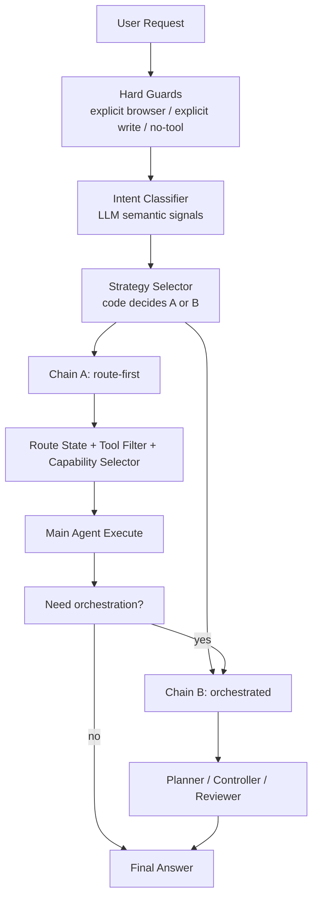
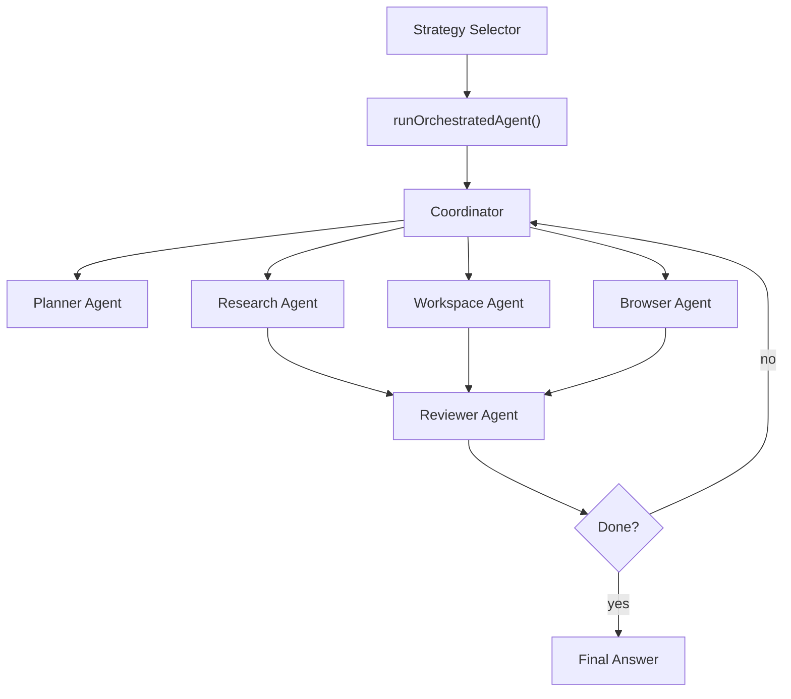

# LLM 意图分类与 A/B 链路选择详细设计

> 状态：设计稿 v2
> 日期：2026-04-18
> 范围：`bridge/agent.mjs`、`bridge/agentRouting.mjs`、`bridge/capabilitySelector.mjs`、`bridge/agentPrompting.mjs`

---

## 1. 设计结论

本项目后续的推荐方向不是“继续扩充关键字路由”，也不是“所有任务都走重编排”，而是：

1. **方案 A 作为默认入口**
   - 即当前 `route-first` 路线：先做能力分层，再做最小工具挂载，再进入主 Agent 执行。
2. **方案 B 作为复杂任务升级模式**
   - 仅当任务复杂度足够高，或 A 链路执行中证明需要显式规划、阶段化控制和复核时，才升级到编排模式。
3. **前置模型负责语义理解，系统代码负责最终链路选择与安全约束**
   - 不允许把“走 A 还是走 B”“是否放开写入/浏览器/预算”完全交给 prompt 或模型拍板。

一句话概括：

> **模型给语义信号，代码做最终决策；A 跑默认流，B 处理复杂流。**

---

## 2. 背景与问题

### 2.1 当前实现状态

当前默认架构是 `route-first`，本质上已经接近 [docs/agent_architecture_solutions.md](/Users/fanhuaze/Documents/YunWork/desk-agent/docs/agent_architecture_solutions.md) 中的**方案 A**：

1. 在 `agentRouting.mjs` 中推断 `capabilityTier`
2. 在 `filterToolsForRouteState()` 中物理裁剪工具
3. 在 `capabilitySelector.mjs` 中进一步筛选 skill / tool group
4. 通过预算、停止条件和证据策略约束执行

当前并**不是**完整的方案 B。虽然已有 governor、route escalation、task tree 等控制元素，但主流程仍然是“先路由，再执行”，而不是“先规划，再控制，再复核”。

### 2.2 当前主要问题

目前的短板不在“有没有 route-first”，而在“route-first 的前置判断仍然过度依赖关键字”：

1. `agentRouting.mjs` 使用多组关键字数组推断：
   - `capabilityTier`
   - `answerMode`
   - `needsExternalFacts`
   - `explicitWebInteraction`
2. `capabilitySelector.mjs` 再次使用另一套关键字数组推断：
   - `isResearchTask`
   - `isBrowserTask`
   - `isEditingTask`
   - `isReviewTask`

这导致：

1. **不可扩展**
   - 问股票就补“股票”
   - 问天气就补“天气”
   - 问体育就补“体育”
2. **上下文理解差**
   - `price` 在代码语境下不等于联网
   - `查一下` 可能是查代码，也可能是查新闻
3. **双重维护**
   - `agentRouting.mjs` 与 `capabilitySelector.mjs` 各维护一套近似词表
4. **系统行为被词表绑死**
   - 一旦词表没命中，就会出现“明明应该联网却没有拿到 web 工具”的体验问题

### 2.3 本次 web 能力暴露出的典型问题

新增 `web_search` / `web_fetch` 后，暴露出一个很典型的问题：

用户问“最近阿里巴巴股票有什么利好和利空”，如果前置词表没命中“股票 / 利好 / 利空 / 财报 / 公告”，则请求不会进入 `web-lookup`，后面即便已经实现了 `web_search` / `web_fetch`，模型也拿不到这些工具。

这说明：

> **真正需要替换的不是某一个词表，而是“词表驱动的意图判断方式”。**

---

## 3. 目标

### 3.1 目标

1. 用一次轻量级 LLM 分类替代双重关键字路由
2. 保留当前 `route-first` 的低延迟和最小能力暴露优势
3. 为未来的复杂任务编排（方案 B）提供统一入口
4. 避免“模型靠 prompt 自己猜该用什么工具”
5. 保留 deterministic 的预算、审批、证据和停止条件

### 3.2 非目标

1. 不在这次重构中把所有任务都改成 planner-controller-reviewer
2. 不把 `filterToolsForRouteState()`、预算器、审批器、evidence policy 交给模型
3. 不用新的分类器替代所有本地打分逻辑
4. 不移除 keyword fallback

---

## 4. 核心原则

### 4.1 模型负责语义，代码负责边界

模型擅长：

1. 理解“这个请求是否需要实时外部事实”
2. 理解“用户是想直接执行，还是先诊断/建议”
3. 理解“这个任务是单步还是多阶段”
4. 理解“这是不是显式浏览器交互任务”

代码擅长：

1. 计算最终 `capabilityTier`
2. 物理挂载/裁剪工具
3. 管预算、审批、证据和停止条件
4. 决定是否从 A 升级到 B

### 4.2 不把 prompt 当路由器

`buildRouteFirstSystemPrompt()` 只能描述**已经算好的**当前能力与预算，不负责承担“主路由判断”。

提示词最多做两件事：

1. 解释当前已挂载的能力边界
2. 给出温和的工具使用建议

不能依赖 prompt 去弥补前置路由缺陷。

### 4.3 A 默认，B 升级

链路选择原则：

1. 简单任务默认走 A
2. 复杂任务才走 B
3. 前置分类只给“复杂度信号”，最终是否走 B 由代码决定
4. A 在执行过程中发现任务复杂度超出预期时，可以升级到 B

---

## 5. 目标架构



### 5.1 决策分层

#### 第 0 层：硬规则

用于处理无需模型判断的高确定性情况：

1. 用户明确说“用浏览器打开 / 登录 / 点击 / 填表”
2. 用户明确说“改代码 / 写文件 / 执行命令”
3. 用户只是闲聊、纯解释、无工具需求

这些场景可以直接给分类器注入先验，减少漂移。

#### 第 1 层：Intent Classifier

使用轻量 LLM 只做一件事：

> 输出结构化语义信号，而不是直接控制系统行为。

#### 第 2 层：Strategy Selector

代码消费分类结果，决定：

1. 是否走 A 还是 B
2. A 的初始 `routeState`
3. 是否允许后续升级

#### 第 3 层：执行中升级

即使前置判成 A，也允许在运行中升级到 B，例如：

1. 多次 route escalation 后仍无增量
2. 任务显式变成多阶段执行
3. 需要更强的计划、复核和阶段化控制

---

## 6. Intent Classifier 设计

### 6.1 新增文件

新增：

1. `bridge/intentClassifier.mjs`

该文件负责调用 LLM 输出结构化意图信号。

### 6.2 输出结构

**不建议**让模型直接输出完整 `routeState` 或完整链路结果。

推荐输出如下原子字段：

```ts
type IntentClassification = {
  answerMode: 'advise' | 'diagnose' | 'execute'
  needsExternalFacts: boolean
  webInteractionRequired: boolean
  workspaceRelated: boolean
  isCapabilityAdmin: boolean
  systemChromeRequested: boolean
  taskComplexity: 'low' | 'medium' | 'high'
  planDepth: 'single_step' | 'multi_step' | 'long_horizon'
  confidence: 'low' | 'medium' | 'high'
}
```

说明：

1. `answerMode`
   - 替代当前 `advise / diagnose / execute` 关键字推断
2. `needsExternalFacts`
   - 决定是否需要 `web-lookup`
3. `webInteractionRequired`
   - 决定是否需要浏览器交互 tier
4. `workspaceRelated`
   - 决定是否需要本地工作区上下文
5. `taskComplexity`
   - 用于 A/B 链路选择
6. `planDepth`
   - 判断是否需要显式规划
7. `confidence`
   - 低置信度时更倾向于保守 fallback

### 6.3 为什么不直接让模型输出 `capabilityTier`

因为 `capabilityTier` 属于系统状态机，不应完全由模型定义。

更稳妥的方式是：

1. 模型输出原子语义信号
2. 代码根据这些信号推导：
   - `capabilityTier`
   - `allowEscalationTo`
   - `budgets`

这样可减少：

1. 非法 tier 输出
2. prompt 改动对系统状态的连锁影响
3. “模型越权决定安全边界”的风险

### 6.4 Prompt 原则

分类 prompt 应该只定义语义标签，不定义系统行为。

错误示例：

1. “如果要联网就输出 web-lookup”
2. “如果复杂就走 orchestrated”

正确示例：

1. “判断是否需要实时外部事实”
2. “判断是否需要显式浏览器交互”
3. “判断该任务是单步还是长链条”

### 6.5 调用要求

分类调用要求：

1. 只读最近 4 条消息
2. `temperature = 0`
3. 低 token 上限
4. 5 秒硬超时
5. 失败必须静默回退

---

## 7. A/B 链路选择器设计

### 7.1 新增职责

可以新增一个独立函数，也可以放入 `agentRouting.mjs`：

1. `selectAgentStrategy(classification, hardSignals)`

输出：

```ts
type AgentStrategy = {
  chain: 'route-first' | 'orchestrated'
  reason: string
}
```

### 7.2 默认决策表

#### 走 A（route-first）的典型条件

满足以下任一组合时优先走 A：

1. `taskComplexity = low`
2. `planDepth = single_step`
3. `answerMode = advise | diagnose`
4. 只是需要联网查资料，但不需要多阶段执行
5. 需要浏览器交互，但交互本身比较直接

#### 走 B（orchestrated）的典型条件

满足以下组合时走 B：

1. `taskComplexity = high` 且 `planDepth = multi_step | long_horizon`
2. `answerMode = execute` 且同时涉及多类工具域
3. 需要先计划，再执行，再验收
4. 长链路自动化、复杂调试、复杂网页流程、跨多系统任务

### 7.3 推荐的第一版决策公式

```ts
function selectAgentStrategy(classification, hardSignals) {
  if (hardSignals.forceOrchestrated) {
    return { chain: 'orchestrated', reason: 'forced-by-hard-signal' }
  }

  if (
    classification.taskComplexity === 'high' &&
    classification.planDepth !== 'single_step'
  ) {
    return { chain: 'orchestrated', reason: 'high-complexity' }
  }

  return { chain: 'route-first', reason: 'default-fast-path' }
}
```

注意：

1. **不要**让分类器直接输出 `chain = A/B`
2. `chain` 应由代码根据分类信号推导

---

## 8. `agentRouting.mjs` 重构设计

### 8.1 改造目标

将当前：

1. `inferRouteState(messages)`

拆为：

1. `inferRouteStateFromClassification(classification, hardSignals?)`
2. `inferRouteStateFromKeywords(messages)` 作为 fallback

### 8.2 基于分类结果推导 routeState

```ts
type RouteState = {
  answerMode: 'advise' | 'diagnose' | 'execute'
  capabilityTier: 'none' | 'local-readonly' | 'local-write' | 'web-lookup' | 'browser-interactive'
  allowEscalationTo: string[]
  budgets: {
    searchesRemaining: number
    browserEscalationsRemaining: number
    writeEscalationsRemaining: number
  }
  isCapabilityAdminTask: boolean
  explicitSystemChromeRequest: boolean
}
```

### 8.3 推导规则

推荐规则：

1. 若 `webInteractionRequired = true`
   - `capabilityTier = browser-interactive`
2. 否则若 `needsExternalFacts = true`
   - `capabilityTier = web-lookup`
3. 否则若 `answerMode = execute` 且 `workspaceRelated = true`
   - `capabilityTier = local-write`
4. 否则若 `workspaceRelated = true`
   - `capabilityTier = local-readonly`
5. 否则
   - `capabilityTier = none`

### 8.4 哪些逻辑继续留在代码

保留不变或仅轻改：

1. `filterToolsForRouteState()`
2. `applyRouteToolBudgets()`
3. `escalateRouteState()`
4. `getRouteEscalationTargets()`

这些都属于系统硬边界，不应下放给分类器。

---

## 9. `capabilitySelector.mjs` 重构设计

### 9.1 改造目标

当前 `inferTaskSignals()` 依赖关键字推断：

1. `isEditingTask`
2. `isReviewTask`
3. `isBrowserTask`
4. `isResearchTask`
5. `isDesktopTask`
6. `isGitTask`
7. `isComplexTask`

建议拆成两层：

#### 第一层：由 classification 提供核心信号

```ts
type DerivedTaskSignals = {
  isEditingTask: boolean
  isReviewTask: boolean
  isBrowserTask: boolean
  isResearchTask: boolean
  isComplexTask: boolean
}
```

#### 第二层：保留少量本地规则补充细粒度信号

例如：

1. `isGitTask`
2. `isDesktopTask`
3. `isStructureTask`

这些可以先继续保留轻规则，不必全都交给分类器。

### 9.2 推荐改造方式

新增：

1. `inferTaskSignalsFromClassification(classification, text)`

并修改：

1. `selectTurnCapabilities({ ..., classification })`

如果有 classification，就优先用它构造核心信号；本地规则只作为补充。

### 9.3 为什么不建议把全部 tool group 打分交给 LLM

因为这会导致：

1. 延迟上升
2. 可解释性下降
3. 每轮能力选择变得过于漂移

更稳妥的方式是：

1. 分类器只提供核心任务类型
2. 本地 selector 继续做轻量分组打分
3. `allowed-tools` 的 skill 约束继续作为 deterministic 叠加层

---

## 10. `agent.mjs` 主流程集成设计

### 10.1 新流程

在 `runRouteFirstAgent()` 中插入分类调用，但与工具加载并行：

```ts
const [classification, skillCatalog, pluginTools, mcp] = await Promise.all([
  classifyIntent(messages, settings).catch(() => null),
  loadSkillCatalog(...),
  loadPluginTools(...),
  connectMcpTools(...),
])
```

### 10.2 路由与链路选择顺序

推荐顺序：

1. 做硬规则判断
2. 调用 `classifyIntent()`
3. `selectAgentStrategy()`
4. 若选择 A：
   - `inferRouteStateFromClassification()` 或 fallback
   - 再进入现有 `route-first` 主循环
5. 若选择 B：
   - 进入 `runOrchestratedAgent()`

### 10.3 fallback 策略

分类器失败时：

1. **不要**返回一个保守的“默认 none”
2. **必须**回退到现有关键字逻辑

即：

```ts
const classification = await classifyIntent(...).catch(() => null)
const routeState = classification
  ? inferRouteStateFromClassification(classification)
  : inferRouteStateFromKeywords(messages)
```

### 10.4 执行中升级

对于 A 链路，建议保留升级到 B 的能力。

触发条件可以是：

1. route escalation 多次发生
2. `routeHistory` 显示任务进入多阶段长链路
3. 主 Agent 明确请求更复杂的计划执行模式
4. browser-interactive 场景反复无增量推进

第一版可以先**不自动升级到 B**，但要预留接口。

---

## 11. `agentPrompting.mjs` 重构设计

### 11.1 总原则

Prompt 只描述当前系统已经决定好的事实，不承担核心路由责任。

### 11.2 应保留的内容

1. 当前 `capabilityTier`
2. 当前预算
3. 当前已挂载能力
4. 当前批准策略

### 11.3 应弱化的内容

像：

1. “研究类任务优先 web_search 再 web_fetch”
2. “浏览器交互时优先某条路径”

这些可以保留，但只能作为**弱指导**，不能成为系统真正的决策来源。

### 11.4 可新增的内容

对于 `web-lookup` tier，可以增加域名选择建议，但只做建议，不做限制：

1. Finance：Yahoo Finance、Google Finance、东方财富、雪球
2. Docs：官方文档、MDN、npm、PyPI、crates.io
3. News：Reuters、AP、地区性可信媒体

---

## 12. 与方案 A / 方案 B 的关系

### 12.1 当前状态

当前默认实现属于：

1. **方案 A 主体**
2. 带少量 governor / escalation / task tree 等控制元素
3. **还不是完整方案 B**

### 12.2 本文方案的定位

本文并不是“转向方案 B”，而是：

1. 先把方案 A 的入口判断做干净
2. 为未来 A -> B 升级预留统一信号与策略层

### 12.3 最终目标形态

最终形态应是：

1. A 做默认入口
2. B 做复杂任务升级模式
3. 由统一的 intent classification + strategy selection 提供入口决策

---

## 13. 实施计划

### Phase 1：引入分类器，但不切换链路

目标：

1. 新增 `bridge/intentClassifier.mjs`
2. 跑通分类输出
3. 仅做日志/埋点，不影响现有路由

交付：

1. `classifyIntent()`
2. `parseAndValidateClassification()`
3. 分类结果观测日志

### Phase 2：接入 A 链路

目标：

1. `agentRouting.mjs` 改为优先使用 classification
2. `capabilitySelector.mjs` 消费 classification 的核心信号
3. 保留 keyword fallback

交付：

1. `inferRouteStateFromClassification()`
2. `inferRouteStateFromKeywords()`
3. `selectTurnCapabilities(..., classification)`

### Phase 3：引入 A/B 选择器

目标：

1. 在 `agent.mjs` 中新增 `selectAgentStrategy()`
2. 默认仍走 A
3. 仅在高复杂度场景切到 B

交付：

1. `chain: route-first | orchestrated`
2. 决策日志与原因记录

### Phase 4：执行中升级

目标：

1. 支持 A 运行中升级到 B
2. 与现有 route escalation 和 governor 协同

交付：

1. 升级判定条件
2. 升级时的上下文继承策略

### Phase 5：清理旧关键字依赖

目标：

1. 逐步减少 `agentRouting.mjs` 中大词表
2. 逐步减少 `capabilitySelector.mjs` 中高层意图词表
3. 仅保留轻量 fallback 与细粒度本地规则

---

## 14. 验证清单

必须覆盖以下场景：

1. “最近阿里巴巴股票有什么利好和利空”
   - 应判为 `needsExternalFacts = true`
   - 默认走 A
   - `capabilityTier = web-lookup`
2. “帮我修复这个 bug”
   - 应判为 `workspaceRelated = true`
   - `answerMode = execute`
   - 默认走 A
3. “打开浏览器登录 GitHub 并创建 issue”
   - `webInteractionRequired = true`
   - 默认走 A 的 browser-interactive 或高复杂度时走 B
4. “分析一下这个仓库结构”
   - `workspaceRelated = true`
   - `answerMode = diagnose | advise`
   - `capabilityTier = local-readonly`
5. “帮我做一个多阶段发布自动化方案，并执行验证”
   - 应触发高复杂度
   - 适合走 B
6. 分类超时 / 限流 / 失败
   - 必须自动回退到 keyword 路由
7. 分类成功但置信度低
   - 策略器应倾向走 A 和更保守能力

---

## 15. 最终建议

对当前项目，最优先的不是继续补关键字，也不是立刻切到全编排，而是：

1. 先引入 `intentClassifier`
2. 让分类器输出原子语义信号
3. 让代码根据这些信号决定 A / B 链路与 `routeState`
4. 保留 deterministic 的工具过滤、预算、审批和证据策略
5. 在 A 稳定后，再做 A -> B 的执行中升级

这条路径可以最大限度复用你们已经完成的 route-first 重构，同时避免重新滑回“prompt 驱动系统行为”或“关键字驱动工具选择”的老问题。

---

## 16. 编排模式（B）实现补充方案

### 16.1 目标定位

编排模式不是替代标准模式，而是为以下任务提供更强控制力：

1. 明确需要“先规划，再执行，再验收”
2. 涉及多阶段、多工具域、多轮复核
3. 浏览器自动化、代码改动、命令执行、资料检索需要协同推进
4. 用户更关心阶段性进度、失败恢复和可审计性

一句话：

> **标准模式负责快，编排模式负责稳。**

### 16.2 第一版建议范围

第一版 B 模式建议只覆盖这些高价值场景：

1. 复杂代码任务
   - 先读代码
   - 再输出执行计划
   - 然后按阶段改动与验证
2. 复杂网页流程
   - 登录、跳转、多页面、多表单、多状态检查
3. 长链路自动化
   - 发布、回归、验收、结果汇总
4. 跨域任务
   - 本地代码 + shell + 浏览器 + web 资料联合完成

不建议第一版就覆盖所有任务，也不建议把简单任务强行送进 B。

### 16.3 推荐架构



建议直接按**多 Agent 编排**落地，核心角色至少包括：

1. `Coordinator`
   - 维护全局目标、状态机、预算、审批和阶段推进
2. `Planner Agent`
   - 输出结构化计划，并在失败或阻塞时重规划
3. `Research Agent`
   - 专门负责 `web_search` / `web_fetch`、资料收集与事实核查
4. `Workspace Agent`
   - 专门负责读代码、改文件、跑命令、执行验证
5. `Browser Agent`
   - 专门负责浏览器交互、页面状态检查、复杂网页流程
6. `Reviewer Agent`
   - 负责阶段验收、证据核对、完成判定与返工建议

这不是“为了多 Agent 而多 Agent”，而是因为复杂任务天然存在不同执行域和并行面。既然要做编排模式，就应该直接做目标形态，而不是先做一个注定要推倒重来的缩水版。

### 16.4 新增文件建议

建议新增：

1. `bridge/agentModes/orchestrated.mjs`
   - Coordinator 主状态机与阶段循环
2. `bridge/orchestration/coordinator.mjs`
   - 任务分派、并行调度、结果归并
3. `bridge/orchestration/plannerAgent.mjs`
   - Planner agent 调用封装
4. `bridge/orchestration/researchAgent.mjs`
   - Research agent 调用封装
5. `bridge/orchestration/workspaceAgent.mjs`
   - Workspace agent 调用封装
6. `bridge/orchestration/browserAgent.mjs`
   - Browser agent 调用封装
7. `bridge/orchestration/reviewerAgent.mjs`
   - Reviewer agent 调用封装
8. `bridge/orchestration/state.mjs`
   - 运行时状态、阶段快照、上下文裁剪
9. `bridge/orchestration/contracts.mjs`
   - 各 agent 的结构化输入输出协议

### 16.5 结构化状态设计

推荐维护一个显式的编排状态对象：

```ts
type OrchestrationState = {
  objective: string
  status: 'planning' | 'dispatching' | 'executing' | 'reviewing' | 'completed' | 'blocked'
  plan: Array<{
    id: string
    title: string
    status: 'pending' | 'in_progress' | 'done' | 'failed'
    kind: 'research' | 'code' | 'shell' | 'browser' | 'verification'
    assignedAgent?: 'research' | 'workspace' | 'browser'
    dependsOn?: string[]
    successCriteria?: string
    notes?: string
  }>
  activeStepId?: string
  runningAgents: Array<{
    id: string
    role: 'planner' | 'research' | 'workspace' | 'browser' | 'reviewer'
    stepId?: string
    status: 'idle' | 'running' | 'completed' | 'failed'
  }>
  evidence: EvidenceRecord[]
  checkpoints: string[]
  failureCount: number
  reviewCount: number
}
```

这层状态必须由代码持有，而不是只存在模型上下文里。

### 16.6 Planner 输出格式

建议 Planner 只输出结构化计划，不直接执行：

```ts
type PlannerOutput = {
  summary: string
  planDepth: 'multi_step' | 'long_horizon'
  steps: Array<{
    id: string
    title: string
    kind: 'research' | 'code' | 'shell' | 'browser' | 'verification'
    assignedAgent: 'research' | 'workspace' | 'browser'
    dependsOn?: string[]
    successCriteria: string
  }>
}
```

Planner 的职责：

1. 拆阶段
2. 写清每阶段完成条件
3. 指定每一步交给哪个 agent
4. 标记哪些步骤可以并行
5. 标记哪些步骤需要验证

建议：

1. 默认最多 6-8 步
2. 若规划超过上限，要求合并阶段
3. 若用户任务模糊，先输出最小可执行计划
4. 并行步骤默认不超过 2-3 个，避免调度失控

### 16.7 Coordinator / Executor 设计

Coordinator 每一轮负责两类决定：

1. 哪些计划项现在可以执行
2. 这些计划项应分配给哪个 agent，以及是否允许并行

建议输出：

```ts
type CoordinatorDecision = {
  dispatches: Array<{
    stepId: string
    agent: 'research' | 'workspace' | 'browser'
    actionType: 'inspect' | 'search' | 'edit' | 'run' | 'browse' | 'verify'
    instruction: string
    doneWhen: string
  }>
  needsReplan?: boolean
}
```

各执行 agent 的建议职责：

1. `Research Agent`
   - 只做公开网页检索、资料提炼、来源整理
2. `Workspace Agent`
   - 只做本地代码、文件、shell、测试验证
3. `Browser Agent`
   - 只做浏览器交互、页面状态检查、登录后流程

各 agent 仍然复用现有：

1. tool filtering
2. approval
3. budgets
4. evidence policy
5. finalization

也就是说，B 模式不是重写工具层，而是在工具层上面加“多 agent 调度层”。

### 16.8 Reviewer 设计

Reviewer 每轮至少判断三件事：

1. 当前步骤是否完成
2. 证据是否充分
3. 是否需要返工 / 重规划 / 继续下一步 / 改派其他 agent

建议输出：

```ts
type ReviewResult = {
  stepStatus: 'done' | 'retry' | 'blocked'
  objectiveStatus: 'in_progress' | 'completed' | 'blocked'
  feedback: string
  missingEvidence?: string[]
}
```

Reviewer 不直接改计划，但可以明确建议：

1. 重试同一 agent
2. 改派另一个 agent
3. 进入 replan
4. 判定整体完成

### 16.9 与现有 route-first 的复用关系

编排模式不应该绕开你们现有的安全边界。建议复用如下能力：

1. `filterToolsForRouteState()`
2. `applyRouteToolBudgets()`
3. `enforceEvidencePolicy()`
4. approval 流程
5. MCP / plugin / skill 选择逻辑

推荐做法：

1. B 模式初始化时仍先根据 classification 计算一个初始 `routeState`
2. 每个 agent 在接任务时，再根据 `step.kind` 和 `agent role` 做一次更细的 capability 裁剪
3. 保持 route escalation 仍由代码控制
4. 保持审批和预算都由 Coordinator 汇总，而不是交给子 agent 自由决定

### 16.10 用户可见体验建议

设置页建议不用“方案 A / 方案 B”这种内部表述，而是：

1. `标准模式`
   - 适合大多数任务，直接开始执行，响应更快
2. `编排模式`
   - 适合复杂多阶段任务，会先规划、分步执行并做验收

运行中建议给用户可见的阶段状态：

1. 正在规划
2. 正在分派子任务
3. Research / Workspace / Browser 哪个 agent 正在执行
4. 正在验证结果
5. 因审批 / 登录 / 权限受阻

### 16.11 分阶段实施建议

#### Phase B1：实现 Coordinator + Planner + Reviewer

目标：

1. 实现 `runOrchestratedAgent()`
2. 实现 Coordinator 状态机
3. 跑通 Planner -> Dispatch -> Review 主循环

交付：

1. 基础 orchestration state
2. 结构化 plan / dispatch / review 输出
3. 空的 research / workspace / browser agent 接口壳

#### Phase B2：接入 3 类执行 Agent

目标：

1. 接入 `Research Agent`
2. 接入 `Workspace Agent`
3. 接入 `Browser Agent`
4. 支持 2-3 个独立步骤并行

交付：

1. 3 类 agent 的结构化入参 / 出参
2. 并行调度与结果归并
3. step-kind 到 capability-tier 的映射

#### Phase B3：接入现有 route/evidence/approval

目标：

1. 编排模式完整复用现有工具过滤与证据策略
2. 支持 route escalation
3. 支持审批中断恢复

交付：

1. reviewer 基于 evidence 做完成判定
2. Coordinator 统一处理预算 / 审批 / 阻塞
3. 浏览器复杂流程在 Browser Agent 内稳定运行

#### Phase B4：支持 A -> B 运行时升级

目标：

1. 标准模式执行中可升级到编排模式
2. 继承已有上下文、工具证据和 route history

交付：

1. 升级触发器
2. 上下文继承协议
3. 用户可见的“已切换到编排模式”提示

### 16.12 验证清单补充

编排模式需要额外覆盖：

1. 计划可读，且步骤数受控
2. 独立步骤能并行分派给不同 agent
3. 某一步失败后能重试、改派或返工，而不是整轮崩掉
4. 审批后能恢复到正确步骤继续
5. 浏览器复杂流程能记录阶段进度
6. 最终回答能说明：
   - 做了哪些阶段
   - 哪些已完成
   - 哪些因权限 / 登录 / 外部条件被阻塞
