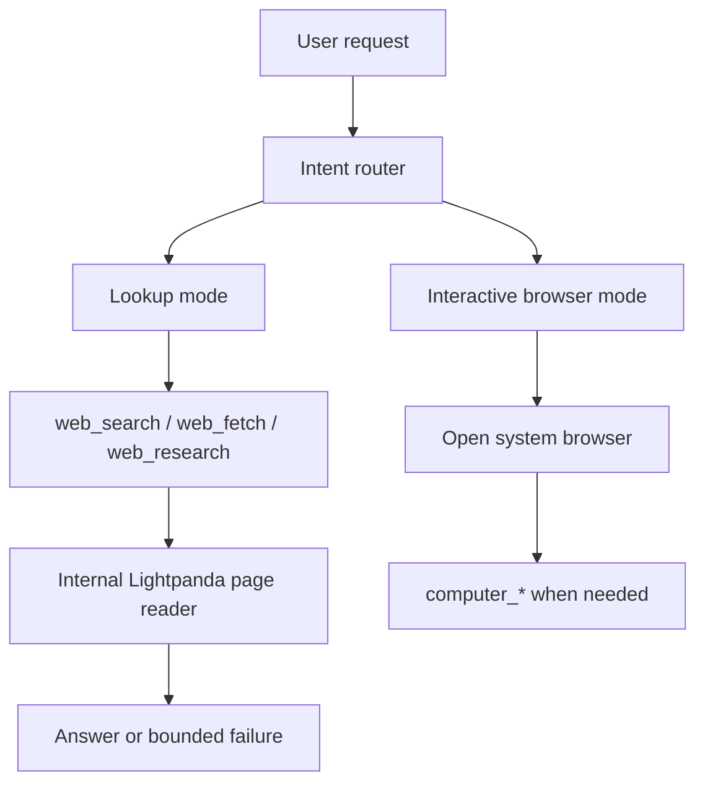

# Lightpanda + System Browser Simplification Design

## 1. Decision Summary

Aura will stop treating "browser" as one large mixed capability.

We will split the current browser stack into two explicit products:

1. Lookup path: `web_search` / `web_fetch` / `web_research` plus a new Lightpanda-backed page reader.
2. Interactive path: open the user's system browser for explicit browser-operation tasks, with optional `computer_*` follow-up.

This is a deliberate product simplification, not a compatibility extension.

Target behavior:

1. Information lookup tasks never auto-open a visible browser.
2. Lookup failures stay failures. They do not escalate to system Chrome.
3. Browser-operation tasks do not use Lightpanda.
4. Managed browser download, browser source switching, Chrome login import, Aura browser profile management, and the old Playwright browser runtime are removed.

## 2. Problem Statement

The current browser architecture mixes too many responsibilities:

1. Search-result browsing
2. Page reading
3. JS-capable headless execution
4. Screenshot / trace / video
5. Browser takeover
6. Managed browser installation
7. Browser source switching
8. Cookie import from Chrome
9. Profile lifecycle management

This causes three product problems:

1. Wrong fallback shape: "lookup failed" escalates into a full browser runtime.
2. High UI complexity: the browser settings page exposes concepts normal users do not understand.
3. High maintenance burden: the browser runtime spans bridge code, Tauri commands, settings storage, chat cards, routing, evidence, and docs.

This also causes the current anti-bot pain:

1. `browser_search` opens real search-engine result pages.
2. `web_fetch` treats many failures as "needs browser" too early.
3. The system still keeps a heavy browser runtime available as an easy fallback.

## 3. Product Model

### 3.1 Lookup Mode

Lookup mode is for:

1. Searching current information
2. Reading page content
3. Extracting facts from JS-dependent pages
4. Comparing multiple pages
5. Returning failure when a site requires login, CAPTCHA, or challenge

Lookup mode uses:

1. `web_search`
2. `web_fetch`
3. `web_research`
4. Internal Lightpanda runtime

Lookup mode does not use:

1. `browser_search`
2. `browser_open`
3. takeover flows
4. system Chrome fallback

### 3.2 Interactive Browser Mode

Interactive browser mode is for:

1. Opening a website for the user to handle
2. Explicit browser-operation requests
3. Login flows
4. CAPTCHA / MFA / permission prompts
5. Tasks that require a visible user-facing browser

Interactive browser mode uses:

1. system default browser open
2. existing `computer_*` tools where desktop interaction is needed

Interactive browser mode does not use:

1. Lightpanda
2. headless page-reading fallback
3. Aura browser profile / managed browser concepts

## 4. High-Level Architecture

### 4.1 Target Flow



### 4.2 Key Routing Rule

The old rule was:

1. Try `web_*`
2. If blocked, escalate to browser runtime
3. If blocked again, hand off to user

The new rule is:

1. Lookup intent -> stay on `web_*` + Lightpanda only
2. Browser-operation intent -> go directly to system browser

There is no automatic path from lookup mode into interactive browser mode.

## 5. Tool Surface Changes

### 5.1 Tools to Keep

Keep:

1. `web_search`
2. `web_fetch`
3. `web_research`
4. `computer_*`

### 5.2 Tools to Add

Add:

1. `system_browser_open`
   Opens a URL in the user's default browser.
2. Internal Lightpanda adapter
   Not exposed as a first-class user tool in v1.

The Lightpanda adapter should initially remain internal to reduce model complexity.

Suggested internal entry points:

1. `runLightpandaFetch(url, options)`
2. `runLightpandaExtract(url, options)`
3. `runLightpandaEvaluate(url, script, options)` if needed later

### 5.3 Tools to Remove

Remove completely:

1. `browser_open`
2. `browser_search`
3. `browser_get_page`
4. `browser_snapshot`
5. `browser_run_javascript`
6. `browser_screenshot`
7. `browser_click`
8. `browser_type`
9. `browser_wait_for`
10. `browser_inspect_element`
11. `browser_list_sessions`
12. `browser_set_active_session`
13. `browser_close_session`
14. `browser_storage_list`
15. `browser_storage_get`
16. `browser_storage_set`
17. `browser_storage_clear`
18. `browser_storage_export_state`
19. `browser_storage_import_state`
20. `browser_console_get`
21. `browser_network_get`
22. `browser_trace_start`
23. `browser_trace_stop`
24. `browser_video_start`
25. `browser_video_stop`
26. `browser_takeover_visible`
27. `browser_resume_after_takeover`

Also remove:

1. `chrome_open_url`
2. `chrome_get_active_tab`
3. `chrome_run_javascript`

Rationale:

1. `chrome_*` is Chrome-specific and conflicts with the new "system browser" model.
2. The generic interactive path should be `system_browser_open` plus `computer_*`.

## 6. Lightpanda Runtime Design

### 6.1 Installation Model

Aura will not download Lightpanda for the user.

Supported model:

1. User installs Lightpanda manually.
2. User chooses the executable path in settings, or Aura auto-detects common locations.
3. Aura validates the binary by checking version / startup health.

Unsupported model:

1. managed browser installation
2. bundled browser runtime
3. automatic Lightpanda download inside Aura

### 6.2 Runtime Shape

v1 Lightpanda is a lookup-only local runtime.

Capabilities:

1. open URL
2. wait for page readiness
3. execute limited JS if needed for extraction
4. return markdown / text / metadata
5. run several sessions concurrently

Non-capabilities:

1. visible window
2. user takeover
3. persistent profile
4. login import
5. screenshots / traces / video
6. state handoff into system browser

### 6.3 Concurrency Model

Lookup mode may run Lightpanda concurrently, but not without bounds.

Default proposal:

1. global session cap: `4`
2. per-host cap: `2`
3. idle session TTL: `15s`
4. hard timeout per page: `10s` to `15s`

This allows parallel retrieval while keeping memory and site pressure controlled.

### 6.4 Failure Policy

Lookup mode fails fast and returns a bounded error when a page:

1. requires login
2. shows a challenge or CAPTCHA
3. cannot be rendered stably
4. exceeds timeout

Aura will not auto-open a visible browser from these failures.

## 7. Lookup Pipeline Redesign

### 7.1 New Fetch Ladder

Target `web_fetch` ladder:

1. direct HTTP fetch
2. readability / local extraction
3. Jina fallback if enabled
4. Lightpanda fetch for JS-dependent or browser-only pages
5. bounded failure

Important change:

1. Remove automatic escalation from `web_fetch` / `web_research` to `browser_*`.

### 7.2 Search Policy

`browser_search` is removed.

Search policy becomes:

1. Prefer API-backed search providers
2. Use HTML search fallback only inside `web_search`, never by opening a real browser search page
3. Let `web_research` deepen with `web_fetch` and Lightpanda
4. If evidence remains blocked, return failure with reason

### 7.3 Intent Mapping

Router should classify requests into two explicit intents:

1. `lookup`
2. `browser-operation`

Suggested lookup cues:

1. search
2. latest info
3. docs
4. compare pages
5. extract content
6. read article
7. summarize website

Suggested browser-operation cues:

1. open website and do something
2. login
3. click
4. submit
5. fill form
6. download from page
7. handle popup
8. authorization
9. captcha

Classification should be intentionally conservative. Ambiguous requests should prefer `browser-operation` only when the task clearly implies page actions.

## 8. Interactive Browser Design

### 8.1 System Browser Strategy

The new interactive entry point is:

1. `system_browser_open(url)`

Implementation can reuse the existing OS-level open behavior already exposed through `open_path_in_default_app`.

### 8.2 Interaction Strategy

Interactive tasks may continue through:

1. user manual handling
2. `computer_*` tools if desktop automation is permitted

We are explicitly not keeping a dedicated in-app headless-to-visible browser takeover model.

### 8.3 State Model

There is no shared session/state model between Lightpanda and the system browser.

That means:

1. no cookie transfer
2. no profile sync
3. no takeover continuation
4. no "resume after takeover"

This is a product simplification, not a temporary limitation.

## 9. Settings Redesign

### 9.1 Current Problem

The current browser page mixes:

1. runtime enable/disable
2. browser source selection
3. managed installation
4. custom executable
5. profile lifecycle
6. takeover mode
7. browser search engine
8. browser locale / timezone / color scheme / UA
9. login import
10. Chrome automation fallback

This is too much for ordinary users.

### 9.2 New Settings Goal

The new browser settings should answer only two user questions:

1. How should Aura get information from dynamic websites?
2. How should Aura open a real browser when interaction is needed?

### 9.3 Proposed New Page

Rename the page from "浏览器" to `网页与浏览器`.

Show only two top-level cards.

Card 1: `资料获取`

1. `启用 Lightpanda 加速动态网页读取`
2. `Lightpanda 可执行文件`
3. `并发页面数`
4. `页面读取超时`
5. status text: available / not configured / invalid path

Card 2: `浏览器操作`

1. `允许 Aura 打开系统默认浏览器`
2. `需要交互时可继续使用桌面操作`
3. `桌面操作默认自动允许` only if the desktop-approval setting remains in product

Text note:

1. "查资料时不会自动打开浏览器。"
2. "只有明确网页操作任务才会打开系统浏览器。"

### 9.4 What Leaves the Page Entirely

Remove from settings UI:

1. managed browser install / uninstall
2. browser source radio group
3. custom browser path for Chrome runtime
4. Aura profile controls
5. takeover mode
6. browser search engine controls
7. browser locale / timezone / color scheme / UA controls
8. Chrome profile scan
9. cookie import
10. imported site management
11. Chrome automation fallback

If web-provider tuning remains needed, it should live under a separate `Web Research` area, not under browser settings.

## 10. Settings/Data Model Changes

### 10.1 Remove Types

Remove from `src/types.ts`:

1. `BrowserRuntimeSource`
2. `BrowserSearchEngine`
3. `BrowserTakeoverMode`
4. `BrowserSearchPreferences`
5. `BrowserBehaviorPreferences`
6. `BrowserRuntimeSettings`
7. `ChromeImportSource`
8. `ImportedChromeSite`
9. `BrowserRuntimeStatusRecord`
10. `ManagedBrowserInstallStage`
11. related progress/status types that exist only for managed browser install

### 10.2 Add Types

Add a smaller browser config model:

```ts
export type LightpandaSettings = {
  enabled: boolean
  executablePath: string
  maxConcurrency: number
  timeoutSeconds: number
}

export type InteractiveBrowserSettings = {
  enabled: boolean
  allowComputerUse: boolean
}
```

Then attach them under settings:

```ts
browser: {
  lightpanda: LightpandaSettings
  interactive: InteractiveBrowserSettings
}
```

### 10.3 Storage Migration

Migration policy:

1. read old browser fields once
2. ignore them for runtime behavior
3. write only the new compact schema going forward

We should not keep compatibility logic that preserves old behavior.

## 11. Code Deletion Scope

### 11.1 Delete Entire Files

Delete entirely:

1. `bridge/browserRuntime.mjs`
2. `bridge/browserProfileActions.mjs`

Delete or replace:

1. `src/lib/browser.ts`
   Replace with Lightpanda detection/validation helpers only if still needed.

### 11.2 Major Tauri Deletion

Remove commands and helpers related to:

1. browser runtime detection
2. managed browser install / uninstall / cancel
3. browser runtime status record
4. Aura browser profile reset
5. Chrome profile discovery
6. Chrome cookie import / clearing
7. managed browser progress events

This is a large simplification area in `src-tauri/src/main.rs`.

### 11.3 Major Frontend Deletion

Delete browser settings UI blocks for:

1. browser overview
2. runtime source selection
3. install and detection panel
4. profile and session management
5. takeover controls
6. login import
7. imported site management
8. browser behavior
9. Chrome automation fallback panel

Also remove related CSS for:

1. install progress bars
2. browser summary cards that exist only for the old runtime

### 11.4 Routing / Tooling Cleanup

Delete references to:

1. `browser_*` in `bridge/agentRouting.mjs`
2. `browser_*` in `bridge/agentEvidence.mjs`
3. browser runtime tool groups in `bridge/capabilitySelector.mjs`
4. browser runtime registration in `bridge/advancedTools.mjs`
5. browser runtime docs / skills that describe the removed stack

### 11.5 Docs / Prompt Cleanup

Remove or rewrite:

1. `skills/aura-browser-operator.md`
2. browser runtime sections in architecture docs
3. prompting that teaches browser fallback from web research

## 12. New Code to Add

### 12.1 New Runtime Module

Add:

1. `bridge/lightpandaRuntime.mjs`

Responsibilities:

1. validate executable
2. launch or reuse local Lightpanda process
3. manage bounded concurrency
4. expose lookup-only page extraction helpers
5. shut down idle processes

### 12.2 New Interactive Open Tool

Add:

1. `system_browser_open`

Responsibilities:

1. open URL in the system default browser
2. emit a simple structured tool result
3. remain cross-browser rather than Chrome-specific

### 12.3 Chat/Event Support

Add or update event cards for:

1. Lightpanda lookup reads
2. system browser open events

Remove event-card assumptions that only know old `browser_*` artifacts.

## 13. Phased Implementation Plan

### Phase 1: Freeze the New Product Boundary

Goal:

1. Stop growing the old browser runtime.

Tasks:

1. Write the new design decision into docs
2. Remove browser fallback assumptions from prompts and routing
3. Mark `browser_*` and `chrome_*` as deprecated internally

Acceptance:

1. Team agrees that lookup mode will not auto-open a browser.

### Phase 2: Introduce the New Settings Model

Goal:

1. Replace the current browser settings schema and page structure.

Tasks:

1. add compact Lightpanda + interactive settings types
2. add storage migration
3. redesign the settings page UI
4. remove obsolete controls from the page

Acceptance:

1. Browser settings page contains only the new two-card structure.

### Phase 3: Add System Browser Open

Goal:

1. Support explicit browser-operation tasks with a simple visible-browser path.

Tasks:

1. add `system_browser_open`
2. route browser-operation intent to system browser + `computer_*`
3. remove Chrome-specific fallback assumptions

Acceptance:

1. Explicit browser-operation tasks no longer depend on the old browser runtime.

### Phase 4: Add Lightpanda Runtime

Goal:

1. Make dynamic-page lookup work without the old browser runtime.

Tasks:

1. implement `bridge/lightpandaRuntime.mjs`
2. validate executable path
3. add concurrency pool
4. wire Lightpanda into `web_fetch`
5. wire Lightpanda into `web_research`

Acceptance:

1. Dynamic lookup tasks can use Lightpanda without mounting `browser_*`.

### Phase 5: Delete Old Browser Runtime Code

Goal:

1. Remove dead code completely.

Tasks:

1. delete `bridge/browserRuntime.mjs`
2. delete managed browser install code
3. delete Chrome import code
4. remove `browser_*` and `chrome_*` references
5. remove obsolete docs and skills

Acceptance:

1. Repository no longer contains the old Aura browser runtime path.

## 14. Recommended Execution Order for the Next Development Cycle

Recommended order:

1. land the settings/data-model redesign first
2. add `system_browser_open`
3. build the Lightpanda runtime and wire it into `web_fetch`
4. update routing so lookup and browser-operation are fully separated
5. delete the old browser runtime stack
6. clean up docs, prompts, and UI leftovers

Rationale:

1. The settings/UI simplification unblocks product clarity immediately.
2. `system_browser_open` gives us a simple explicit interaction path early.
3. Lightpanda can then be integrated without preserving the old browser fallback model.
4. Final deletion should happen only after the new path is working.

## 15. Testing and Acceptance Criteria

### 15.1 Functional

1. Lookup tasks do not open the system browser.
2. Browser-operation tasks do not try to use Lightpanda.
3. `web_fetch` can use Lightpanda on JS-dependent pages.
4. Login/challenge pages return bounded failure in lookup mode.

### 15.2 Product

1. Browser settings page is understandable without explaining "profile", "runtime source", or "managed browser".
2. There is no "download browser" concept inside Aura.
3. There is no Chrome-specific mental model in the main product flow.

### 15.3 Codebase

1. No `browser_*` tool registration remains.
2. No managed-browser install code remains.
3. No Chrome cookie import code remains.
4. No prompt text suggests research fallback into the removed browser runtime.

## 16. Risks and Open Questions

### 16.1 License Risk

Lightpanda open-source licensing must be reviewed before product distribution decisions are finalized.

### 16.2 Cross-Platform Default Browser Open

Current helper uses macOS `open`. We should confirm the intended desktop-platform scope before finalizing `system_browser_open`.

### 16.3 Lookup Success Rate

Lightpanda is a better fit for lightweight dynamic retrieval, but we still need a real benchmark on our target sites before deleting the old runtime.

## 17. Immediate Next Step

The next implementation step should be:

1. replace the browser settings schema and UI
2. add `system_browser_open`
3. remove automatic browser fallback flags from web research settings

This gives us the new product boundary first, before we spend engineering effort on Lightpanda runtime internals.


已经推进到“新架构主干成型，旧链路大半拆掉”的阶段了，核心进度是：

已完成：配置模型切到 Lightpanda + system browser 新结构；设置页重做成“资料获取 / 浏览器操作 / Web Research / Web Search / Web Fetch”这套新 UI。
已完成：加了真实的 Lightpanda 检测命令和前端桥接；web_fetch 已接入 Lightpanda fallback，不再自动建议 browser_*。
已完成：web_research 的浏览器兜底逻辑已移除；system_browser_open 新工具已加上；chrome_* 和旧浏览器运行时已从 bridge 主链路移除。
已完成：前端 tsc --noEmit 通过，pnpm build:bridge 通过；旧的 bridge/browserRuntime.mjs 和 bridge/browserProfileActions.mjs 已删掉。
还在收尾的部分：

聊天页和主窗口里残留的旧“browser takeover / browser structured card” UI 清理。
Rust 侧旧浏览器安装/导入/清理命令的删减，以及构建/依赖的最终瘦身。
最后一轮全局搜索、删死代码、再跑验证。
