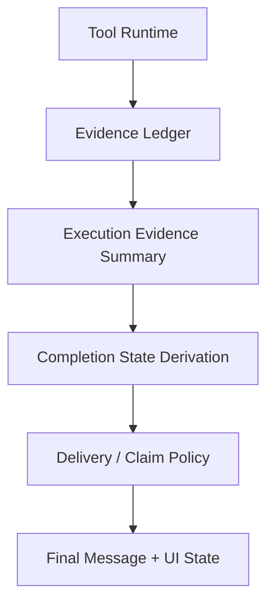

# Route-First 完成态与证据账本详设

本文档用于指导 Aura 在方案 A `route-first` 执行流中，彻底移除基于自然语言文案的“是否已完成”判断，并用纯运行时结构化状态替代当前的后置文本扫描策略。

目标不是再加一层 Prompt 限制词，也不是把关键词扫描从 Prompt 挪到后处理，而是把“完成态”正式建模成运行时真相，让模型只负责组织用户可读回答，不再负责定义任务是否真的完成。

---

## 1. 背景与问题

当前实现中，`execute` 路径在 provider 输出回答后，还会走一层后置 `enforceEvidencePolicy`。  
这层逻辑的目标本来是防止模型在没有真实执行证据时误报“已经完成”，但当前实现仍然依赖自然语言扫描：

1. 扫描最终回答里是否出现“已完成 / 已修复 / fixed / configured / 已经帮你”之类词。
2. 如果命中关键词且当前没有工具证据，则整段回答被替换成统一兜底文案。

这会带来三个问题：

1. 它仍然是自然语言启发式，本质上和过去的强提示词是同一路线。
2. 它可能误杀正常长回答，只因为回答中包含“完成、修复、配置”之类词。
3. 它把“系统完成判定”和“用户可读回答”混在一起，导致正文被整段覆盖。

一句话总结：

**当前问题不是 Prompt 不够强，而是系统没有把“完成态”建模成结构化状态。**

---

## 2. 设计目标

### 2.1 业务目标

1. 不再因为回答文案里出现某些词就误判“已完成”。
2. 长回答不再被一句兜底提示整段覆盖。
3. `advise / diagnose / execute` 三类回答对完成态有清晰、稳定、可解释的边界。

### 2.2 工程目标

1. 系统永远不从 `message` 倒推完成态。
2. 完成态只能由运行时事实计算。
3. 证据策略能兼容当前方案 A，并为后续方案 B 复用。
4. UI、快照、恢复流、持久化都能消费同一套结构化状态。

### 2.3 非目标

1. 本次不要求一次性把所有 plugin / MCP 都改造成完美证据源。
2. 本次不要求立刻实现任务级领域特定完成标准。
3. 本次不要求让模型输出强制 JSON 协议。

---

## 3. 设计原则

### 3.1 `message` 不是完成态真相

`message` 是展示层产物，只负责给用户可读输出。  
`completionState` 是系统真相，只由运行时状态机计算。

正确关系：

- `message` 负责“怎么表达”
- `completionState` 负责“是否真的完成”

错误关系：

- 先看 `message` 再猜任务是否完成

### 3.2 先有状态机，再有文案约束

正确顺序：

1. 系统先根据执行证据算出完成态
2. 再根据完成态限制最终文案边界

不允许的顺序：

1. 模型先说自己完成了
2. 系统再扫描关键词尝试纠偏

### 3.3 证据层和判定层分离

建议拆成两层：

1. 证据层：工具运行后产生结构化证据
2. 判定层：根据证据聚合结果推导完成态

如果只有判定层，没有证据层，状态机就只能消费粗粒度启发式数据，例如：

- `toolEvents.length > 0`
- 调过 `run_shell`
- 打开过浏览器

这仍然容易误判。

---

## 4. 总体架构



含义如下：

1. 工具运行时不只产生日志，还产出结构化证据。
2. 系统把分散证据聚合成一份 `ExecutionEvidenceSummary`。
3. 系统根据 `routeState.answerMode` 和 `ExecutionEvidenceSummary` 推导 `completionState`。
4. 最终回答阶段只消费 `completionState`，不扫描自然语言。

---

## 5. 数据模型设计

### 5.1 完成态

建议新增：

```ts
type CompletionState =
  | 'not_executed'
  | 'executed_unverified'
  | 'executed_verified'
  | 'blocked_by_approval'
  | 'blocked_by_capability'
  | 'failed_after_execution'
```

语义定义：

1. `not_executed`
   - 本轮没有发生真实执行
   - 适用于 `execute` 路径未真正改文件、跑命令或浏览器交互
2. `executed_unverified`
   - 发生了真实执行
   - 但没有拿到足够验证证据
3. `executed_verified`
   - 发生了真实执行
   - 且拿到了满足当前完成标准的验证证据
4. `blocked_by_approval`
   - 任务需要执行，但被审批阻塞或拒绝
5. `blocked_by_capability`
   - 任务需要执行，但当前路由预算、能力层级或挂载边界无法继续推进
6. `failed_after_execution`
   - 已经执行过操作，但执行过程中失败

### 5.2 单条证据记录

建议新增：

```ts
type EvidenceRecord = {
  toolName: string
  source: 'builtin' | 'plugin' | 'mcp' | 'subagent'
  status: 'success' | 'error' | 'denied'
  effectTypes: Array<'read' | 'write' | 'execute' | 'browser' | 'plan'>
  targets?: string[]
  producedEvidence: Array<
    | 'file_mutation'
    | 'command_exit_0'
    | 'command_output'
    | 'test_pass'
    | 'test_fail'
    | 'page_state'
    | 'search_result'
    | 'user_denied'
  >
  verificationLevel: 'none' | 'partial' | 'verified'
  detail?: string
}
```

### 5.3 聚合证据摘要

建议新增：

```ts
type ExecutionEvidenceSummary = {
  records: EvidenceRecord[]
  hasAnyExecution: boolean
  hasWriteEffect: boolean
  hasBrowserEffect: boolean
  hasVerifiedEvidence: boolean
  hasApprovalBlock: boolean
  hasCapabilityBlock: boolean
  hasExecutionFailure: boolean
}
```

### 5.4 结果结构扩展

建议在 Agent 结果、任务快照、消息版本中增加：

```ts
completionState?: CompletionState
evidenceSummary?: {
  hasAnyExecution: boolean
  hasVerifiedEvidence: boolean
  hasApprovalBlock: boolean
  hasCapabilityBlock: boolean
  hasExecutionFailure: boolean
}
deliveryNote?: string
```

其中：

1. `completionState` 是系统最终判定
2. `evidenceSummary` 是 UI 与调试摘要
3. `deliveryNote` 是系统附加说明，不替代正文

---

## 6. 运行时判定规则

### 6.1 输入

完成态推导只允许消费以下结构化输入：

1. `routeState.answerMode`
2. `ExecutionEvidenceSummary`
3. governor 产生的阻塞原因
4. 审批状态

不允许消费：

1. `message`
2. `draftMessage`
3. 最终回答里的“已完成 / 已修复”等自然语言

### 6.2 判定规则

建议规则如下：

1. `advise / diagnose`
   - 默认不进入完成态 claim
   - 可统一映射为 `not_executed`
   - UI 可显示为“分析 / 建议回答”

2. `execute + hasApprovalBlock`
   - `completionState = blocked_by_approval`

3. `execute + hasCapabilityBlock`
   - `completionState = blocked_by_capability`

4. `execute + !hasAnyExecution`
   - `completionState = not_executed`

5. `execute + hasAnyExecution + hasExecutionFailure`
   - `completionState = failed_after_execution`

6. `execute + hasAnyExecution + !hasVerifiedEvidence`
   - `completionState = executed_unverified`

7. `execute + hasAnyExecution + hasVerifiedEvidence`
   - `completionState = executed_verified`

### 6.3 允许的对用户表述边界

建议系统根据 `completionState` 约束最终输出：

1. `not_executed`
   - 允许：分析、方案、下一步
   - 不允许：宣称已完成

2. `executed_unverified`
   - 允许：说明已做修改或已执行操作
   - 不允许：宣称全部完成

3. `executed_verified`
   - 允许：确认已完成

4. `blocked_by_approval`
   - 允许：明确说明卡在审批

5. `blocked_by_capability`
   - 允许：明确说明卡在能力 / 预算边界

6. `failed_after_execution`
   - 允许：说明做到哪里失败了

---

## 7. 证据账本设计

### 7.1 为什么需要证据账本

只有完成态状态机还不够。  
如果状态机底层输入仍然只有：

- `toolEvents.length > 0`
- 有没有调 `run_shell`
- 有没有打开浏览器

那它仍然是粗粒度启发式，无法稳定区分：

1. 读文件和真执行
2. 执行操作和验证完成
3. 浏览器交互成功和任务真正达成

因此必须把 `toolEvents` 升级成“证据账本”。

### 7.2 builtin tool 证据映射

建议先从 builtin tools 做静态映射：

1. `list_files / glob_files / read_file / search_code`
   - `effectTypes = ['read']`
   - `verificationLevel = 'none'`

2. `write_file / edit_file / multi_edit_file`
   - `effectTypes = ['write']`
   - `producedEvidence = ['file_mutation']`
   - `verificationLevel = 'none'`

3. `run_shell`
   - `effectTypes = ['execute']`
   - 成功时至少记录 `command_output`
   - exit code 0 时记录 `command_exit_0`
   - 若命令看起来像测试命令且成功，则记录 `test_pass`
   - 若命令看起来像测试命令且失败，则记录 `test_fail`

4. `browser_search`
   - `effectTypes = ['browser']`
   - `producedEvidence = ['search_result']`
   - 不自动视为验证完成

5. `browser_open / browser_click / browser_type`
   - `effectTypes = ['browser']`
   - 默认只说明发生过浏览器执行
   - 不自动视为验证完成

6. `browser_get_page / browser_run_javascript`
   - 若返回结构化页面状态，可追加 `page_state`
   - 可作为 `partial` 或 `verified` 的候选证据

### 7.3 plugin / MCP / subagent

第一阶段可采用保守策略：

1. 若 tool 元数据未声明 effect / evidence，则默认按只读或未知处理
2. 不因为 plugin / MCP 成功返回就自动视为已完成
3. 后续可逐步为高价值能力补充证据声明字段

---

## 8. 模块职责建议

### 8.1 `bridge/agentEvidence.mjs`

建议承担以下职责：

1. `collectEvidenceFromToolEvents(toolEvents)`
2. `deriveCompletionState(routeState, evidenceSummary, runtimeBlocks)`
3. `buildDeliveryPolicy(completionState)`
4. `applyCompletionPolicy(result, completionState, evidenceSummary)`

### 8.2 `bridge/tools.mjs`

建议补充：

1. tool -> evidence 的静态映射
2. `invokeTool` 成功/失败后写入结构化 evidence
3. shell / browser 的附加证据抽取

### 8.3 `bridge/agentGovernor.mjs`

建议负责：

1. 把审批阻塞映射为 `blocked_by_approval`
2. 把 route 停止条件映射为 `blocked_by_capability`
3. 把“无增量信息 / 达到预算上限”转换成结构化阻塞原因

### 8.4 `bridge/providers.mjs`

建议只消费结构化完成态，不做自然语言推断。

---

## 9. finalization / recovery 改造建议

### 9.1 问题

当前 finalization / recovery 会接收工具结果摘要和草稿回答，但没有接收结构化完成态。  
因此 finalizer 仍然需要“自己猜能不能说完成”，容易再度滑回文案层误判。

### 9.2 正确做法

finalizer prompt 应追加系统给定边界，例如：

```txt
System completion state: executed_unverified
Allowed wording: describe what was changed, but do not claim the task is fully completed.
```

这里不是用 Prompt 替代控制器，而是把控制器已经算好的结果传给整理器。

### 9.3 recovery

recovery 也必须消费同一套 `completionState`。  
恢复回答只能整理已有事实，不能重新定义任务是否完成。

---

## 10. UI 与快照设计

### 10.1 双通道展示

UI 不应再用一句系统提示覆盖正文。  
建议改成双通道展示：

1. 正文继续展示 `message`
2. 单独展示完成态 badge
3. 单独展示 `deliveryNote`

### 10.2 建议 UI 状态

可展示为：

1. `未执行`
2. `已执行未验证`
3. `已验证完成`
4. `等待审批`
5. `能力受限`
6. `执行失败`

### 10.3 持久化

`completionState`、`evidenceSummary`、`deliveryNote` 应进入：

1. Agent 结果
2. Tauri 任务快照
3. 消息版本持久化

---

## 11. 实施路线

建议分三步实施。

### 11.1 第一阶段：完成态核心

目标：

1. 删除基于自然语言关键词的完成态判断
2. 引入 `CompletionState`
3. 引入 `ExecutionEvidenceSummary`
4. 在 `agentEvidence.mjs` 中重写完成态推导逻辑

交付：

1. `resultClaimsExecution()` 删除
2. `enforceEvidencePolicy()` 改造成纯结构化判定

### 11.2 第二阶段：证据账本

目标：

1. builtin tools 产出结构化 evidence
2. shell / browser 补充验证信号
3. governor 产出审批阻塞与能力阻塞信号

交付：

1. `collectEvidenceFromToolEvents()` 可稳定区分执行 / 验证 / 阻塞

### 11.3 第三阶段：展示与恢复流

目标：

1. finalization / recovery 接 completionState
2. UI 展示双通道状态
3. SQLite 持久化完成态字段

交付：

1. 长回答不会再被一句兜底文案整段覆盖

---

## 12. 验收标准

### 12.1 正确性

1. 系统不再根据最终回答文本判断是否完成。
2. `execute` 任务未执行时，不得显示“已完成”。
3. `execute` 任务已执行但未验证时，不得显示“已完成”。
4. `advise / diagnose` 不会因为正文出现“完成 / 修复 / 配置”字样而被误杀。

### 12.2 用户体验

1. 长回答正文不会再被一句统一兜底文案整段覆盖。
2. 用户能看到系统状态与正文的区别。
3. 被审批或能力边界阻塞时，原因可解释。

### 12.3 架构一致性

1. 方案 A 不再依赖自然语言完成态扫描。
2. 证据层、判定层、展示层职责清晰分离。
3. 这套机制可被后续方案 B 复用。

---

## 13. 一句话结论

这次改造的本质不是“换一种方式限制模型说完成”，而是：

**把“是否完成”从自然语言世界，迁回运行时结构化状态世界。**

只有这样，方案 A 的 Route-First 重构才算真正完成了“Prompt 变薄，运行时变强”的目标。
