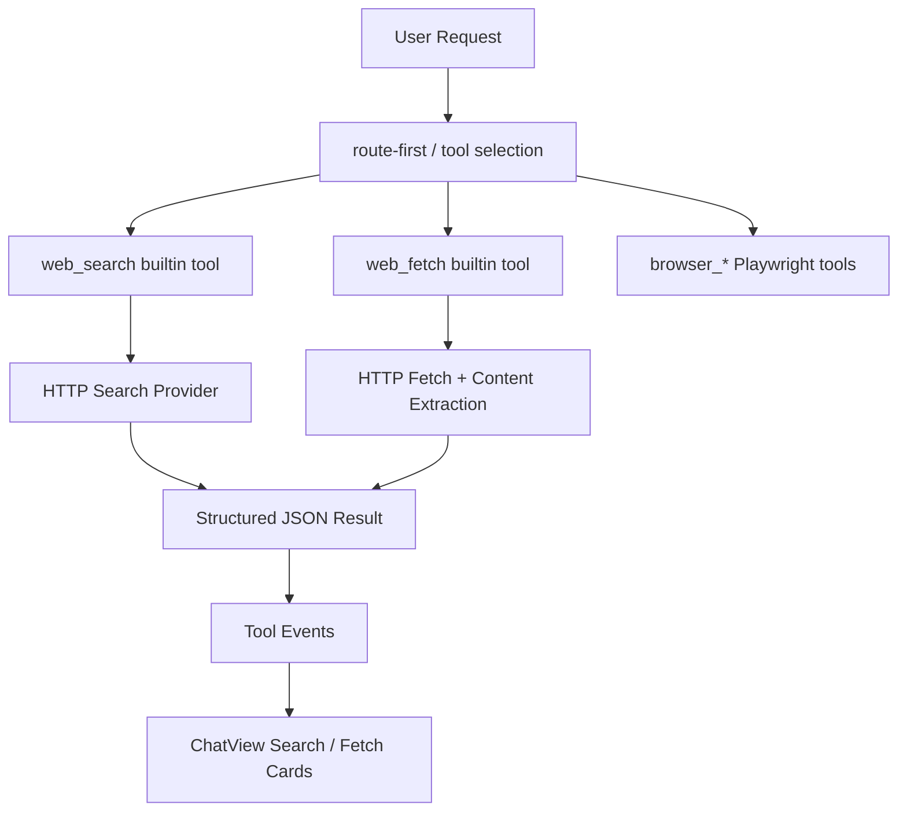
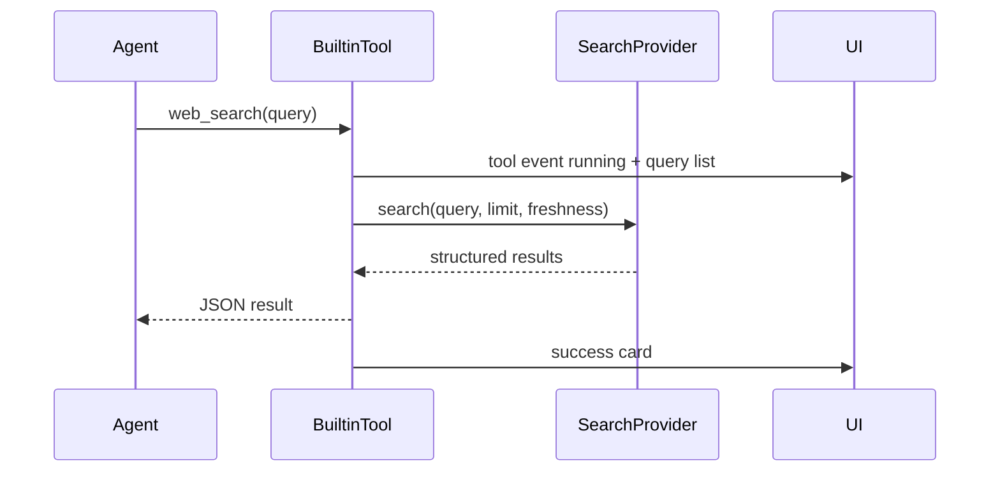
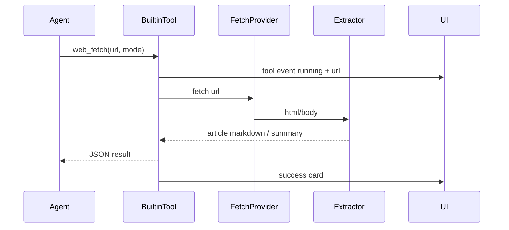

# Aura `web_search` / `web_fetch` 内置工具详设

本文档定义 Aura 面向“联网检索最新信息”的两类新内置工具：

1. `web_search`
2. `web_fetch`

目标是把“搜资料 / 查新闻 / 找文档 / 读取网页正文”从现有 `browser_*` Playwright 浏览器自动化链路中拆分出来，形成一套更像 Codex / 通用研究助手的能力路径：

1. 默认走结构化搜索与网页抓取，不打开 Playwright 浏览器
2. 前端以“Searching the web / Fetching page”这类结构化卡片展示工具进度和结果
3. 只有当任务必须使用浏览器交互，或用户明确要求“用浏览器打开”时，才进入现有 `browser_*` Playwright 路径

---

## 0. 设计结论

### 0.1 一句话方案

新增两类 builtin tool：

1. `web_search`：用搜索 provider 或结构化搜索源返回标题、链接、摘要
2. `web_fetch`：用 HTTP 抓取并抽取正文，返回 markdown / 文本摘要 / 元数据

默认实现 **不依赖 Playwright**，并且 **不直接打开真实搜索结果网页**。  
后续如有必要，再增加：

1. Tauri 隐藏 WebView fallback
2. Playwright fallback

### 0.2 为什么不直接继续增强 `browser_search`

现有 `browser_search` 的执行模型是：

1. 构造 Google / Bing / DuckDuckGo / Baidu URL
2. 用 Playwright 打开真实搜索页
3. 再通过 `browser_get_page` / `browser_snapshot` 去读页面

这条链路的问题：

1. 易触发验证码、登录、反爬虫
2. 结果本质是“网页自动化”，不是“结构化检索”
3. 前端只能展示 `browser_*` 风格的 Session / Snapshot / Artifact 卡片
4. 研究类任务会平白拉起 Playwright 与浏览器 runtime

本设计的核心目标就是把“检索”和“网页交互”分层。

---

## 1. 当前基线

### 1.1 已有能力

当前仓库已经具备：

1. builtin tool 注册入口：[bridge/tools.mjs](/Users/fanhuaze/Documents/YunWork/desk-agent/bridge/tools.mjs)
2. advanced tool / 浏览器工具入口：[bridge/browserRuntime.mjs](/Users/fanhuaze/Documents/YunWork/desk-agent/bridge/browserRuntime.mjs)
3. Node bridge -> 宿主 app action 通道：[bridge/ipc.mjs](/Users/fanhuaze/Documents/YunWork/desk-agent/bridge/ipc.mjs)
4. 宿主 app action 处理函数：[src-tauri/src/main.rs](/Users/fanhuaze/Documents/YunWork/desk-agent/src-tauri/src/main.rs)
5. 工具事件映射到消息事件：[src/MainWindowApp.tsx](/Users/fanhuaze/Documents/YunWork/desk-agent/src/MainWindowApp.tsx)
6. 结构化浏览器事件卡片：[src/views/ChatView.tsx](/Users/fanhuaze/Documents/YunWork/desk-agent/src/views/ChatView.tsx)
7. route-first 对 `browser_search` 的预算、证据和路由控制：
   - [bridge/agentRouting.mjs](/Users/fanhuaze/Documents/YunWork/desk-agent/bridge/agentRouting.mjs)
   - [bridge/agentEvidence.mjs](/Users/fanhuaze/Documents/YunWork/desk-agent/bridge/agentEvidence.mjs)

### 1.2 当前缺口

当前缺口不是“不能联网”，而是“联网方式不对”：

1. 没有专门的 `web_search` 结构化检索工具
2. 没有专门的 `web_fetch` 正文抽取工具
3. 最新信息类问题仍然容易走到 `browser_search`
4. UI 没有“搜索查询 / 搜索结果列表 / 网页正文摘要”的专用卡片
5. 证据系统里没有把“搜索结果”和“网页抓取结果”当作一级产物

---

## 2. 目标与原则

### 2.1 业务目标

1. 让“最新信息 / 文档 / 新闻 / 资料”类问题优先走 `web_search` / `web_fetch`
2. 明显减少验证码、反爬、登录要求
3. 前端体验更接近 Codex 的 `Searching the web` 状态与结果卡片
4. 研究型任务不默认拉起 Playwright

### 2.2 工程原则

1. v1 先做单链路、低复杂度、稳定可交付版本
2. 默认实现不依赖 BrowserWindow / WebView DOM 抽取
3. Playwright 继续只负责“网页交互”
4. `web_search` / `web_fetch` 的工具协议从第一版就固定下来，底层 provider 后续可替换
5. 先支持 provider-first，再谈 WebView fallback

### 2.3 非目标

1. 本次不替换现有 `browser_*`
2. 本次不实现复杂登录态网页抓取
3. 本次不做搜索引擎页面 DOM 抓取主路径
4. 本次不做网页交互自动化

---

## 3. 能力分层

### 3.1 最终分工

| 能力 | 适合场景 | 默认是否拉起浏览器 |
|---|---|---|
| `web_search` | 最新信息、新闻、文档、资料入口检索 | 否 |
| `web_fetch` | 打开某个 URL 读取正文 / 摘要 / metadata | 否 |
| `browser_*` | 登录、点击、填写表单、验证码、复杂网页交互 | 是 |

### 3.2 路由原则

优先顺序：

1. 用户要“查资料 / 搜新闻 / 找文档 / 最新信息”
   - 先 `web_search`
   - 再按需 `web_fetch`
2. 用户要“打开网页看看 / 点按钮 / 登录 / 提交”
   - 直接 `browser_*`
3. 用户明确说“用浏览器”
   - 直接 `browser_*`
4. `web_fetch` 失败且页面明显需要交互
   - 返回结构化错误，引导切换到 `browser_*`

---

## 4. 总体架构

### 4.1 v1 总体架构



### 4.2 为什么 v1 不把 Tauri WebView 当默认实现

虽然 Tauri 能创建 `WebviewWindow`，也能导航与执行 JS，但如果把它直接当 `web_search` / `web_fetch` 的默认底层，会立刻带来：

1. 远程网页加载与抽取回传链路更复杂
2. 跨平台 WebView 内核差异更大
3. 仍然会有一部分站点风控问题
4. 实现成本高于“先做 provider-first”

因此 v1 设计选择：

1. `web_search` 默认用结构化搜索 provider
2. `web_fetch` 默认用 HTTP 抓取 + 正文抽取
3. Tauri WebView fallback 留给 v2
4. Playwright fallback 留给显式浏览器场景

---

## 5. 工具接口设计

## 5.1 `web_search`

### 输入

```ts
type WebSearchArgs = {
  query: string
  limit?: number
  provider?: string
  freshness?: 'day' | 'week' | 'month' | 'year'
  locale?: string
  requireFresh?: boolean
}
```

### 输出

```ts
type WebSearchResult = {
  query: string
  provider: string
  tookMs: number
  total: number
  results: Array<{
    title: string
    url: string
    snippet: string
    site?: string
    publishedAt?: string
    score?: number
  }>
  suggestions?: string[]
}
```

### 语义约束

1. `results` 必须稳定返回数组，哪怕为空
2. 不返回网页原始 HTML
3. provider 必须显式告诉前端和 agent
4. 搜索结果只作为候选，不直接等同于网页正文证据

### 错误模型

```ts
type WebSearchError = {
  code:
    | 'WEB_SEARCH_DISABLED'
    | 'WEB_SEARCH_PROVIDER_NOT_CONFIGURED'
    | 'WEB_SEARCH_PROVIDER_FAILED'
    | 'WEB_SEARCH_NO_RESULTS'
  summary: string
  suggestedAction?: string
}
```

## 5.2 `web_fetch`

### 输入

```ts
type WebFetchArgs = {
  url: string
  mode?: 'article' | 'markdown' | 'summary' | 'metadata'
  maxChars?: number
  provider?: string
  selectorHint?: string
}
```

### 输出

```ts
type WebFetchResult = {
  url: string
  finalUrl?: string
  provider: string
  title: string
  site?: string
  excerpt?: string
  content?: string
  contentFormat: 'markdown' | 'text' | 'metadata'
  publishedAt?: string
  author?: string
  wordCount?: number
  tookMs: number
}
```

### 语义约束

1. `mode=summary` 优先返回较短正文摘要
2. `mode=article` / `markdown` 返回正文或 markdown 主内容
3. `mode=metadata` 只返回标题、站点、作者、时间等元信息
4. 不把完整 HTML 直接塞给模型

### 错误模型

```ts
type WebFetchError = {
  code:
    | 'WEB_FETCH_DISABLED'
    | 'WEB_FETCH_UNSUPPORTED_CONTENT'
    | 'WEB_FETCH_PROVIDER_NOT_CONFIGURED'
    | 'WEB_FETCH_PROVIDER_FAILED'
    | 'WEB_FETCH_PAGE_REQUIRES_BROWSER'
  summary: string
  suggestedAction?: string
}
```

---

## 6. Provider 策略

## 6.1 设计原则

v1 不做 OpenClaw 式完整 provider 插件系统，但工具接口要为 provider 留好位置。

### v1 provider 策略

#### `web_search`

1. 优先 keyless / 易接入 provider
2. 支持未来扩展到带 key provider

建议候选：

1. `duckduckgo-html`
2. `brave-search`（有 key 时）
3. `serpapi`（有 key 时）
4. `tavily`（有 key 时）

#### `web_fetch`

1. 默认 `http-readability`
2. 后续可加第三方抓取 provider

建议候选：

1. `http-readability`
2. `jina-reader`（若后续想接）
3. `firecrawl`（若后续想接）

### v2 provider 策略

保留扩展点：

1. `tauri-webview`
2. `remote-browser-fetch`
3. `playwright-fallback`

---

## 7. 执行链路设计

## 7.1 `web_search` 执行链路



### 核心要求

1. 允许一次性发多条 query，但 v1 可先只支持单条 query
2. 工具 summary 要显式包含 query 和结果数
3. 输出必须是结构化 JSON，不是拼接文本

## 7.2 `web_fetch` 执行链路



### 核心要求

1. 支持正文提取与摘要提取
2. 自动截断超长内容
3. 对明显“登录/验证码/脚本强依赖”页面返回结构化错误，不直接转 Playwright

---

## 8. 模块落点规划

## 8.1 bridge 层

### 新增文件

1. `bridge/webTools.mjs`
2. `bridge/webProviders/search/*.mjs`
3. `bridge/webProviders/fetch/*.mjs`
4. `bridge/webExtractors/*.mjs`

### 需要接入的现有文件

1. [bridge/tools.mjs](/Users/fanhuaze/Documents/YunWork/desk-agent/bridge/tools.mjs)
   - 注册 `web_search` / `web_fetch`
2. [bridge/agentRouting.mjs](/Users/fanhuaze/Documents/YunWork/desk-agent/bridge/agentRouting.mjs)
   - 增加 `web_*` 路由策略
3. [bridge/agentEvidence.mjs](/Users/fanhuaze/Documents/YunWork/desk-agent/bridge/agentEvidence.mjs)
   - 把搜索结果和抓取结果纳入 evidence
4. [bridge/agentPrompting.mjs](/Users/fanhuaze/Documents/YunWork/desk-agent/bridge/agentPrompting.mjs)
   - 指导模型先 `web_search` 再 `web_fetch`

## 8.2 Tauri 宿主层

v1 **不要求** Tauri 宿主层新增 WebView runtime。

仅需可选增强：

1. 保存 web tool 配置
2. 保存 provider key / runtime metadata
3. 可选缓存目录与清理入口

如果后续要做 Tauri WebView fallback，再新增：

1. `web_runtime_*` app action
2. `WebviewWindow` manager
3. DOM 抽取回传机制

## 8.3 前端层

### 需要接入的现有文件

1. [src/views/ChatView.tsx](/Users/fanhuaze/Documents/YunWork/desk-agent/src/views/ChatView.tsx)
2. [src/MainWindowApp.tsx](/Users/fanhuaze/Documents/YunWork/desk-agent/src/MainWindowApp.tsx)
3. `src/types.ts`

### 新增组件

1. `WebSearchEventCard`
2. `WebFetchEventCard`

---

## 9. 前端展示设计

## 9.1 事件识别

当前 `ChatView` 只对 `browser_*` 做结构化卡片识别。  
需要扩展为：

1. `browser_*` -> `BrowserStructuredEventCard`
2. `web_search` -> `WebSearchEventCard`
3. `web_fetch` -> `WebFetchEventCard`

## 9.2 `WebSearchEventCard`

### 顶部信息

1. Query
2. Provider
3. Result count

### 主体内容

每条结果展示：

1. 标题
2. 站点
3. 链接
4. 摘要

### 设计目标

UI 体验对标：

1. Codex 的 `Searching the web`
2. 研究型助手的搜索结果卡片

不展示：

1. Session
2. Snapshot refs
3. Browser artifact

## 9.3 `WebFetchEventCard`

### 顶部信息

1. URL / site
2. Provider
3. Content format

### 主体内容

1. 标题
2. 摘要
3. 折叠后的正文片段
4. 发布时间 / 作者（若有）

---

## 10. 与现有 Playwright 的协作关系

## 10.1 明确切换条件

以下情况才建议切到 `browser_*`：

1. 用户明确说“用浏览器打开”
2. 页面必须登录
3. 页面有验证码
4. 页面必须点按钮/滚动/交互后才能看到内容
5. `web_fetch` 返回 `WEB_FETCH_PAGE_REQUIRES_BROWSER`

## 10.2 agent 提示语原则

后续在 `agentPrompting` 里新增：

1. 查资料类任务优先 `web_search`
2. 打开候选结果优先 `web_fetch`
3. 只有遇到交互需求才切 `browser_*`
4. 不要为了“看最新信息”直接使用 `browser_search`

---

## 11. 证据系统改造

## 11.1 新证据类型

在 `agentEvidence` 里新增：

1. `web_search_result`
2. `web_fetch_content`
3. `web_fetch_summary`

## 11.2 验证级别

建议规则：

1. `web_search` 成功
   - 记为 `partial`
2. `web_fetch` 成功拿到正文 / 摘要
   - 记为 `partial`
3. `web_fetch` 成功且模型引用了正文内容
   - 仍记为 `partial`
4. 明确测试 / 执行类任务才进入 `verified`

原因：

1. 搜索与抓取提供的是外部信息证据
2. 它们不是“执行验证”

---

## 12. v1 详细实施范围

### 12.1 必做

1. 新增 `web_search`
2. 新增 `web_fetch`
3. 新增 `WebSearchEventCard`
4. 新增 `WebFetchEventCard`
5. route-first 引导研究类任务优先走 `web_*`
6. evidence 支持 `web_*`
7. 明确与 `browser_*` 的切换条件

### 12.2 不做

1. Tauri `WebviewWindow` fallback
2. Playwright 自动 fallback
3. 多 provider 插件体系
4. 登录态网页抓取
5. PDF / 文档文件复杂解析

---

## 13. 分阶段开发计划

## Phase 1：最小可用版本（建议先做）

目标：

1. 跑通 `web_search`
2. 跑通 `web_fetch`
3. 前端有专用卡片
4. agent 路由开始优先走 `web_*`

交付物：

1. `bridge/webTools.mjs`
2. `duckduckgo-html` 或等效简单搜索 provider
3. `http-readability` fetch provider
4. `ChatView` 搜索/抓取卡片

## Phase 2：稳定性增强

目标：

1. provider fallback
2. 更稳的正文抽取
3. 缓存与限流
4. 失败分类更清晰

交付物：

1. provider 排序策略
2. fetch retry / timeout / cache
3. 更好的错误码与 suggestedAction

## Phase 3：渲染型 fallback

目标：

1. 解决 JS 重页面抓取
2. 减少必须切 Playwright 的场景

交付物：

1. Tauri 隐藏 `WebviewWindow` runtime
2. `tauri-webview` fetch provider
3. 对明显 SPA 页面做渲染型抓取

## Phase 4：高级能力

目标：

1. provider 完整可插拔
2. runtime metadata / key 管理
3. 研究工具统一配置页

---

## 14. 风险与取舍

### 14.1 已知风险

1. keyless 搜索 provider 质量可能不稳定
2. 部分网页正文抽取效果受页面结构影响
3. `web_fetch` 默认 HTTP 模式无法处理强 JS 页面
4. 需要控制返回长度，避免把大段网页灌给模型

### 14.2 关键取舍

本设计明确优先：

1. 更像 Codex 的检索体验
2. 更少验证码
3. 更少 Playwright 启动
4. 更容易做结构化卡片

而不是优先：

1. 覆盖所有网页场景
2. 一开始就搞成完整 provider 平台
3. 一开始就引入 Tauri WebView runtime

---

## 15. 后续实现时的首批改动文件

建议按以下顺序开工：

1. [bridge/tools.mjs](/Users/fanhuaze/Documents/YunWork/desk-agent/bridge/tools.mjs)
   - 注入 `web_search` / `web_fetch`
2. 新增 `bridge/webTools.mjs`
   - 定义工具与 provider 调度
3. [bridge/agentRouting.mjs](/Users/fanhuaze/Documents/YunWork/desk-agent/bridge/agentRouting.mjs)
   - 最新信息优先走 `web_*`
4. [bridge/agentEvidence.mjs](/Users/fanhuaze/Documents/YunWork/desk-agent/bridge/agentEvidence.mjs)
   - 增加 `web_*` 证据
5. [src/views/ChatView.tsx](/Users/fanhuaze/Documents/YunWork/desk-agent/src/views/ChatView.tsx)
   - 增加 `WebSearchEventCard` / `WebFetchEventCard`
6. [src/MainWindowApp.tsx](/Users/fanhuaze/Documents/YunWork/desk-agent/src/MainWindowApp.tsx)
   - 保持事件映射兼容结构化 JSON 输出
7. 可选：
   - `src/types.ts`
   - `src/lib/storage.ts`

---

## 16. 最终建议

对当前项目，最正确的第一步不是“再改 `browser_search`”，而是：

1. 新增 `web_search`
2. 新增 `web_fetch`
3. 让研究型任务先走 `web_*`
4. 让 `browser_*` 回归“交互浏览器工具”的本职

这样后续无论你是：

1. 接 API provider
2. 做 Tauri WebView fallback
3. 保留 Playwright 作为终极浏览器 fallback

都不会推翻第一版工具协议和 UI 设计。
