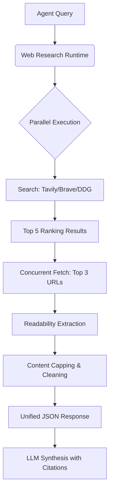

# Web Research 深度调研工具设计方案

## 1. 概述 (Overview)
`web_research` 是从“传统网页搜索”进化到“原子化深度调研”的核心组件。它旨在解决 Agent 在联网搜索时面临的“信息碎片化”、“高频无效往返（Blind Loop）”以及“摘要误导”等痛点。

### 核心改变：从“菜单模式”到“成品模式”
- **旧模式**：搜索 (Search) -> 查阅摘要 -> 决定爬取 (Fetch) -> 读取正文。单次获取深度信息需要 3-5 轮对话。
- **新模式**：深度调研 (Research) -> 并发搜索与预取 -> 返回带原文的结果。单次对话即可获得详实的证据。

---

## 2. 核心架构 (Architecture)

### 关键组件：
1. **并发调度引擎 (Concurrent Engine)**：利用 `Promise.all` 并发抓取排名前 N 的网页，消除串行抓取的延时。
2. **Readability 提取器**：对抓取内容进行“脱水”，剔除广告和导航，仅保留纯净正文。
3. **内容容量控制器 (Context Capping)**：强制限制每个网页返回 1500-2000 字符，确保 3-5 个网页的内容能完美融入上下文，不撑爆模型。

---

## 3. 运行逻辑优化 (Execution Flow)

### 3.1 引用索引系统 (Citation Indexing)
所有返回的结果都带有一个唯一的 `citationIndex`。
- **原理**：Agent 接收到的数据不仅有摘要，还有 `[1]`, `[2]` 对应的详细正文。
- **效果**：强制大模型在生成回答时采用类似于 Perplexity 的“学术引用格式”，增强事实可靠性，杜绝幻觉。

### 3.2 智能降级与防御 (Smart Fallbacks)
为了防止用户担心的“死循环”（例如 Top 3 全部遇到反爬虫拦路），系统具备以下防御机制：
- **错误透明化**：如果某个网页抓取失败（如 403, 500），返回对应的 `error` 字段。
- **引用 Snippet 兜底**：若 Fetch 失败，保留 Search Engine 提供的原始 `snippet`，保证至少有基础信息可用。
- **环境升级建议 (Environment Signal)**：若多个核心结果均被 WAF 拦截，工具会向模型下发专用信号：`"require_browser_interaction": true`，引导模型改用 `browser_*` 模式，而不是在那里死循环重搜。

---

## 4. 与前置分析的联动 (Integration with Pre-analysis)

当前的“搜索前大模型分析”流程将成为 `web_research` 的**高质量输入源**。
- **输入端**：利用 LLM 优化后的高质量、多维度关键词。
- **输出端**：Research 模块一次性带回的海量正文，让模型不再需要进行“下一轮搜什么”的盲目尝试。

---

## 5. 预期收益 (Impact)

1. **对话轮数减少 50%+**：原本需要多次往返的操作，现在一步到位。
2. **任务成功率提升**：由于模型能看到“原文”而非“摘要”，它处理复杂文档（如 API 教程、长篇政策、股票财报）的能力将大幅提升。
3. **Token 使用效率**：虽然单次返回的内容变多，但因为减少了反复思考和中间重试的 Token 消耗，总成本更低。

---

## 6. 后续规划 (Roadmap)
- [ ] 在 `bridge/capabilitySelector.mjs` 中实现联网任务向 `web_research` 的强制路由。
- [ ] 增加 Tavily 的 `include_raw_content` 作为云端抓取降级方案，规避本地 IP 被封锁的问题。
- [ ] 支持用户在设置页面动态调整 Research 的“深度”（如一次性读取多少个网页）。
